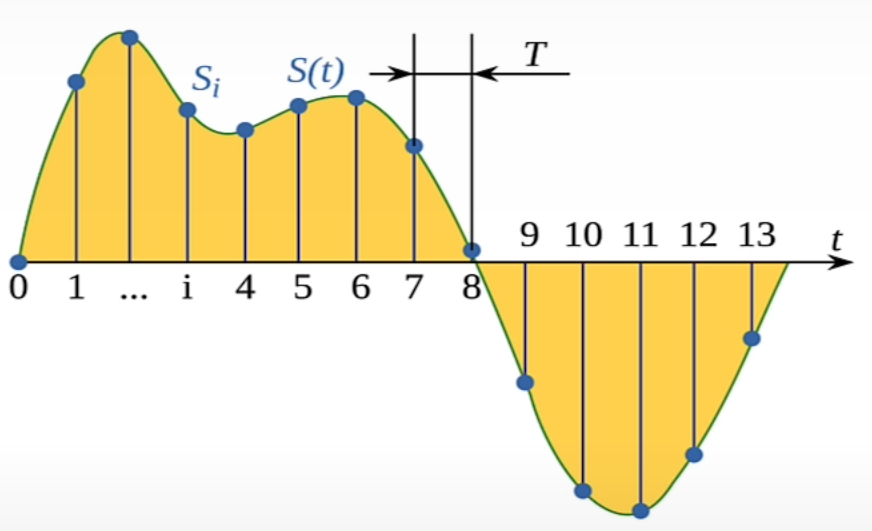
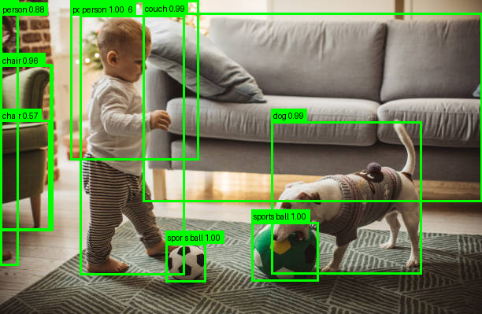
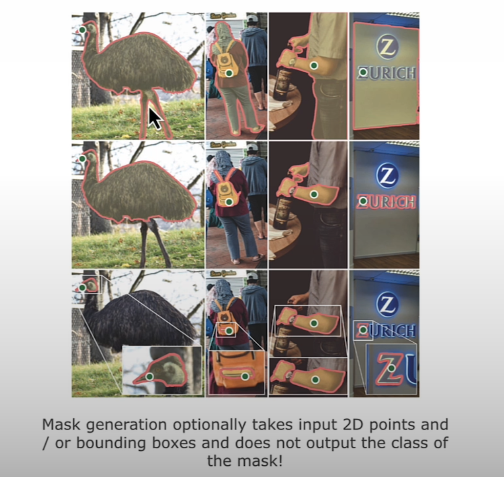
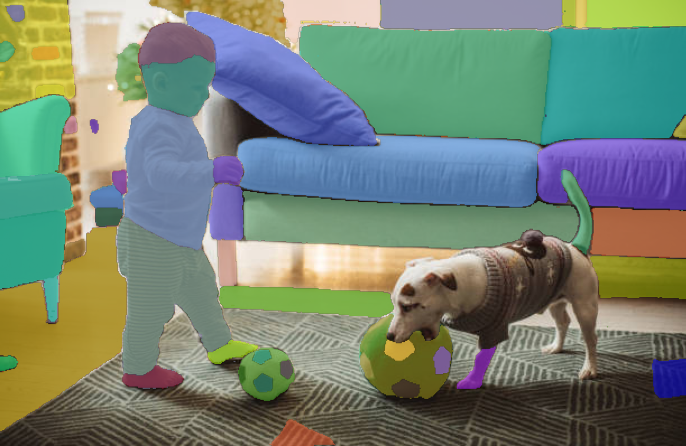
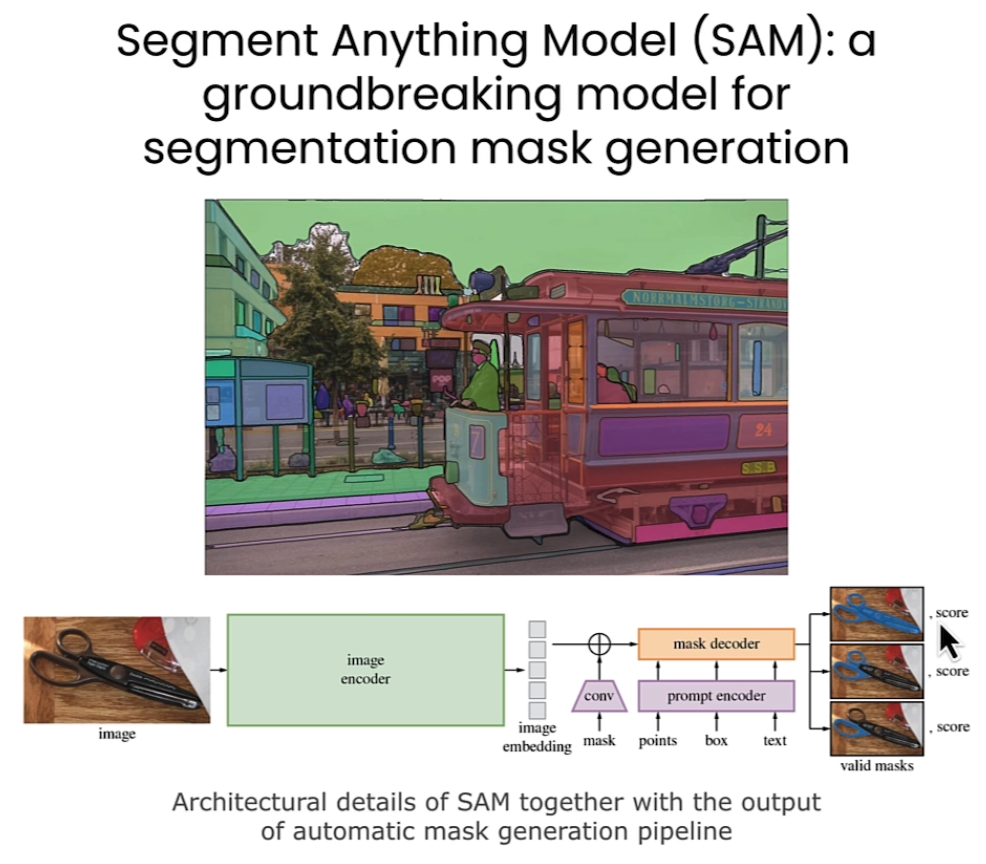

- https://huggingface.co/
- models can have checkpoints with varying number of parameters.
- checkpoint refers to the saved model, including the pre-trained weights and all the necessary configurations.
- we often say we load a model, but technically speaking, we load a model checkpoint.
- depending on your hardware, you may not be able to run the largest checkpoints.
- traditionally, Hugging Face models stored weights in: pytorch_model.bin, which is just a serialized PyTorch checkpoint created via torch.save().
- however, many newer models (including whisper v3 Turbo) now use the .safetensors format instead.
- safetensors is:
  - safer (cannot execute arbitrary Python code during load)
  - faster (memory-mapped loading — no deserialization overhead)
  - portable (can be read from multiple frameworks, not just PyTorch)
- pytorch_model.bin file stores the trained weights of the model.
- the loaded model typically needs ~10–30 % more memory than the raw checkpoint
  - e.g. model.safetensors ~ 1.62 GB
  - 1.62 GB x 1.3 ~ 2.10 GB of memory needed
- how find a model for a task, a dataset, or a demo? hugging face tasks:
  - [chat completion](https://huggingface.co/docs/inference-providers/en/tasks/chat-completion)
  - [feature extraction](https://huggingface.co/docs/inference-providers/en/tasks/feature-extraction)
  - [automatic speech recognition](https://huggingface.co/docs/inference-providers/en/tasks/automatic-speech-recognition)
  - [text to video](https://huggingface.co/docs/inference-providers/en/tasks/text-to-video)
- using a model with `transformers` library:
  
- the Pipeline object offers a high level abstraction to solve tasks:
    ```python
    # Use a pipeline as a high-level helper
    from transformers import pipeline

    pipe = pipeline("automatic-speech-recognition", model="openai/whisper-large-v3")
    ```
- so the pipeline library takes care of:
  - text to "tokens" conversion
  - audio to "logmel" spectrogram
  - images resizing and normalization (if needed)
- the transformers library doesn’t install PyTorch automatically because it’s designed to be framework-agnostic, so it can work with:
  - PyTorch (torch)
  - TensorFlow (tensorflow)
  - Flax (jax, flax)
- chat with open source models in https://huggingface.co/chat/
- what does “compiled kernel” mean?
  - a kernel is a function that runs on your GPU (massively parallelized).
  - when PyTorch or any deep-learning library runs something like a matrix multiplication, it doesn’t send python code to the GPU — it calls pre-compiled CUDA kernels (binary machine code).
  - when PyTorch is built, it includes many of these kernels already compiled for specific GPU architectures. Each architecture is identified by a “compute capability” (e.g., 6.1, 7.5, 8.0, etc.).
  - the error: `CUDA error: no kernel image is available for execution on the device` means
    - your GPU asked to execute CUDA code, but this PyTorch build doesn’t include a binary (‘kernel image’) compiled for that GPU’s architecture.
- what does sm_61 mean?
  - streaming Multiprocessor architecture 6.1
  - my gpu GTX 1060 (sm_61) / Pascal architecture
  - each generation of NVIDIA GPUs has a numeric compute capability, which tells software what instructions, tensor cores, and memory features it supports.
  - PyTorch wheels only embed kernels for a subset of these.

| GPU Family        | Architecture Name | Compute Capability | Code      |
| ----------------- | ----------------- | ------------------ | --------- |
| GTX 900 (Maxwell) | Maxwell           | 5.2                | sm_52     |
| GTX 10xx (Pascal) | Pascal            | 6.1                | **sm_61** |
| RTX 20xx (Turing) | Turing            | 7.5                | sm_75     |
| RTX 30xx (Ampere) | Ampere            | 8.6                | sm_86     |
| RTX 40xx (Ada)    | Ada Lovelace      | 8.9                | sm_89     |
| H100              | Hopper            | 9.0+               | sm_90     |

- the [open llm leader board](https://huggingface.co/open-llm-leaderboard) aims to track, rank and evaluates open LLMs and chatbots.
- the [lm arena](https://huggingface.co/spaces/lmarena-ai/chatbot-arena) rankings across various LLMs on their versatility, linguistic precision, and cultural context across text.
- pretrained models are models that were train from scratch, mainly from big companies with access to the compute
- [facebook not language left behind (NLLB)](https://huggingface.co/facebook/nllb-200-distilled-600M) - machine translation model primarily intended for research in machine translation
- what exactly is a tokenizer?
  - a tokenizer is the component that converts raw text (strings) into numbers (token IDs) that the model can understand.
  - "Hello world"  →  [15496, 995]
  - models only understand numbers.
  - the tokenizer is the dictionary.
- can you share a tokenizer across different models?
  - no, not safely (unless the models use exactly the same vocabulary).
  - you cannot share tokenizers between unrelated models
    - GPT-2 tokenizer on a BERT model
    - NLLB tokenizer on T5
    - LLaMA tokenizer on Mistral
  - you can share tokenizers between models that:
    - come from the same family
    - use the same vocabulary (e.g. facebook/nllb-200-distilled-600M, facebook/nllb-200-1.3B)
    - have the same tokenization scheme
    - tokenizers runs in the CPU
- `all-MiniLM-L6-v2` model: it’s a sentence-embedding model from the Sentence‑Transformers library. It maps sentences (or short paragraphs) into a 384-dimensional dense vector space.
  - architecture wise: it’s based on the “MiniLM” family
  - it's fine-tuned for sentence similarity / semantic search tasks
  - high throughput for embedding many sentences.
  - it gives a very decent trade-off of accuracy vs cost.
- other sentence-embedding models: https://www.sbert.net/docs/sentence_transformer/pretrained_models.html

| Model                                 | Better if you need…                                                                     | Trade-offs                                                     |
| ------------------------------------- | --------------------------------------------------------------------------------------- | -------------------------------------------------------------- |
| all-mpnet-base-v2                     | **Higher accuracy** for embedding quality (semantic search, retrieval) ([sbert.net][1]) | Slower, larger model, more resource usage                      |
| paraphrase-multilingual-MiniLM-L12-v2 | Good for **multilingual** embeddings (many languages) ([Medium][2])                     | Slightly larger than L6 version, maybe slightly less efficient |
| multi-qa-mpnet-base-cos-v1            | For **question-answering / retrieval** heavy tasks (domain specific) ([sbert.net][1])   | More specialized, maybe overkill for simple embedding tasks    |

- audio data:
  - sampling           = measuring the value of a continuous signal at fixed time steps.
  - sampling rate (Hz) = the number of samples taken in one second
  - 8,000 Hz (8KHz): telephone / walkie-talkie
  - 16,000 Hz (16KHz): human speech recording
  - 192,000 Hz (192Khz): high-resolution audio
  - for example, 5-second sound:
    - 8,000 Hz => 5 * 8000 = 40,000 signal values
    - 16,000 Hz => 5 * 16000 = 80,000 signal values
    - 192,000 Hz => 5 * 192000 = 960,000 signal values
  - why is the sampling rate important when working with AI models?
    - it determines how much detail you capture, e.g. 44.1 kHz captures all frequencies humans can hear.
    - models don’t inherently understand different sampling rates, so if the model learned patterns based on say 16,000 samples per second it will interpret new input as if one second = 16,000 samples.
    - it impacts model size, training speed, and memory.
  - if a model is trained at 16,000 Hz and you feed it 10 seconds of audio sampled at 192,000 Hz (without resampling), the model will interpret the input as much longer than it actually is.
    - 10 seconds x 192,000 samples/sec = 1,920,000 samples
    - 1,920,000 samples / 16,000 samples/sec = 120 seconds
  
  

- the `ESC50 dataset` is a labeled collection of five-second environmental sounds, such as sounds made by animals and humans, nature sounds, indoor sounds, urban noises.
  - `ashraq/esc50` points to the ESC-50 dataset repository on Hugging Face
- in zero-shot audio classification uses user-supplied `candidate_labels`, arbitrary descriptive phrases that the model scores against the audio clips.
  - `laion/clap-htsat-unfused` is the CLAP audio–text mode
  - CLAP stands for Contrastive Language-Audio Pretraining—it’s the technique used to train the zero-shot audio/text model.
  - here “contrastive” means the model learns by comparing matched vs. mismatched pairs—e.g., an audio clip with its true text caption and the same clip with unrelated captions. During training, it pulls the embeddings of true pairs closer together and pushes apart those of mismatched pairs. That contrastive objective teaches the model a joint audio–text space where similarity directly reflects semantic alignment.
- Automatic Speech Recognition is a task that involves transcribing speech audio recording into text.
  - meeting notes
  - videos subtitles
- what a distilled model? a distilled model is:
  - a compressed version of a bigger model
  - trained not on raw human data, but on the teacher model’s outputs
  - designed to be faster, cheaper, and more efficient
  - while keeping as much of the teacher’s accuracy and behavior as possible
- stereo audio adds a spatial component that enhances the listening experience for music.
  - stereo audio has a left and a right channel, similar to how humans have two ears. this lets a system compare what is heard on each side.
  - a sound arriving at one "ear" slightly earlier than the other gives clues about its direction (e.g. a sound reaches the left channel a few milliseconds earlier → the source is on the left.)
  - a sound may be louder in one channel than the other, also indicating direction. (e.g. example: louder in the right channel → source is likely on the right)
- for transformer models, stereo is usually unnecessary; they typically use mono audio.
- tasks like recognizing a dog bark, a cat meow, or spoken words don’t require knowing the sound’s spatial location.
- mono is sufficient because the model only needs to know what was said or heard, not where it came from.
- stereo has two channels (twice the data), which increases computational complexity without offering meaningful benefits for most transformer audio tasks.

- for models the batch size can be seen as a multiplier of the memory requirement.
  - example: `- asr(audio_16KHz, chunk_length_s=30, batch_size=4, return_timestamps=True)["chunks"]`
- it represents how many models (or inputs) you can run in parallel.
- if your hardware has enough capacity, you can use a larger batch size (more batches at the same time).

- why text-to-speech is a challenging task?
  - it is a one-to-many problem. in classification, you have one correct label, maybe a few...
  - in automatic speech recognition, there's one correct transcription for a given text.
  - however, there's an infinite amount of ways to say the same sentence.
  - each person has a different way of speaking, but they are all valid and correct.
  - think about different voices, dialects, speaking styles, and so on.

- what is end-to-end object detection? end-to-end object detection refers to object-detection systems where the entire process — from input image → bounding boxes + object labels — is learned and optimized in one unified neural network, without needing hand-crafted components or multi-stage pipelines.
  - [DETR (End-to-End Object Detection) model with ResNet-50 backbone](https://huggingface.co/facebook/detr-resnet-50)
  

- what is segmentation mask generation? is a computer-vision task where an AI model produces a pixel-accurate outline (mask) of objects in an image — without necessarily identifying what the object is.
This is sometimes called class-agnostic segmentation.
  - [SlimSAM-uniform-77](https://huggingface.co/Zigeng/SlimSAM-uniform-77)
  - [0.1% Data Makes Segment Anything Slim](https://arxiv.org/pdf/2312.05284)
  
  
  - note SAM output 3 image masks!
  
  - SAM with a single point:
  

- what is depth estimation?
  - [Vision Transformers for Dense Prediction](https://arxiv.org/pdf/2103.13413)
  - DPT stands for dense prediction
  - DPT is a model that you can use to perform depth estimation given an image
  - depth estimation is a common task in computer vision.
  - commonly use in autonomous driving
  - [Intel/dpt-hybrid-midas](https://huggingface.co/Intel/dpt-hybrid-midas)

- what are multimodal models?
  - when a task requires a model to be able to take as an input more than one type of data,
  - let's say an image and a sentence, we'll call it multimodal.
  

- what are some common multimodal tasks?
  - image captioning
  - image to text matching
  - visual Q&A
  - zero-shot image classification

- image - text retrieval
  - [Salesforce/blip-itm-base-coco](https://huggingface.co/Salesforce/blip-itm-base-coco)
  

- image - captioning
  - [Salesforce/blip-image-captioning-base](https://huggingface.co/Salesforce/blip-image-captioning-base)

