- [Python Numpy Tutorial](https://cs231n.github.io/python-numpy-tutorial)
- [Repository](https://github.com/cs231n/cs231n.github.io)
- [Website](https://cs231n.stanford.edu/index.html)
- what is image classification? is the task of taking an image and assigning it to one label from a fixed set of categories (for example, “cat” or “dog”).
- why image classification is hard?
  - the semantic gap: there is a difference in how we perceived the image and how a machine perceived the image, humans understand images based on meaning and context, while machines only see raw pixels.
  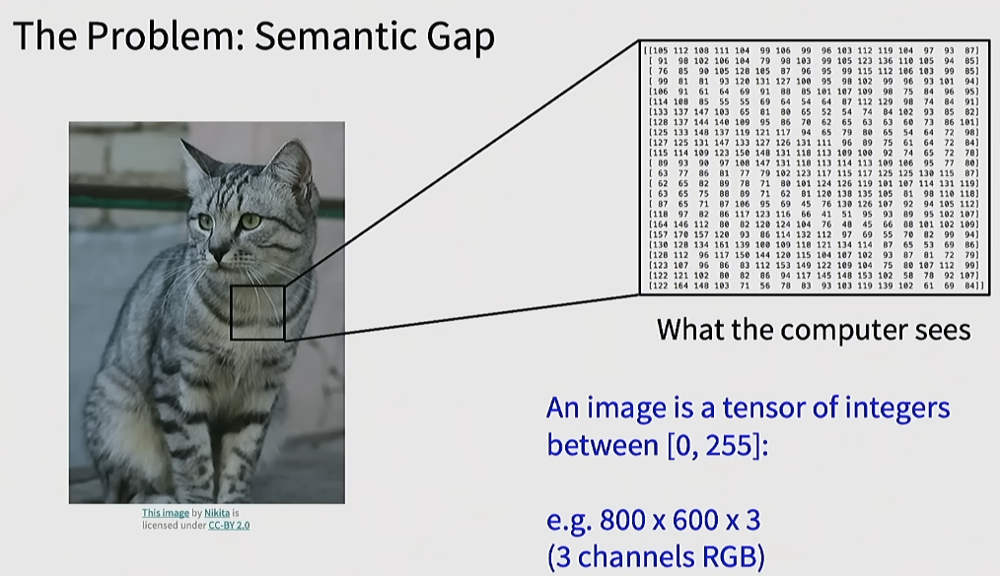
  - viewpoint variation: for us humans there is not much difference, from the machine perspective all pixels change when the camera moves!
  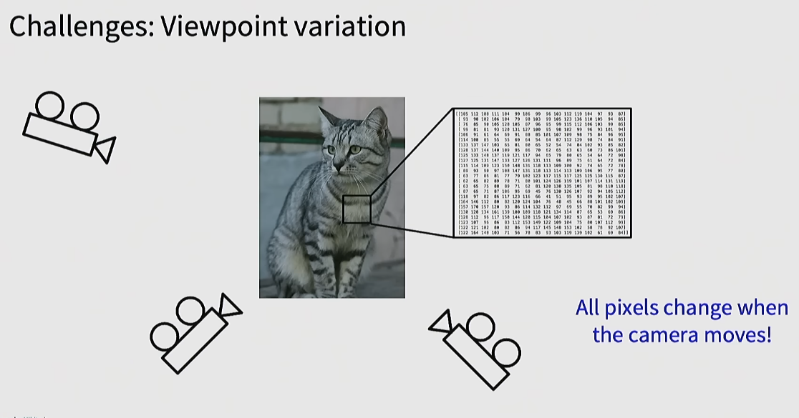
  - ilumination: the value of each rgb pixel are usually a function of the surface material, color and light source, and that is why same cat (same object) may look different under distinct ilumination conditions.
  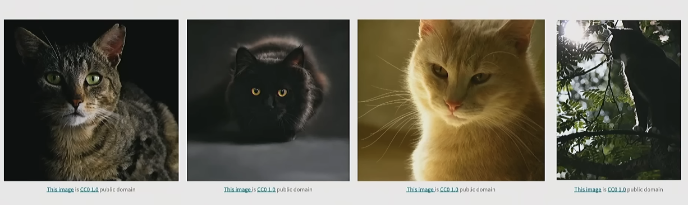
  - background clutter: there are many things in the background that make it harder to clearly see the object you want to recognize.
  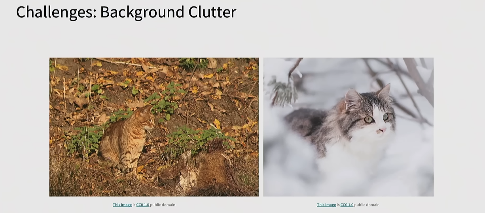
  - occlusion: part of the object you want to recognize is hidden.
  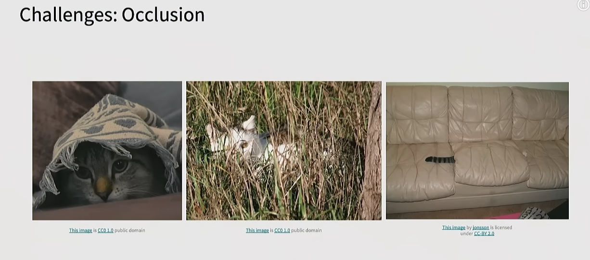
  - deformation: the object could look very different from its usual shape or pose.
  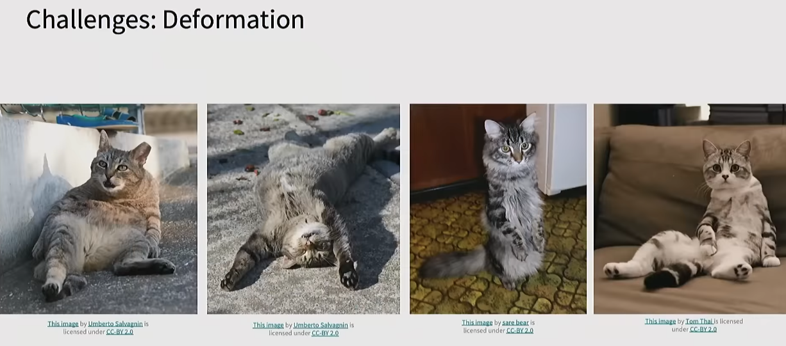
  - intra class variation: objects from the same category can look very different.
  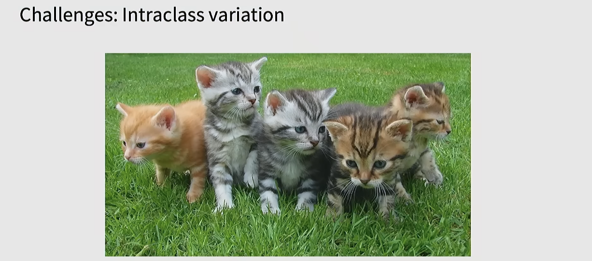
  - context: the surroundings of an object can influence how it’s recognized.
  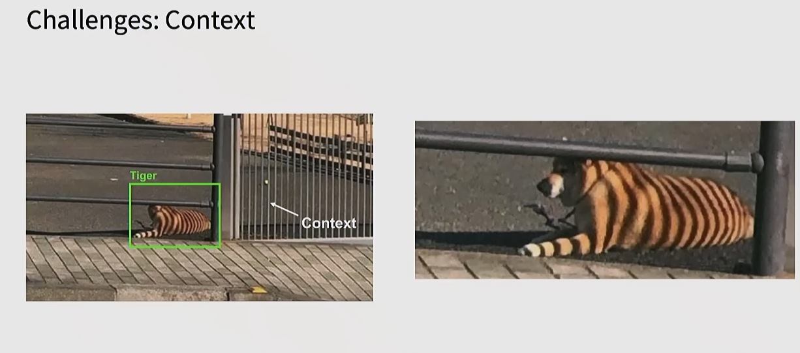
  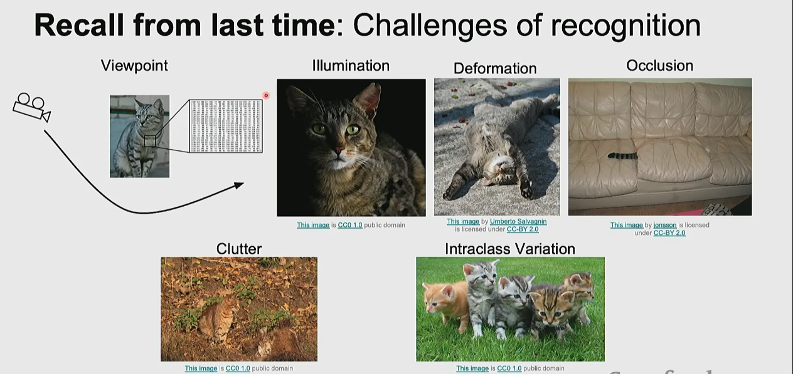
- algorithmic approach: before modern data-driven methods (like deep learning), people tried to classify images using hand-crafted rules.
  - first, detect simple features like edges.
  - then detect more specific features like corners or shapes.
  - finally, try to combine these manually defined features to decide what the object is.
  - the problem: these rules were too simple and couldn’t capture all the variations in real images (different poses, lighting, shapes, backgrounds). in addition, this approach does not scale you have to repeat for each new object to classify.
    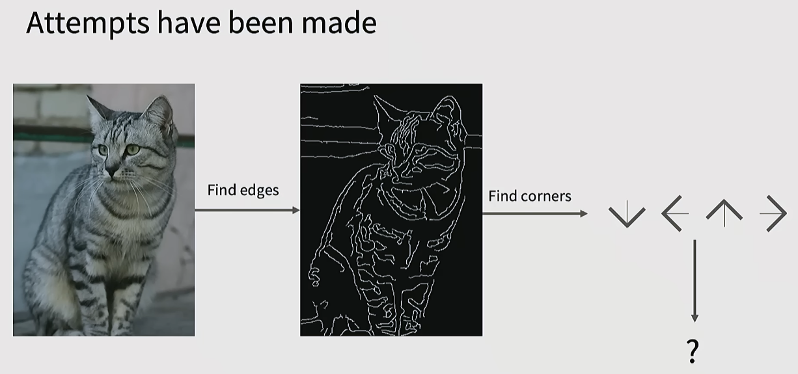
- data-driven approach: instead of designing features by hand, we let the model learn the right features automatically from large amounts of data.
  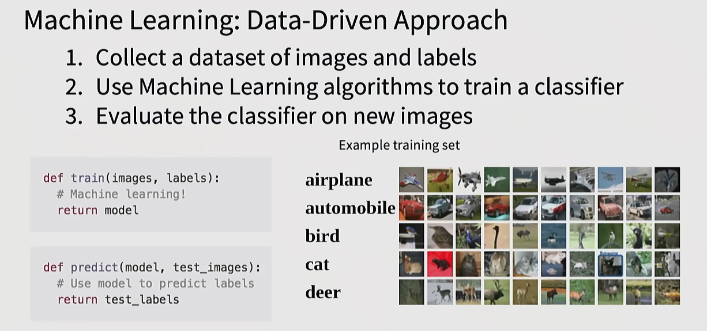
- distance metrics to compare images:
  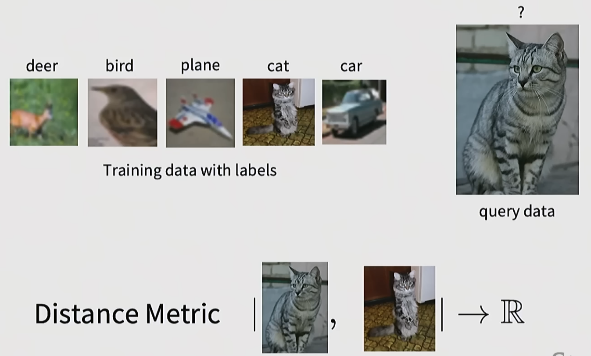
  - L1 distance: (also called Manhattan distance) is a way to measure how different two things are by adding up the absolute differences between each of their corresponding components (pixels, numbers, features, etc.).
  - L2 distance: (also called Euclidan distance) measures how far two points (or images, or vectors) are by taking the square root of the sum of squared differences between their corresponding components. it’s the straight-line distance between them.
  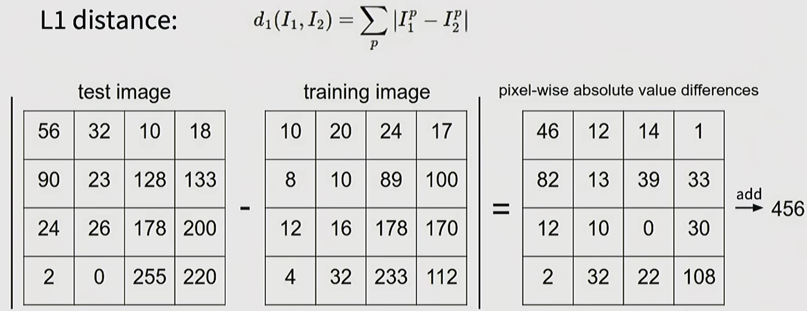
  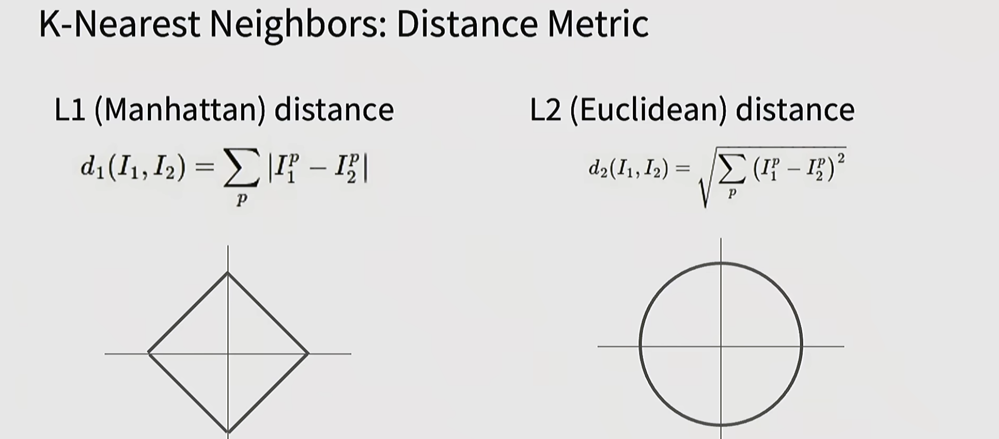
  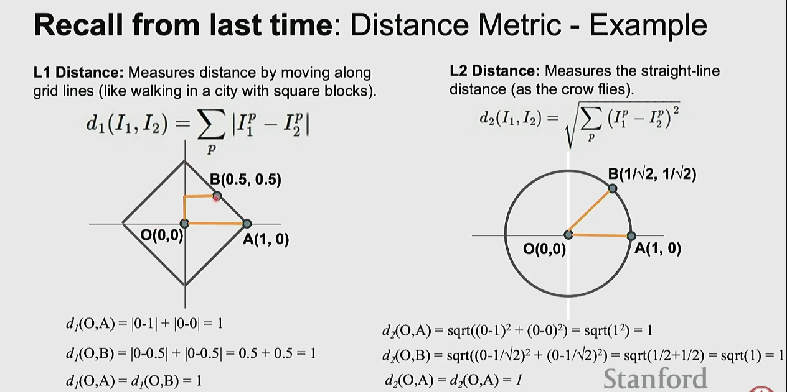
    - what is the problem with L1 distance? despite training being O(1) since there’s nothing to learn, calculating the distance to all images is O(n)! if the dataset grows... for example, to a trillion images — this becomes impractical. it’s better to use an algorithm that’s faster at prediction (inference) time.
- what is accuracy? accuracy (in simple terms) means how often we get the correct answer.
  - accuracy = total number of predictions / number of correct predictions
- what is precision? of all the things the model said were positive, how many were actually positive?
  - precision = true positives / true positives + false positives
  - example: How many of the people the detective arrested were actually criminals?
    - he arrested 20 people.
    - 15 were real criminals.
    - precision = 75%
    - this is about not arresting innocent people.
    - precision → “did we catch the right ones?”
- what is recall? of all the actual positives, how many did the model correctly find?”
  - recall = true positives / true positives + false negatives
  - example: How many criminals did the detective find?
    - there were 100 real criminals.
    - he caught 80.
    - recall = 80%
    - this is about not missing any real criminals.
    - recall → “did we catch them all?”
- what does the majority voting means in the k-nearest neighbors algorithm?
  - when you want to classify a new point:
  - the algorithm finds the K closest training points (its “neighbors”).
  - each of those neighbors has a known class label.
  - the algorithm counts how many neighbors belong to each class.
  - the class with the highest count (the majority) is assigned to the new point.
  - suppose K = 5, and the 5 nearest neighbors have labels:
  - 3 are green, 1 is blue, 1 is red
  - the majority class is green, so the new point is classified as green.
  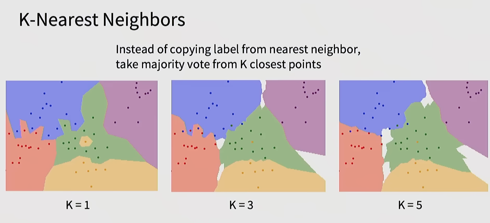
- what are hyperparameters? hyperparameters are settings you choose before training a machine learning model.
they control how the model learns, but the model does not learn them by itself. think of hyperparameters like cooking settings (temperature, time):
they affect the result, but the oven doesn’t set them—you do.
  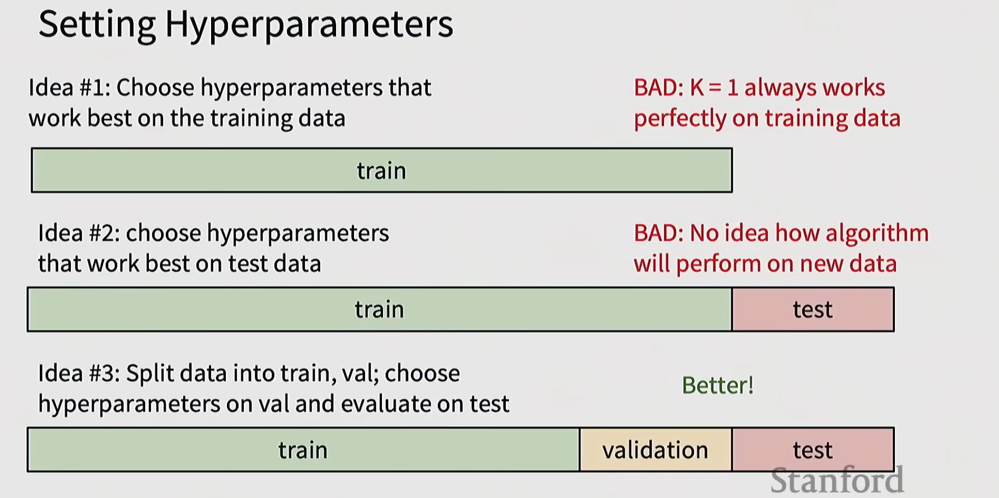
  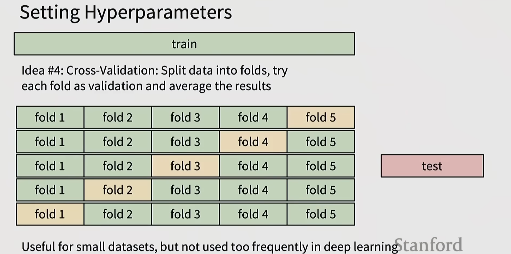
  - Idea #1: ❌ Bad idea
    - because the model may overfit the training data (e.g., K=1 gives perfect training accuracy), and it won’t generalize to new data.
  - Idea #2: ❌ Bad idea
    - because you are using the test data to tune the model, so the test data is no longer a fair measure of performance. you lose the ability to evaluate on truly new data.
  - Idea #3: ✔ Better idea
    - because the validation set is used for tuning, and the test set stays untouched until the end, giving an honest evaluation of how well the model generalizes.
  - Idea #4: ✔ Good idea
    - because it gives a more reliable estimate of how your hyperparameters will perform on new data, especially when the dataset is small.
- why k-nearest neighbor on images is never used?
  - very inefficient
  - distance metrics on images which are very high dimensional objects they act on very unnatural unintuitive ways.
  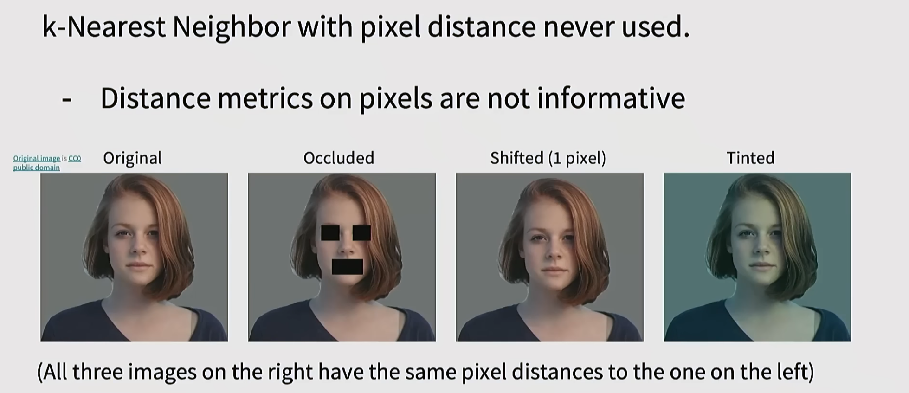

- what is a linear classifier? a linear classifier is a simple machine-learning model that makes predictions using a straight-line (linear) decision boundary. a linear classifier tries to separate data into classes using a line, plane, or hyperplane. it cannot learn complex shapes — only straight boundaries.
  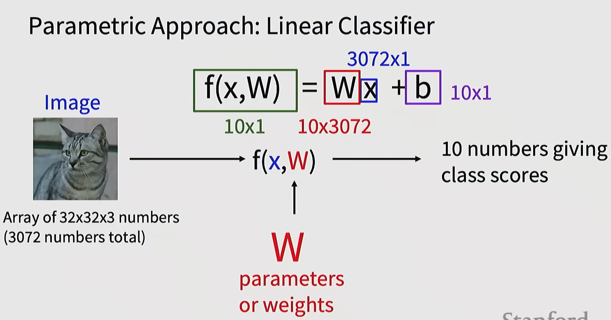
  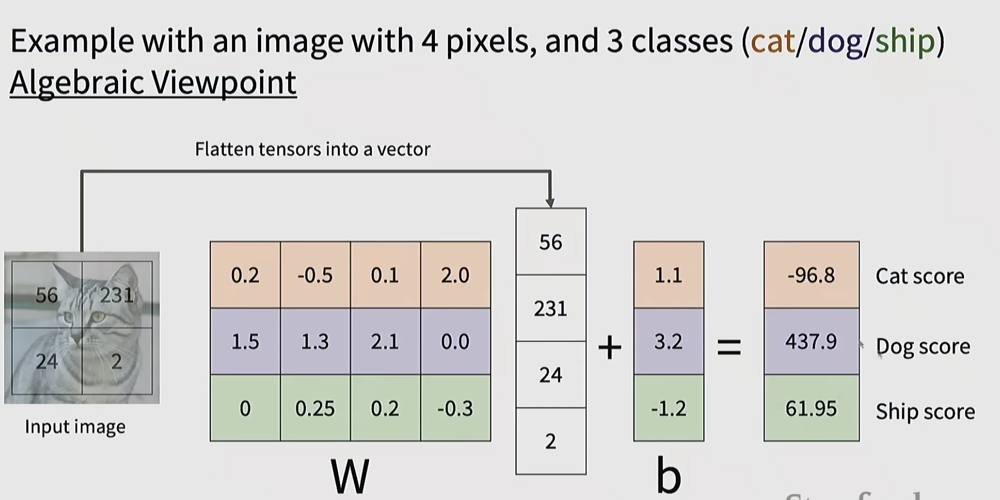
  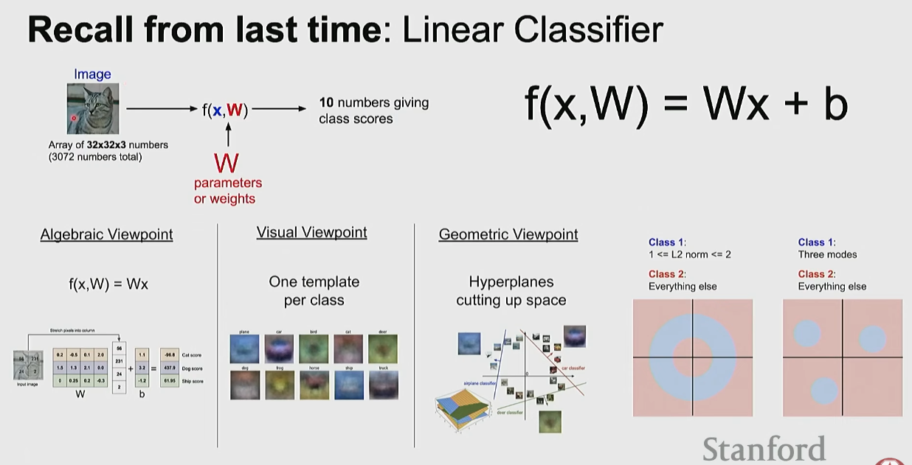
  - the cat image is turned into a long list of numbers (3072 numbers).
  - the model uses a weight matrix (W) and bias (b) to compute: f(x, W) = Wx + b
  - the result is 10 numbers, each representing a score for a class (e.g., cat, dog, car, etc.).
  - a linear classifier just multiplies the input by weights and adds a bias — nothing fancy.
  - note that in the last image, each row of W can be viewed as a “template” image showing what the model has learned for each class.
  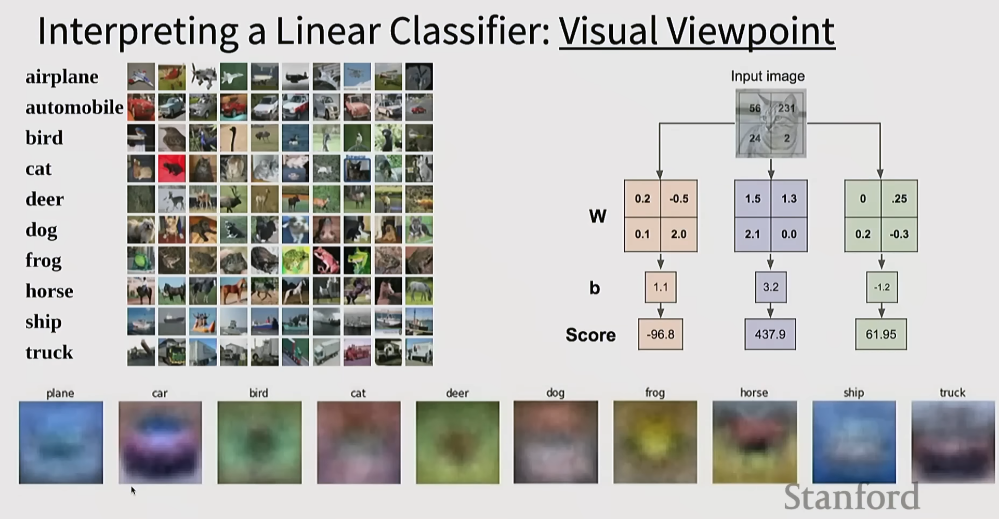
  - a linear classifier tries to separate images (like cars, airplanes, deer) using straight lines (or planes in higher dimensions). if an image falls on one side of the line, the classifier scores it higher; if it falls on the other side, the score is lower.
  - those blurry pictures are the W rows visualized, basically what each classifier “looks for.”, each row of W acts like a template.
  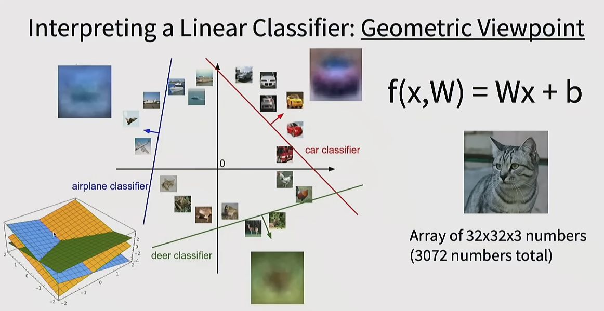

- neural networks = many simple linear classifiers stacked together!
  - more layers = more power to learn complex patterns.
  - each LEGO block represents a linear classifier.
  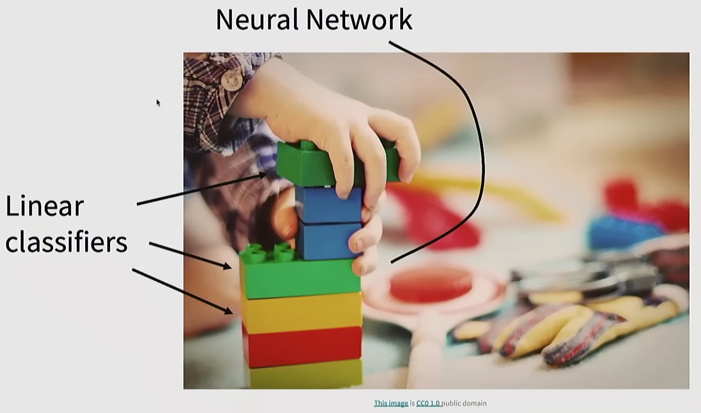
  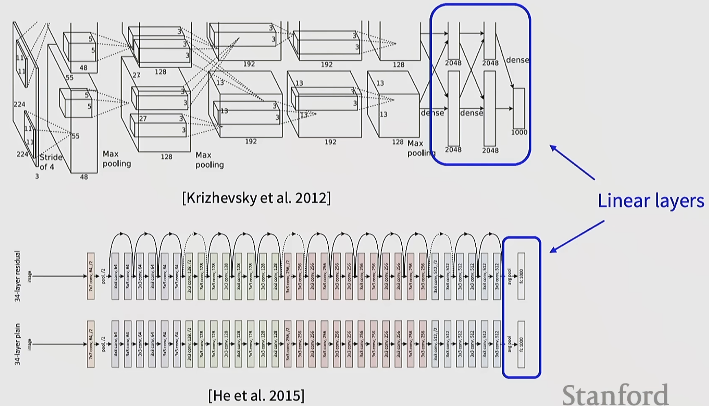

- what are hard cases for linear classifier?
  - the following examples show why linear classifiers are limited.
  - they fail on data that is non-linear, circular, or consists of multiple disconnected regions.
  - that’s why we stack layers (neural networks) to handle these shapes.
  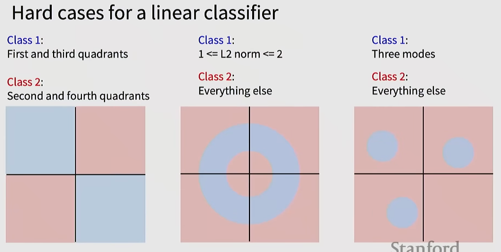

- what is a loss function?
  - a loss function in simple terms tells you how "bad" a model is!
  - a loss function measures the difference between what the model predicted and what the correct answer should be.
  - good prediction(s) → low loss
  - bad prediction(s)  → high loss
  - the goal during training is to adjust W (the weights) so that the loss becomes as small as possible.
   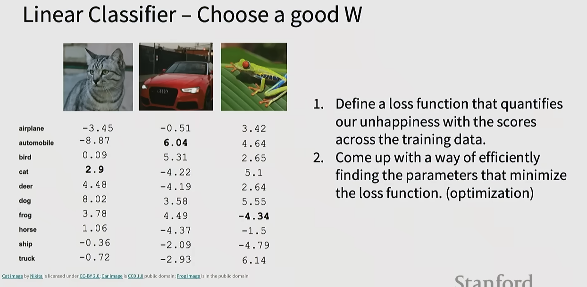
   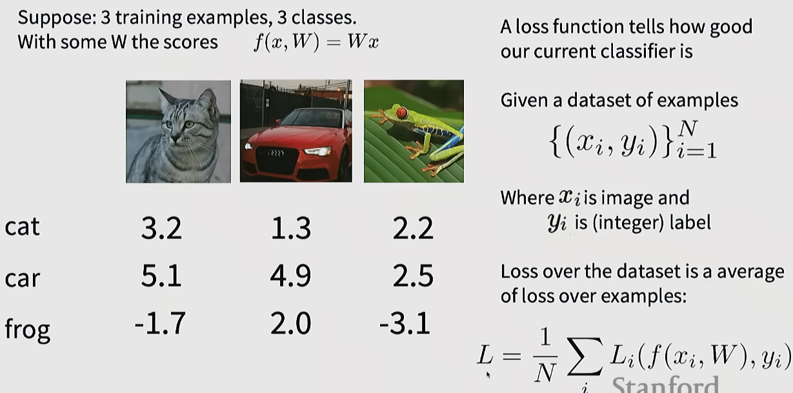

- how a softmax classifier turns raw scores into probabilities? the softmax classifier turns raw scores into probabilities, then uses the negative log-probability of the correct class as the loss to train the model.
  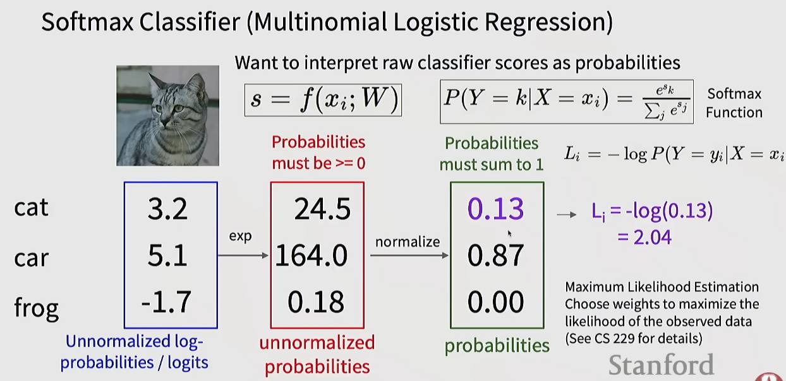
  - the linear classifier produces raw numbers:
    - cat: **3.2**
    - car: **5.1**
    - frog: **–1.7**
  - these are not probabilities.
  - they can be negative, and they don’t sum to 1.
  - apply `exp()` to make everything positive
  - we take the exponential of each number:
    - exp(3.2)  → **24.5**
    - exp(5.1)  → **164.0**
    - exp(–1.7) → **0.18**
  - now everything is **positive**, but still not a probability.
  - normalize to make them sum to 1 → Softmax
  - sum = 24.5 + 164.0 + 0.18 ≈ **188.7**
  - probabilities:
    - cat: **0.13**
    - car: **0.87**
    - frog: **0.00**
  - so the model thinks the image is **87% car**, **13% cat**, **0% frog**.

- how to compute the loss (cross-entropy loss) for the training?
  - if the *true label* is **cat**, we look at the probability for “cat,” which is **0.13**.
  - the loss is:
    - **L = –log(0.13) ≈ 2.04**
    - this penalizes the model for giving the correct class a low probability.
    - so... we adjust the weights **W** so that the probability of the correct class becomes higher.
    - mathematically, we want to **maximize the probability of the true class**, or equivalently: **minimize the loss**.

- what does cross-entropy measures? cross-entropy measures how different the predicted probabilities are from the true probabilities.
  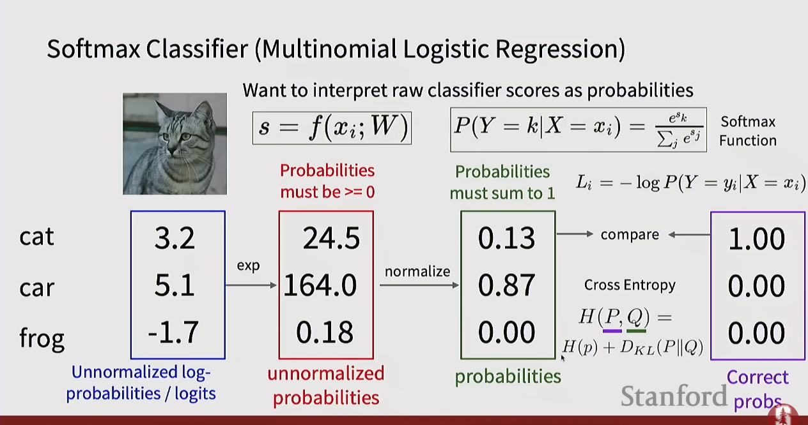
  - so what is H(P, Q)?
    - H(P, Q) = – Σ P(i) log Q(i)
    - P = the true distribution
    - (the purple vector: 1 for cat, 0 for everything else) => [1, 0, 0]
    - Q = the model’s predicted distribution
    - (the green vector: 0.13 cat, 0.87 car, 0.0 frog)
    - H(P, Q) = “How different is Q from P?”
    - if Q matches P perfectly → H(P, Q) is small
    - if Q is very wrong → H(P, Q) is large
  - note in this case softmax loss = cross-entropy loss, not necessarily always like this.

- why do we use –log for cross-entropy and loss?
  - because –log(probability) gives a perfect numerical penalty for “how wrong” the model is.
  - loss = –log(0.99) ≈ 0.01 → **Very small penalty (good)**
  - loss = –log(0.01) = 4.60 → **HUGE penalty**

- multiclass SVM loss:
  - we look at all the incorrect classes.
  - for each one, we compute: sj - sy + 1
  - if this value is > 0, the incorrect score is too high → penalty.
  - if it is ≤ 0, the incorrect score is comfortably lower → no penalty.
  - the total loss for that example is the sum of these penalties.
  - “if an incorrect class score is higher than (correct score – 1), we add loss. otherwise, we add nothing.”
  - 🚫 today SVM loss is rarely used in deep learning.
  - softmax + cross-entropy has completely replaced SVM loss.
  - all modern frameworks (PyTorch, TensorFlow, JAX) standardize on softmax cross-entropy
  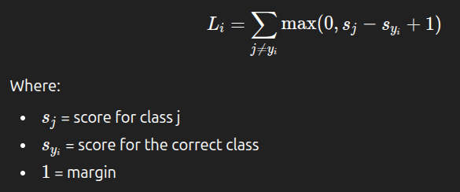
  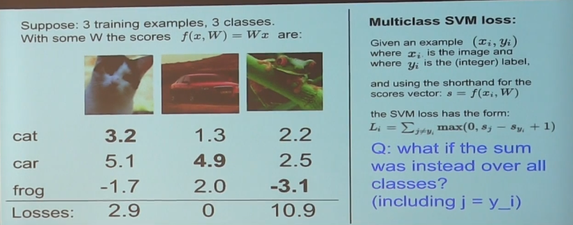

- what is the point of regularization?
  - prevent the model from doing too well on training data
  - express preferences over weights
  - make the model simple so it works on test data
  - improve optimization by adding curvature
  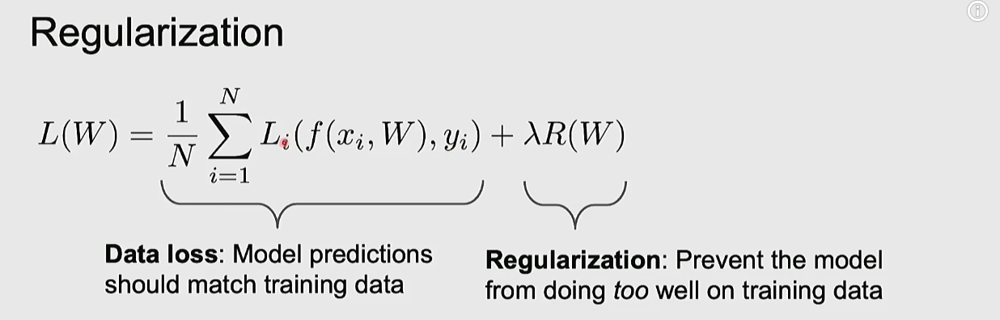
  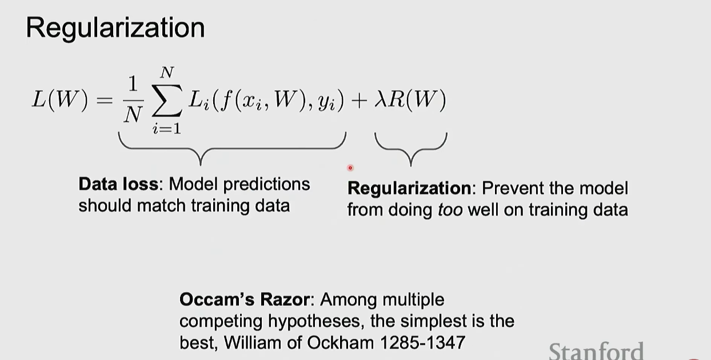
  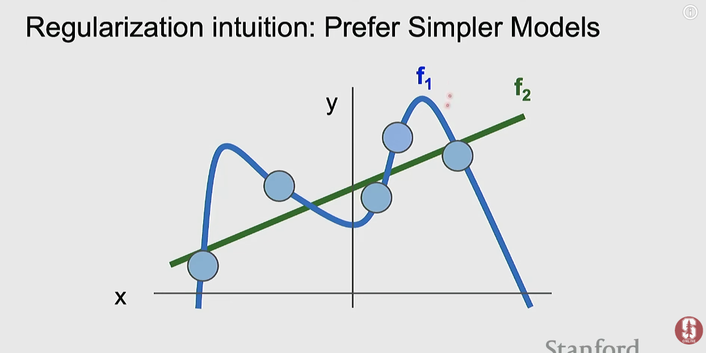
  - f₁ = a very complex model
    - it might perfectly fit the training data, but it is overfitting:
  - f₂ = a simple model
    - doesn’t pass through all points perfectly.
    - but captures the overall trend.
    - it generalizes better.
  - so... regularization adds a penalty for complexity.
  - λ controls how much the model should care about simplicity vs accuracy.
  - if λ is small -> regularization is "weak"
  - if λ is large -> regularization is strong
  - you are literally choosing how much you want to punish complexity.

- what are the types of regularization?
  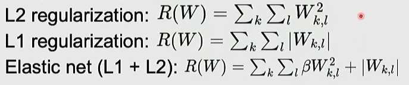
  - other more advance types:
  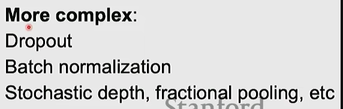

- which of w1 or w2 will the L2 regularizer prefer?
  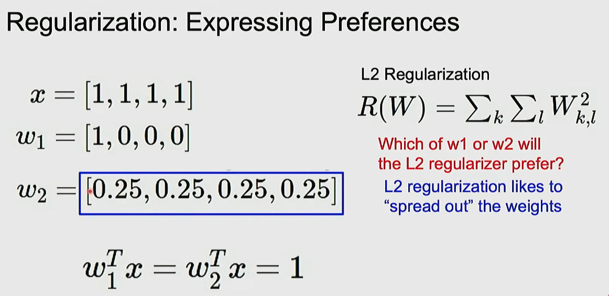

- why the semicolons in `f(x;W) = Wx`?
  - mathematicians use “;” to separate regular inputs from parameters of a function, so readers immediately know those variables play different roles.
  - x = the main variable the function acts on
  - x = image
  - W = model weights
  - **W** is not an input in the traditional function sense — it's a parameter we optimize

- why do we use softmax?
  - softmax is popular because it converts scores into probabilities and gives a smooth, stable loss that works extremely well with gradient descent — making it the best choice for multi-class classification in deep learning.
  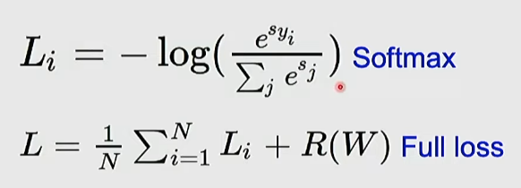

- why should not calculate the derivative this way?
  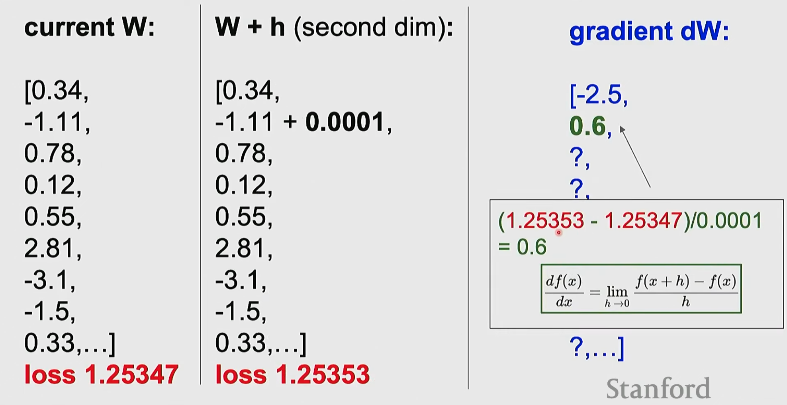
  - this is one of the core ideas behind why we use analytic gradients (backpropagation) instead of numerical gradients.
  - for each parameter by nudging it slightly and observing the change in loss.
  - **reason 1:** it is extremely slow
    - 1,000 weights → 1,000 numerical derivatives
    - a modern neural network: 10 million weights → 10 million loss evaluations
    - why so slow?
      - copy the entire model
      - add ℎ to one weight
      - compute the whole forward pass
      - compute the loss
    - backpropagation computes all gradients at once with one forward pass + one backward pass.
  - numerical gradient: O(number of weights)
  - backpropagation: O(1) relative to model size
  - **reason 2:** it is inaccurate
    - when h is tiny (like 0.0001), floating point error becomes huge.
  - **reason 3:** it is very sensitive to the choice of **h**
    - if h is too large → gradient is inaccurate
    - if h is too small → floating point errors dominate
    - no single value of h works well for all situations.
    - backpropagation does not have this problem at all.
  - **reason 4:** You must repeat a full forward pass for EVERY weight
    - with millions of weights, training would take years.
    - this is why neural networks are even possible today.
  - **reason 5:** you cannot use numerical gradients for training
    - they are too noisy and too slow.
    - people sometimes use numerical gradients only to check (verify) that a backprop implementation is correct — but never for real training.

- a vector of derivatives is a "gradient"!

- what is the alternative for computing those derivatives?
  - use "analytic" gradient.
  - do not use "numerical" gradient.
  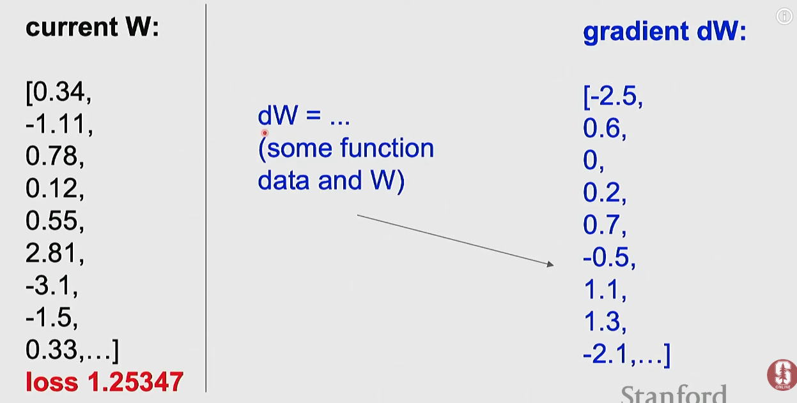
  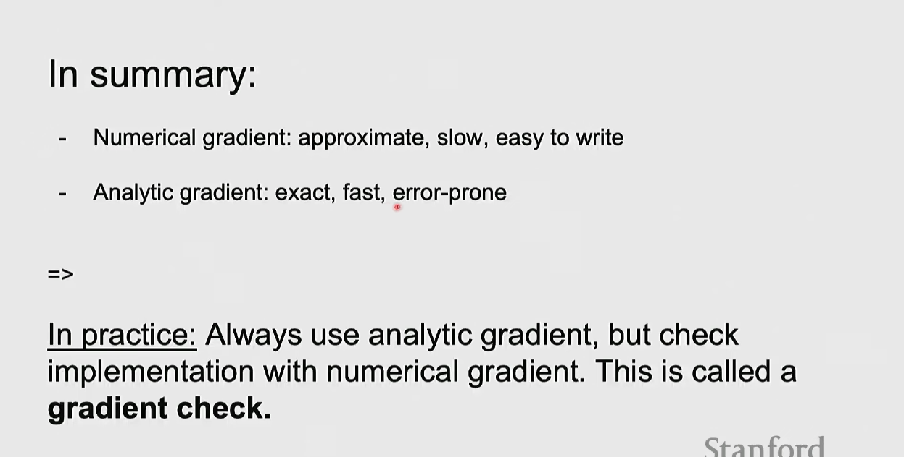

- what is a convex function?
  - a convex function is shaped like a bowl. there is only one lowest point, and gradient descent will always find it.
  - it has one global minimum
  - example: f(x) = x^2

- what is a non-convex function?
  - a non-convex function is shaped like a mountain landscape with many valleys.
  - has multiple local minima
  - example: f(x) = sin(x)

- what is a non-differentiable function?
  - a non-differentiable point is a sharp point where you cannot draw a unique tangent line.
  - f(x) = ∣x∣ no unique slope → derivative does not exist at 0.
  - a function can be:
    - convex and non-differentiable (e.g., |x| is convex but has a corner)
    - non-convex and differentiable (e.g., sin(x))

- what is gradient descent?
  - gradient descent is an algorithm used to find the min. of a function in ML, that function is the loss.
  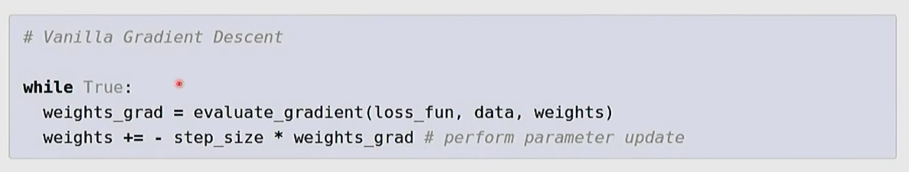
  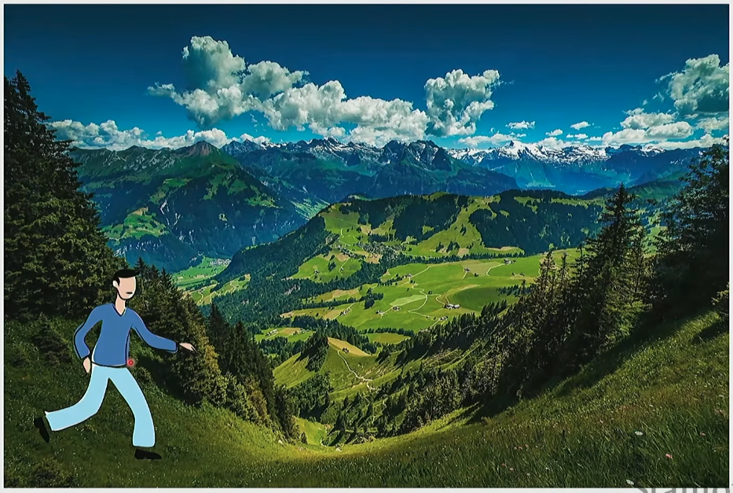

- what is the learning rate in gradient descent (or other optimizers)?
  - the learning rate (also called step size) is one of the most important hyperparameters in gradient descent.
  - the learning rate controls how big a step gradient descent takes each time it updates the weights.
  - ✔ small η → tiny steps
  - ✔ large η → big steps
  - intuition:
    - if your steps are too big → you overshoot, bounce around, or even fly off the hill.
    - if your steps are too small → you move very slowly.
    - if your steps are just right → you smoothly descend to the minimum.
  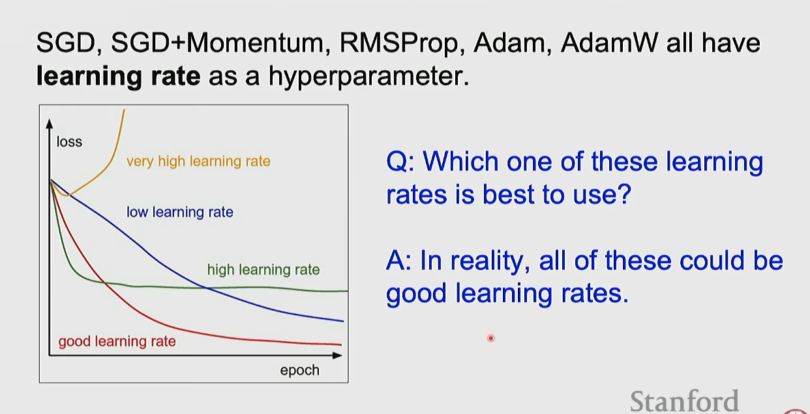
  - what you can do to improve learning rates while training?
  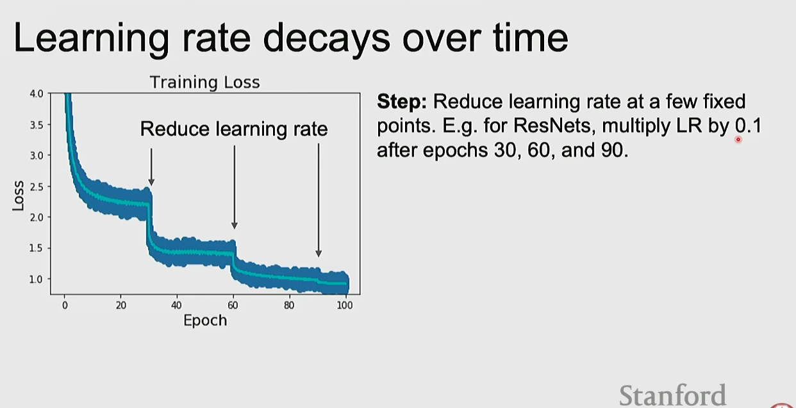
  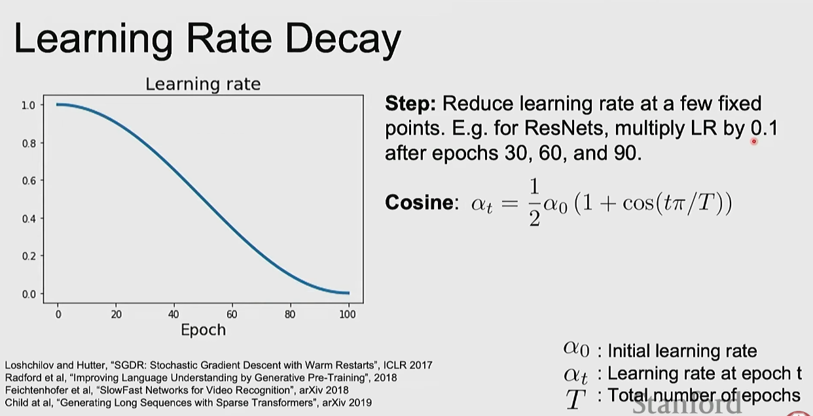
  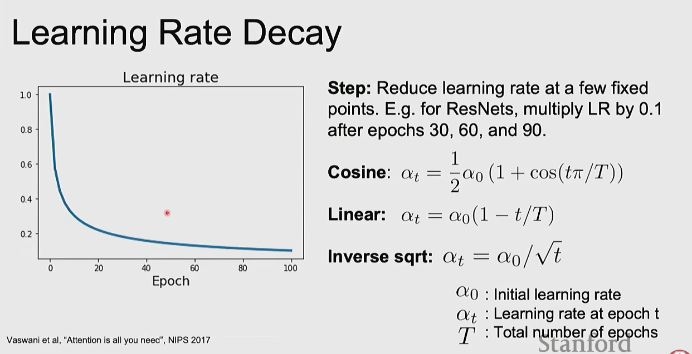
  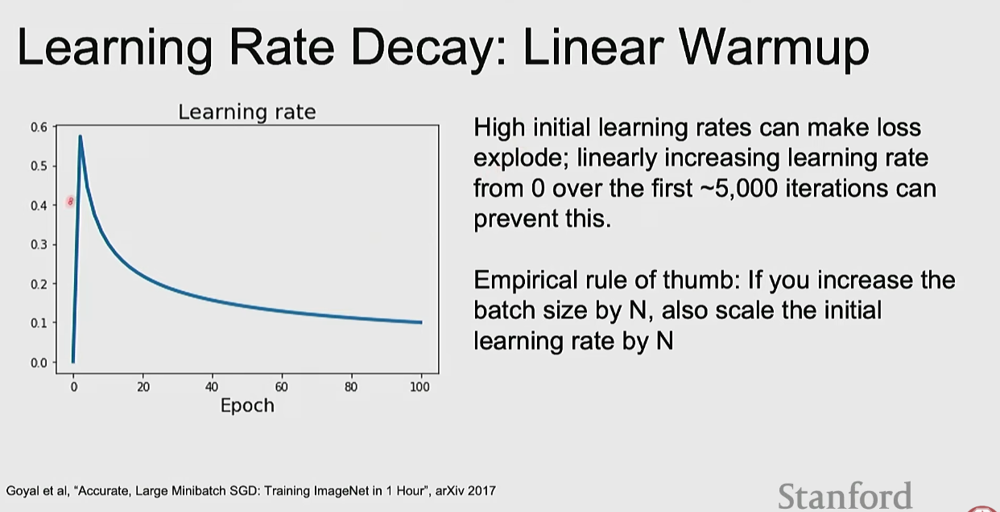

- what is stochastic gradient descent (SGD)?
  - is a type of gradient descent that updates the model using only a small random batch of data each step, making training faster and more scalable than computing the gradient on the entire dataset.
  - “stochastic” means random.
  - the gradient you compute each step is random because each minibatch is random.
  - it's not the true gradient — it's a noisy estimate.
  

- why SGD is used everywhere in deep learning?
  - ✔ much faster than full gradient descent
  - ✔ works well with huge datasets (ImageNet, etc.)
  - ✔ the noise helps escape poor minima and improves generalization
  - ✔ works well with GPU batching
  - ✔ all modern optimizers (Adam, RMSprop, Momentum) are built on top of SGD

- what are some of the problems of SGD?
  
  1. very slow progress along shallow dimension, jitter along steep direction.
    
  2. zero gradient, gradient descent gets "stuck". for example in a saddle point, the gradient is zero in all directions, so you could get stuck...
    
    
  3. our gradients come from minibatches so they can be noisy! look at the path it follows, is messy...
    

- what is SGD with momentum?
  - it helps SGD to:
    - escape saddle points
    - reduce oscillations
    - move faster along shallow but consistent slopes
    - converge faster and more smoothly
  

- what is RMSProp?
  - RMSProp (Root Mean Square Propagation) is an adaptive learning rate optimization algorithm commonly used when training neural networks. It was proposed by Geoffrey Hinton.

- what is Adam optimizer?
  - Adam (Adaptive Moment Estimation) is one of the most popular optimization algorithms for training neural networks. Think of it as a combination of Momentum + RMSProp, with some extra fixes.
  - first_moment → average of gradients (momentum) “where we were heading”
    - first_moment to get a smooth direction
    - 90% = “where we were heading”
  - second_moment → average of squared gradients (RMSProp)
    - second_moment to get a per-dimension normalized step size
    - 10% = “new gradient direction”
  
  
  
  

- what is the difference between AdamW and Adam?
  - **Adam** weight decay is applied inside the gradient → gets distorted by momentum/RMS scaling.
  - **AdamW** weight decay is applied outside the gradient → pure, correct shrinking of weights.
  

- what is weight decay?
  - is a regularization technique used during training to keep neural network weights small so the model doesn’t overfit.
  - weight decay = shrinking the weights a tiny bit on every update.
  - without weight decay: `x ← x - learning_rate * gradient`
  - with weight decay (strength λ):
    - `x ← x - learning_rate * gradient`
    - `x ← x - learning_rate * λ * x`
  - why do we want weights to be small?
    - large weights make the model very flexible → risk of memorizing training data
    - small weights produce smoother, simpler functions → better generalization
    - prevents exploding weights
    - works like L2 regularization
  - 🎯 Weight decay = L2 regularization
    - if you add an L2 penalty to the loss: `loss_total = loss + λ * ||x||²`
    - and take gradient steps, you get the same “shrinking” effect.
    - so weight decay is basically a practical version of L2 regularization inside the optimizer.
    - (normally the L2 regularization it is part of the loss function.)

- what is an optimizer?
  - in machine learning, an optimizer is an algorithm that adjusts a model’s parameters (weights and biases) to reduce the error between the model’s predictions and the true targets.
  - optimizers are just teaching "styles":
    - SGD = reacts immediately to your advice
    - Momentum = remembers past advice
    - RMSProp = slows down when advice becomes too wild
    - Adam = combines both remembering + slowing down
    - AdamW = Adam but with healthier habits
  

- what are second-order optimizations? and why are there not use in deep learning?
  - let's start with some intuition...
  - imagine you're hiking down a mountain and trying to reach the lowest point (the minimum).
  - you want to know:
    - which direction should I walk? → this is the gradient (first derivative).
    - how steep or curved is the ground around me? → this is the Hessian (second derivative).
  - so...
  - 🔵 first order methods (like SGD, Adam) they only use the gradient!
    - “the slope goes down to the right → take a step right.”
  - 🟢 second-order methods (like Newton’s Method) they also use the curvature:
    - “Not only is the slope going right,
    - but the ground curves upward/downward this much
    - → so here is the exact best step to jump to the bottom.”
    - this requires the **Hessian matrix**, which measures curvature.
  - this means with second-order info, the optimizer can:
    - take bigger steps when the landscape is flat
    - take smaller steps when the landscape is curved
    - jump straight to minima in a few steps for simple problems
    - remove the need for learning rate tuning
  - sounds perfect, right?
  - so why don’t we use them in deep learning?
    - the Hessian is huge (too big to compute)
      - 100,000 parameters → Hessian is a 100,000 × 100,000 matrix
      - GPT-3 has 175 billion parameters → Hessian would have
      - 175,000,000,000 × 175,000,000,000 entries 🤯
    - computing it is extremely expensive
      - computing a Hessian requires: i) second derivatives, ii) many passes through the model, iii) tons of memory
      - in practice: 1000× slower or worse.
    - deep learning landscapes are not like smooth bowls
      - chaotic, non-convex, full of saddle points
      - The Hessian can be:
        - singular (not invertible)
        - extremely noisy
        - impossible to approximate reliably
    - overfitting
      - second-order methods tend to overfit because they aggressively fit the curvature of the training data.
  
  

- how does a two layer neural network looks like?
  - x input vector ℝᴰ
  - D — input dimension
    - this tells you how many numbers are in your input vector x.
  - H — hidden layer size
    - the number of neurons in the hidden layer.
  - C — number of classes
    - usually the output dimension for classification.
  - W₁ first-layer weights ℝᴴ×ᴰ
  - W₂ second-layer weights ℝᶜ×ᴴ
  - h = max(0,h) - is important to add non-linearity to the network
  
  - why do we want non-linearity?
  
  - you can keep adding layers...
  

- using more layers, the neural network can learn more templates:
 

- what happen if we try to build a neural network without an activation function?
 

- what are activations functions?
  - activation functions are mathematical functions used inside neural networks to introduce non-linearity.
  - without activation functions → a neural network is just a linear model.
  

- architecture and minimal implementation of a neural network:
  
  
  

- what does more neurons in a neural network usually means?
  

- as a rule of thumb, do not use the size of a neural network as a "regularizer". use a stronger regularization instead:
  

- neural networks playground:
  - https://playground.tensorflow.org/
  - https://cs.stanford.edu/people/karpathy/convnetjs/demo/classify2d.html

- similarities between our brain neurons and a neural network:
  
  
  
  

- what is the problem of computing gradients in a neural network?
  - manually computing gradients requires lots of messy matrix calculus.
  - changing anything (loss function, model structure) means re-deriving everything again.
  - for realistic neural networks, manual derivation is impossible and unscalable.
  - therefore: we need automatic differentiation, not hand-written gradients.
  - even a small 2-layer network (W₂ · ReLU(W₁x)) already produces complex derivatives!
  - loss = hinge loss + regularization → more things to differentiate.
  - to train the model we need ∂L/∂W₁ and ∂L/∂W₂, but computing them manually is difficult.
  - this motivates **backpropagation**: an algorithm to compute gradients automatically.
  - 

- so what is the alternative? "backpropagation" to the rescue!
  
  
  

- in a neural network, “parameters” means ONLY the learnable weights and biases:
  - W1, W2
  - biases b1, b2
  - these are what gradient descent updates.

- parameters = learnable values (weights, biases).
- nodes = everything in the computation graph (inputs, additions, multiplications, activations).
- backprop computes gradients for all nodes, but only uses the gradients of parameters to update the model.


- important points to remember for backpropagation:
  - first pass: We evaluate the function (the forward pass).
  - second pass: We go backwards using the chain rule. the “upstream gradient” is simply the gradient that has been accumulated up to this point.
  - local gradient: This is just the derivative of the current operation with respect to its inputs.

- modularized implementation: forward / backward API
  
  
  - PyTorch sigmoid layer:
    
    
    

- vector derivatives
  - derivative = “if I nudge x, how does y move?”
  - gradient = “if i nudge each coordinate of x, how does y move?”
  - jacobian = “if i nudge each coordinate of x, how does each coordinate of y move?”
  
  
  
  
  
  - backprop = repeated application of the vector chain rule
  - the vector chain rule requires the Jacobian
  - ReLU’s Jacobian happens to be diagonal (so it’s easy)
  - neural networks never build Jacobian matrices explicitly, but the concept explains how gradients flow

- in backpropagation remember the following:
  - forward: compute the loss
  - backward: compute the gradients
  - and the update phase uses the gradients to change your weights.

- ICLR is a real, major academic conference in machine learning — especially focused on representation learning / deep learning.
  - ICLR publishes research on topics like representation learning, optimization, neural networks, etc.
  - Website: https://iclr.cc/
  

- different ways of doing image classification:
  - linear classifier:
    
  - image features (old way):
    
    - color histogram
    
    - histogram of oriented gradients (HoG):
    
    - so... the idea was to "mix" many features and try to classify the image:
    
  - end to end neural network:
    

- since all the all pixels are stacked into a single long vector, the spatial structure of images is destroyed.
  - what is lost?
    - local patterns
    - edges
    - shapes
    - spatial relationships
- CNNs solve this by keeping the image as a 2D grid and using special operations that respect spatial structure.
  - convolution = sliding small filters over the image to detect patterns.
  - CNNs dominated all vision tasks between ~2012 - 2020
  - the word “convolutional” comes from the noun “convolution” and means something twisted, complicated, or folded together.
  - in math, a convolution is when you:
    - take a small function,
    - slide it across another function,
    - combine their values by overlapping.
  - so two things "fold into each other" as one slides over the other...
  
  
  - [Gradient-based learning applied to document recognition](http://vision.stanford.edu/cs598_spring07/papers/Lecun98.pdf)
  
  - [ImageNet Classification with Deep Convolutional Neural Networks "AlexNet"](https://proceedings.neurips.cc/paper_files/paper/2012/file/c399862d3b9d6b76c8436e924a68c45b-Paper.pdf)
  
  - [Faster R-CNN: Towards Real-Time Object Detection with Region Proposal Networks](https://arxiv.org/pdf/1506.01497)
  
  - [Deep Visual-Semantic Alignments for Generating Image Descriptions](https://arxiv.org/pdf/1412.2306)
  
  - [High-Resolution Image Synthesis with Latent Diffusion Models](https://arxiv.org/pdf/2112.10752)
  
  - [Attention Is All You Need](https://proceedings.neurips.cc/paper_files/paper/2017/file/3f5ee243547dee91fbd053c1c4a845aa-Paper.pdf)
  - [An Image is Worth 16x16 Words: Transformers for Image Recognition at Scale](https://arxiv.org/pdf/2010.11929)
  

- a fully connected layer looks at the entire image at once, while a convolutional layer looks at local regions using small filters, slides them across the image, and stacks their responses into a multi-channel feature map.
  
  
  
  
  
  

- for CNNs we sometimes work with batches for images instead of a single image:
  
  

- a ConvNet is a neural network with a bunch of convolutional layers!
  
  - we need to add activation layers in between, because a composition of convolutional layers is still linear, so there won’t be any difference compared to having just one layer.
  

- what does the ConvNet learn?
  
  
  
  

- how to calculate the spatial dimensions of a convolution?
  
  
  
  

- what is the receptive field?
  - the receptive field tells you how much of the original image affects a particular neuron in a deep layer. The more layers you stack, the larger the part of the image each neuron “sees.”
  - in this CNN context, a “neuron” simply means: a single value (or cell) in a feature map, so:
    - one pixel in the input image,
    - or one pixel in a hidden feature map,
    - or one pixel in the final output map.
  - all of these are neurons in a convolutional neural network.
  
  
  
  

- what is a strided convolution?
  - a strided convolution moves the filter in larger steps, which downsamples the image (reduces its spatial size) while still extracting features.
  - think of a camera scanning an image:
    - stride 1 = take a picture at every pixel
    - stride 2 = take a picture every 2 pixels → fewer pictures → smaller output
  - in this example the filter move like this:
    - (0,0) → (0,2) → (0,4)
    - (2,0) → (2,2) → (2,4)
    - (4,0) → (4,2) → (4,4)
  

- convolution examples:
  
  
   feature maps in a CNN while keeping the important information.
  - they don’t learn anything — they just apply a fixed rule like max or average.
  - note that max pooling introduces non-linearity, so you may not need ReLU after a max-pooling operation.
  - if it is average pooling, this is a linear operator, which means you will probably need a ReLU afterward.
  
  

- pooling summary:
  

- what is translation equivariance?
  - translation equivariance means the network recognizes the same features even if the object moves to a different spot in the image.
  - 🐸 intuition from the frog image:
    - you take an image of a frog.
    - you shift it a bit to the right or down.
    - you apply a convolution or pooling.
    - the features (edges, textures, patterns) you detect simply shift to the new place, but stay the same.
  
  
  

- what are the components of CNNs?
  

- [Layer normalization](https://arxiv.org/pdf/1607.06450) (LayerNorm):
  - is a normalization method that normalize each sample’s features to stabilize training and make the network learn faster.
  - you take one training example at a time.
  - you compute the mean and standard deviation across its features.
  - you do not look at other examples in the batch.
  - each sample is normalized independently.
  - example:
    - input (2 samples, 3 features):
    - x =
    - [ 1   2   3 ]
    - [ 4   5   6 ]
    - sample 1: [1 2 3]
    - mean = 2
    - std  = 1
    - normalized = [ (1-2)/1 , (2-2)/1 , (3-2)/1 ]
    - = [ -1 , 0 , 1 ]
  

- Other normalization methods:
    
    - all of this normalization are in `torch.nn`
      - `nn.BatchNorm2d(num_features=2)`
      - `nn.LayerNorm(normalized_shape=[2, 2, 2])`
      - `nn.InstanceNorm2d(num_features=2, affine=True)`
      - `nn.GroupNorm(num_groups=1, num_channels=2)`
    - [Group Normalization](https://arxiv.org/pdf/1803.08494)

- What is regularization Dropout?
  - dropout is a technique where, during training, we randomly:
    - turn off (set to zero) some neurons
    - with a certain probability (e.g., 0.5)
  - [Dropout: A Simple Way to Prevent Neural Networks from Overfitting](https://www.jmlr.org/papers/volume15/srivastava14a/srivastava14a.pdf)
    
  - why does Dropout help with overfitting?
    - it prevents neurons from relying on each other too much
      - without dropout, neurons can "co-adapt":
      - neuron A always relies on neuron B
      - so the model memorizes patterns too closely → overfitting
    - it acts like training many different networks at once
      - because each training pass has a different subset of active neurons, dropout:
    - it adds noise during training → makes the model more robust
      - randomly removing neurons adds noise to internal representations.
      - this prevents the model from memorizing the training data.
    - pytorch: `self.drop = nn.Dropout(p=0.5)`
  - how can this possibly be a good idea?
    
    
    

- What is the goal of activation functions?
  

- In which regions does sigmoid have a small gradient?
  
  
  - this saturation issue is why "ReLU" became really popular:
  - in sigmoid when neurons receive large positive or negative inputs:
    - they move into the “flat” part of the sigmoid
    - their gradient almost disappears
    - gradients vanish during backpropagation
  
  - ReLU is not perfect... since for gradient of negative numbers we have always 0, to improve on this:
  - GeLU is the main activation function use in transformers today
  
  - the activation function zoo:
  
  - where are activations used in CNNs?
  

- number of layers vs. error rate for the ImageNet winners:
  
  

- in AI we plot architectures using block diagrams as the one below.
- each block represents a layer or a group of layers
- helps to gain intuition of the different layers with a glance
  
- what is the effective receptive field of three 3x3 conv (stride 1) layers?
  - stack of three 3x3 conv (stride 1) layers has the same effective receptive field as one 7x7 conv layer
    
    
    
    
    
  - it has fewer parameters as well:
    

- why deeper models sometimes perform worse than shallower models?
  
  
  - ResNet helps deep networks learn better by letting each block only learn what changed, not everything from scratch:
  
  
  - RestNet architecture:
  

- what happens if you initialize your neural network with weights that are **too small**?
- using weights that are too small causes activations to shrink toward zero in deep networks, making learning impossible.
- deep networks need signals to flow forward through layers.
- if the weights are too small:
  - the signal keeps shrinking
  - after many layers, the numbers get close to zero
  - the network outputs almost nothing
  - gradients during training also become tiny
    - → The network cannot learn
  - this problem is called vanishing activations (related to vanishing gradients).
  

- what happens if you initialize your neural network with weights that are **too large**?
- if weights are slightly too large, the network amplifies values every layer until everything becomes huge and unstable, making training impossible.
- this is called **activation explosion** or **blowup**.
- so...
- 🔹 Weights too small → activations shrink to zero.
- 🔺 Weights too large → activations explode (blow up).
  - if W is 5× larger than before:
    - each dot product becomes 5× larger
    - after layer 2, it's ~25× larger
    - after layer 3, ~125×
    - after layer 4, ~625×
  

- a solution for initializing the weights: Kaiming / MSRA initialization
  - [Delving Deep into Rectifiers: Surpassing Human-Level Performance on ImageNet Classification](https://arxiv.org/pdf/1502.01852)
  - this method chooses the standard deviation of the weights so that:
    - after multiplication by the weight matrix
    - and after the ReLU
  - ...the output activations stay at the same scale as the input activations.
  
  - pytorch uses He/Kaiming initialization by default in many layers (e.g., nn.Conv2d, nn.Linear when using ReLU).
  - and you can apply it manually: `torch.nn.init.kaiming_uniform_(tensor, a=0, mode='fan_in', nonlinearity='relu')`
  - other methods:
    - `torch.nn.init.xavier_uniform_(tensor)`
    - `torch.nn.init.orthogonal_(tensor)`
    - `torch.nn.init.constant_(tensor, value=0.1)`
    - `torch.nn.init.uniform_(tensor, a=-0.1, b=0.1)`
    - `torch.nn.init.normal_(tensor, mean=0.0, std=0.02)`
  - why pytorch prefers Kaiming for ReLU networks?
    - because ReLU networks dominate modern deep learning, and He initialization:
    - prevents vanishing activations
    - prevents exploding activations
    - keeps gradients stable
    - enables training of very deep networks (ResNets, VGG, etc.)

- why do we need image normalization in neural networks?
  - neural networks work best when their inputs are well-behaved numeric distributions.
  - raw images are not well-behaved:
    - pixel values are typically 0–255
    - different channels (R, G, B) have different brightness distributions
    - variance across channels can differ a lot
  - normalization fixes these issues.
  - `norm_pixel[i,j,c] = (pixel[i,j,c] - mean[c]) / std[c]`
    - mean for R, G, B
    - std for R, G, B
  - benefits:
    - makes optimization easier (gradient descent becomes stable)
      - converges faster
      - less likely to explode or vanish gradients
    - prevents one channel from dominating others
      - example: in many datasets, the green channel has higher average intensity than red or blue.
    - makes training more consistent across images
      - makes the model focus on actual structure, not brightness differences.
    - allows pretrained models to work correctly
      - pretrained models like: ResNet, VGG, EfficientNet
      - if your input is not normalized with the same values:
        - performance drops
        - features don’t match what the model expects
  - because every image must be individually preprocessed, many practitioners rely on precomputed normalization values to make the process faster and more efficient.
  

- regularization injects randomness during training but removes it during inference.
  - why?
    - randomness during training → prevents overfitting
    - no randomness during testing → stable, deterministic predictions
    - averaging effect → smoother, more generalizable model
  

- data augmentation: increasing the size of your dataset
  
  
  
  
  

- what if you don't have a lot of data? can you still train a CNNs?
  - yes, with transfer learning...
  
  
  
  

- guidelines to choose hyperparameters:
  
  
  
  
  
  - in practice selecting randomly hyperparameters work better than grid-based:
  - [Random Search for Hyper-Parameter Optimization](https://www.jmlr.org/papers/volume13/bergstra12a/bergstra12a.pdf)
  

- evaluate models and tune hyperparameters
  
  - https://wandb.ai/site/
  - https://www.tensorflow.org/tensorboard

- what is a recurrent neural network (RNN)?
  - a recurrent neural network (RNN) is a type of neural network designed to process sequential data—that is, data where the order of elements matters.
  - unlike a standard neural network (which only looks at the current input), an RNN has a loop inside it.
  - this loop allows the network to remember information from previous steps in the sequence.
  - so at time step t, an RNN takes:
    - the current input x<sub>i</sub>
    - the previous hidden state h<sub>t-1</sub> (its memory)
  - and produces:
    - a new hidden state h<sub>t</sub>
    - and sometimes an output y<sub>t</sub>
  
  
  
  
  
  
  
  
  

- what is vanilla RNN?
  - a vanilla RNN (also called a simple RNN or Elman RNN) is the most basic form of a recurrent neural network.
  - it’s the simplest version of an RNN before more advanced architectures like LSTMs and GRUs were invented.
  - a vanilla RNN computes its hidden state at each timestep using this formula:
  

- what is a “hidden state” in an RNN?
  - the hidden state h<sub>t</sub> is the internal memory of the RNN at time step t.

- why is it called "hidden"?
  - the hidden state is called “hidden” because:
    - it is not provided by the user, is created internally by the network.
    - it is not directly part of the output.
    - it represents internal computation / memory.
    - basically:
      - ✔ input = visible
      - ✔ output = visible
      - ✖ hidden state = internal, not exposed → “hidden”

- manually creating a RNN for detecting repeated 1s:
  
  
  
  

- key idea for the loss:
  - when the model outputs a sequence, you compute a loss at every output.
  - when the model outputs one prediction, you compute only one loss.
  - all losses are summed together and backpropagated through time.
  
  
  
  
  
  
  

- Backpropagation Through Time (BPTT)
  - compute outputs and losses for all time steps in the sequence.
  - sum all losses into one total loss.
  - backpropagate the gradient through the entire sequence (from last step to first).
  - accurate but slow, memory-heavy, and prone to vanishing/exploding gradients.
  

- Truncated Backpropagation Through Time (TBPTT)
  - forward pass runs through the whole sequence normally.
  - but gradients are only backpropagated through a small window of recent steps.
  - faster and more stable, but gives only an approximate gradient.
  - still allows long-term information to flow via hidden states.
  
  
  

- a practical example to predict language using RNNs:
  - [Minimal character-level language model with a Vanilla Recurrent Neural Network, in Python/numpy](https://gist.github.com/karpathy/d4dee566867f8291f086)
  
  
  
  
  
  

- some applications of RNNs:
  - [Visualizing and Understanding Recurrent Networks”](https://arxiv.org/pdf/1506.02078)
  
  
  
  

- RNN tradeoffs:
  

- RNN success cases:
  - image captioning:
    - [Explain Images with Multimodal Recurrent Neural Networks](https://arxiv.org/pdf/1410.1090)
    - [Deep Visual-Semantic Alignments for Generating Image Descriptions](https://cs.stanford.edu/people/karpathy/cvpr2015.pdf)
    - [Show and Tell: A Neural Image Caption Generator](https://arxiv.org/pdf/1411.4555)
    - [Long-term Recurrent Convolutional Networks for Visual Recognition and Description](https://arxiv.org/pdf/1411.4389)
    - [Learning a Recurrent Visual Representation for Image Caption Generation](https://arxiv.org/pdf/1411.5654)
    
    
    
    
    
  - visual question answering (VQA)
    - [VQA: Visual Question Answering](https://www.iro.umontreal.ca/~agrawal/VQA_ICCV2015.pdf)
    
  - visual dialog: conversation about images
    - [Visual Dialog](https://arxiv.org/pdf/1611.08669)
    
  - visual language navigation: go to the living room
    - [Reinforced Cross-Modal Matching and Self-Supervised Imitation Learning for Vision-Language Navigation](https://arxiv.org/pdf/1811.10092)
    

- Multilayer RNNs
  - a Multilayer RNN (also called a stacked RNN) is an RNN architecture where multiple recurrent layers are placed on top of each other, allowing the network to learn more complex temporal patterns.
  

- what is an LSTM?
  - [LONG SHORT-TERM MEMORY](https://www.bioinf.jku.at/publications/older/2604.pdf)
  
  
  
  
  
  
  
  
  
  - note this behaviour of skipping layers of LSTM is similar to ResNet!
  
  - an LSTM (Long Short-Term Memory) is a special type of RNN designed to remember information for long periods of time and to avoid the vanishing gradient problem that affects vanilla RNNs.
  - this saw a lot of success before the transformer revolution!
  - a vanilla RNN updates its hidden state like this: h<sub>t</sub> = tanh(W[h<sub>t-1</sub>, x<sub>t</sub>])
  - gradients often vanish → model “forgets” long-term dependencies
  - sometimes gradients explode
  - as a result, vanilla RNNs struggle with sequences longer than ~10–20 steps.
  - an LSTM introduces gates and a cell state that allow it to store, erase, and control information explicitly.
  - the LSTM computes:

    

    - i = input gate
    - f = forget gate
    - o = output gate
    - g = candidate update
  - then.. the cell updates:

    

  - and the hidden state is:

    

  - 🧠 intuition:
    - think of LSTM as having a memory cell:
      - **forget gate:** should I erase old memory?
      - **input gate:** should I store new information?
      - **cell state:** long-term memory highway
      - **output gate:** How much memory should I show to the next layer?
  - the symbol ⊙ means element-wise multiplication, also called the Hadamard product.
  - if you have two vectors of the same size:
  - a=[a<sub>1</sub>,a<sub>2</sub>,a<sub>3</sub>],b=[b<sub>1</sub>,b<sub>2</sub>,b<sub>3</sub>]
  - a ⊙ b=[a<sub>1</sub>b<sub>1</sub>,a<sub>2</sub>b<sub>2</sub>,a<sub>3</sub>b<sub>3</sub>]

- do LSTMs solve the vanishing gradient problem?
  - it definitely helps!
  - the LSTM architecture makes it easier for the RNN to preserve information over many timesteps.
  - LSTM doesn't guarantee that there is no vanishing/exploding gradient, but it does provide an easier way for the model to learn long-distance dependencies.
  

- Modern RNNs:
  - unlimited context length! big advantage over transformers...
  - compute scales linearly with sequence length, contrary to transformers which is quadratic!
  - an important research question currently is how can you get the performance of transformers with the scale of RNNs
  - [RWKV: Reinventing RNNs for the Transformer Era](https://arxiv.org/pdf/2305.13048)
  - [Simplified State Space Layers for Sequence Modeling](https://arxiv.org/pdf/2111.00396)
  - [Mamba: Linear-Time Sequence Modeling with Selective State Spaces](https://arxiv.org/pdf/2312.00752)
  

- RNNs summary:
  - RNNs allow a lot of flexibility in architecture design
  - vanilla RNNs are simple but don't work very well
  - more complex variants (e.g. LSTMs, Mamba) can introduce ways to selectively pass information forward
  - backward flow of gradients in RNN can explode or vanish. exploding is controlled with gradient clipping. backpropagation through time is often needed.
  - better/simpler architectures are a hot topic of current research, as well as new paradigms for reasoning over sequences.

- transformers are used everywhere today!
  - attention and self-attention ideas where born from RNN
  

- Sequence to Sequence with RNNs
  - the diagram shows the classic Sequence-to-Sequence (Seq2Seq) model introduced by Sutskever, Vinyals, and Le (2014), used for machine translation, summarization, and many other tasks.
  - it has two main parts:
  - 🧠 intuition: the model tries to "compress" the entire first sentence into one vector **c**.
  - this is a limitation — later solved by attention mechanisms.
  - 🟦 1. Encoder
    - input sentence: we → see → the → sky
    - each word is fed into an RNN (e.g., LSTM or GRU): h<sub>t</sub> = f<sub>W</sub>(x<sub>t</sub>, h<sub>t-1</sub>)
      - x<sub>t</sub>: input word embedding at time step t
      - h<sub>t</sub>: hidden state at t
      - f<sub>W</sub>: the RNN cell
    - the encoder processes all inputs and produces the final hidden state h<sub>T</sub>
    - then... the final state becomes
      - initial decoder state s<sub>0</sub>
      - context vector c (often equal to h<sub>T</sub>)
  - 🟥 2. Decoder
    - goal: produce an output sentence (e.g., translation)
    - output sentence: vediamo → il → cielo → [STOP]
    - the decoder is another RNN: s<sub>t</sub> = g<sub>U</sub>(y<sub>t-1</sub>, s<sub>t-1</sub>, c)
    - so... at each time step the decoder receives:
      - its previous output token y<sub>t-1</sub>
      - previous hidden state s<sub>t-1</sub>
      - the context vector c
    - and it predicts the next token y<sub>t</sub>
    
  - [Sequence to Sequence Learning with Neural Networks](https://arxiv.org/pdf/1409.3215)
  - what is the initial decoder state s0? How is it defined?
    - s<sub>0</sub> is the decoder's initial hidden state
    - generally you can initialize both to h<sub>T</sub>, in the original 2014 Seq2Seq model paper that was the case
    - in modern Seq2Seq models is a design choice and could be done differently...

  - what does “t” mean in “hidden state at time t”?
    - in RNNs, t = time step index in the sequence.
    - t = 1 → we (h<sub>1</sub> is the hidden state after reading “we”)
    - t = 2 → see (h<sub>2</sub> is the hidden state after reading “see”)
    - t = 3 → the (h<sub>3</sub> is the hidden state after reading “the”)
    - t = 4 → sky (h<sub>4</sub> is the hidden state after reading “sky”)
    - RNNs process sequences one element at a time, so each step is like a “moment in time.”

  - what does an RNN cell mean?
    - an RNN cell is the repeating unit that processes each time step.
    - mathematically: h<sub>t</sub> = f<sub>W</sub>(x<sub>t</sub>, h<sub>t-1</sub>)
    - where **f** is some function defined by the RNN architecture.
    - depending on the model:
      - simple RNN cell: h<sub>t</sub> = tanh(Wx<sub>t</sub>, Uh<sub>t-1</sub>)
      - LSTM cell: more complex internal structure (input gate, forget gate, output gate).
      - GRU cell: simplified version of LSTM (update/reset gates).

  - what is g<sub>U</sub> in the decoder equation?
    - for the equation: g<sub>U</sub>(y<sub>t-1</sub>, s<sub>t-1</sub>, c)
    - g<sub>U</sub> is the RNN cell function used in the decoder.
    - it takes three inputs:
      - the previous output token y<sub>t-1</sub>
      - the previous decoder hidden state s<sub>t-1</sub>
      - the context vector c
    - it outputs:
      - the new decoder hidden state s<sub>t</sub>

- what is the problem with the context vector c?
  - the entire input sequence is compressed into a single vector c.
  - that means:
    - no matter if the input is 5 words or 500 words
    - the encoder outputs one fixed-size vector
    - the decoder must rely only on this vector to generate the entire output sequence
  - this creates a severe information bottleneck!!
  - 🚨 problem 1: fixed-size vector cannot store long sequences
    - this is like compressing an entire book into a single sentence and expecting someone to recreate the book from that sentence.
  - 🚨 problem 2: long-range dependencies are lost
    - the encoder will tend to forget early parts of the sentence.
  - 🚨 problem 3: decoder has no access to individual encoder states
    - the decoder see only **c**, it does not see h<sub>1</sub>, h<sub>2</sub>, h<sub>3</sub>
    - so it can't selectively focus on important parts of the input
    - human analogy: you read an entire paragraph and then someone takes the text away and asks you to translate it from memory.
  - 🚨 problem 4: performance collapses as sentence length increases
    - Seq2Seq works well for short sentences (5–15 words)
    - performance drops sharply for long sentences (>30 words)
  - 📌 in summary: the context vector c is a bottleneck because it forces the whole input sequence into a fixed-size vector,
  - which cannot hold detailed information for long sequences or complex relationships.
  
  


- now we add "attention":
  - [Neural machine translation by jointly learning to align and translate](https://arxiv.org/pdf/1409.0473)
  - aren’t we still producing a single vector? how is this different from producing one context vector?
    - before there was one context vector for the entire output sequence, it never changed.
    - this single vector had to encode EVERYTHING about the input.
    - with attention there is a new context vector for every decoder step: c<sub>1</sub>, c<sub>2</sub>, c<sub>3</sub> ... c<sub>T</sub>
    - each c<sub>t</sub>:
      - is created differently
      - depends on what the decoder is currently trying to output
      - uses all encoder states, not just the last one
    - 🧠 intuition:
      - before attention: you read a paragraph → someone takes it away → you translate everything from memory.
      - with attention: you read a paragraph → you can look back at any word whenever you want while translating.
  - what are alignment scores e<sub>t</sub><sub>i</sub>?
    - they measure how relevant encoder state h<sub>i</sub> s to generating the next decoder word at time t.
  - how are attention weights a<sub>t</sub><sub>i</sub> computed?
    - softmax normalizes the scores so they sum to 1 and behave like probabilities.
  - does the decoder only use the highest-weight encoder state?
    - no, attention uses the full weighted sum — not just the top one.
  - what does it mean to “attend” to a word?
    - the attention weight for that word is highest, so it influences the output most strongly.
  - how attention blends information?
    - imagine blending colors:
      - 64% red
      - 24% blue
      - 8% yellow
      - 3% green
    - the final color is mostly red, but still influenced by all colors.
    - attention works exactly like this — a **soft blend**, not a hard choice.
  - why not pick only the max-weight encoder state?
    - that would be hard attention, which is not differentiable. soft attention allows smooth training by backpropagation.
  - what is “hard attention”?
    - instead of computing a soft weighted sum over all encoder states...
    - the model chooses exactly one encoder state based on the highest score.
    - it is like doing argmax!
    - argmax is not differentiable.
    - argmax outputs a discrete integer (0, 1, 2, 3...)
    - the sudden jumps in argmax mean you cannot compute a smooth gradient.
    - that is why instead of argmax, soft attention uses softmax, which is differentiable!
    - 🎨 analogy:
      - hard attention is like a light switch:
        - on/off
        - sudden jumps
        - no smooth change → no gradient
      - soft attention is like a dimmer knob:
        - smooth transitions
        - you can compute how much to adjust it
        - gradients make sense
  
  
  
  
  
  
  
  

- generalizing the attention layer:
  
  
  - think of the attention Layer not as a math equation, but as a information retrieval system—like a highly specific Google search or a library filing system.
    - query (Q) = your search question
    - keys (K) = titles of documents
    - values (V) = the actual content of those documents
  - 🟦 STEP 1 — Inputs
    - Query vector: Q
      - What am I trying to find?
    - Data vectors: X
      - the set of things you want to look through (in Transformers: the input tokens as word embeddings)
    - Key matrix W<sub>k</sub>
    - Value matrix W<sub>v</sub>
  - 🟥 STEP 2 — Compute Keys and Values
    - transform the input data X:
      - K = XW<sub>K</sub>
      - V = XW<sub>V</sub>
      - $\mathbf{W}_{K}$ and $\mathbf{W}_{V}$ are the parameters (weights) that the neural network learns during training.
    - this lets the network learn what makes a good "label" vs. good "content":
      - say your input X is word embeddings — each word is just a vector of numbers that captures "what this word means" in some general sense.
      - but for attention to work well, you need two different things:
        - something good for comparison — "does this match what I'm looking for?"
        - something good for output — "what information should I actually pass forward?"
      - these are different jobs! There's no reason the same vector should be optimal for both.
      - so when you compute the products:
        - K = XW<sub>K</sub>
        - V = XW<sub>V</sub>
      - you're creating two different transformations of the same input.
        - W<sub>K</sub> learns: "What features of this word make it a good match target?"
          - 🧠 intuition: earns how to write good labels on the folders (so you can find the right one)
        - W<sub>V</sub> learns: "What information should this word contribute when it's attended to?"
          - 🧠 intuition: learns how to write good summaries inside the folders (so you get useful info when you open it).
    - 🟩 STEP 3 — Compute Similarity (Query vs Keys)
      - the layer takes a Query vector ($Q$)—which represents what the model is currently focusing on—and compares it to every Key ($K$) using a mathematical "dot product."
      - $E = QK^T$
    - 🟨 STEP 4 — Softmax → Attention Weights
      - the raw scores from the matching game can be messy numbers.
      - the Softmax function (the box in the middle) turns these scores into probabilities (percentages) that add up to 100%.
      - These are the Attention Weights ($A$) or $a_{11}, a_{12}$... in the diagram.
    - 🟪 STEP 5 — Weighted Sum of Values
      - finally, the model creates the output by mixing the values ($V$) based on those percentages.
      - it takes 80% of the mathematical meaning of "sky", adds 15% of "blue", etc.
      - the result is a new vector ($Y$) that represents the most relevant information for the current context.

  - what is the difference between the Query ($Q$ ) and the Data Vectors ($X$)?
    - $X$ is the raw input.
    - So really: $Q = (some input) · W_{Q}$

  - what is a cross-attention layer?
    - a cross-attention layer is a type of neural network layer that operates on two distinct sets of inputs
    - both data vectors ($X$) and query vectors ($Q$) that potentially came from two different places.
    

  - what is a self-attention layer?
    - here we no longer have the separation between data vectors ($X$) and query vectors ($Q$)
    - we just have input vectors ($X$)
    
    
    - concatenating matrix multiplies
      - is typically more efficient in hardware to do fewer large matrix multiplies,
      - than is it is to do more small matrix multiplies

  - how to solve the issue when self-attention does know the order of the sequence?
    - add positional encoding to each input, this is a vector that is a fixed function of the index
    

  - what is "masked" self-attention layer?
    - a masked self-attention layer is a special version of self-attention where some positions are not allowed to see (attend to) future information.
    - override similarities with -inf; this controls which inputs each vector is allowed to look at.
    
    - why do we need masked self-attention?
      - because autoregressive models generate one token at a time:
      - when generating token #10, → the model must not look at token #11.
      - this ensures the model learns to predict the next token using only past context.

  - what is multiheaded self-attention layer?
    - a multi-headed self-attention layer is just many self-attention mechanisms running in parallel,
    - important: nowadays once you see self-attention used, is almost always "multiheaded self-attention"
    - each looking at the input in a different way, and then combining their findings.
    - it’s one of the core ideas that makes Transformers powerful.
      - 🧠 intuition:
        - imagine you examine a scene using different specialists:
          - head #1: A detective → Looks for cause–effect relations
          - head #2: A poet → Looks at emotional tone
          - head #3: A scientist → Examines numerical patterns
    - why multiple heads?
      - because different heads naturally learn to extract different types of relationships.
      - observed in real models:
        - head 3 focuses on subject–verb relationships
        - head 7 tracks matching brackets or quotes
        - head 11 follows long-range dependencies
    

  - self-attention is just four matrix multiplies!
    

  - three ways of processing sequences:
    
    - [Attention Is All You Need](https://arxiv.org/pdf/1706.03762)
    

  - what is the transformer?
    - [Language Models are Unsupervised Multitask Learners (GPT-2)](https://cdn.openai.com/better-language-models/language_models_are_unsupervised_multitask_learners.pdf)
    - [Language Models are Few-Shot Learners (GPT-3)](https://arxiv.org/pdf/2005.14165)
    - [An Image is Worth 16x16 Words: Transformers for Image Recognition at Scale](https://arxiv.org/pdf/2010.11929)
    - [Outrageously Large Neural Networks: The Sparsely-Gated Mixture-of-Experts Layer](https://arxiv.org/pdf/1701.06538)
    - [GLU Variants Improve Transformers](https://arxiv.org/pdf/2002.05202)
    - [Root Mean Square Layer Normalization](https://arxiv.org/pdf/1910.07467)
    - [Adaptive Input Representations for Neural Language Modeling](https://arxiv.org/pdf/1809.10853)
    
    
    
    
    
    
    
    
    
    
    
    
    
    
    

- transformers are the backbone of all large AI models today!
  

- vision transformers (ViT)
  
  

- common computer vision tasks
  
  - classification
  - semantic segmentation
    - for each training image, each pixel is labeled with a semantic category.
    
    
    
    
    
    
    
    
    
  - object detection
  - instance segmentation

- what are classic CNNs are naturally good at?
  - classic CNNs were designed for image classification:
  - “is there a cat in this image?”
  - for that task:
  - exact pixel location doesn’t matter
  - “cat anywhere” is good enough!
  - so when this becomes a problem?
  - some tasks are not just “what”, but what + where:
  - for example:
    - semantic segmentation → label every pixel
    - depth estimation → predict depth per pixel
    - optical flow → motion per pixel
    - autoencoders → reconstruct the image
  - these tasks need:
    - high-level meaning (from deep layers)
    - original spatial resolution
  - but pooling destroyed spatial detail!!

- so... why “unpooling” is needed at all?
  - in CNNs we often downsample feature maps using:
  - max pooling
  - strided convolutions
  - this reduces spatial size (e.g. 4×4 → 2×2) and keeps strong features, but it throws away spatial detail.
  - when we later want to:
    - reconstruct an image,
    - predict a per-pixel output (segmentation, depth, etc.),
    - we must upsample again.
    - that’s where unpooling / upsampling comes in.
  - network upsampling (“Unpooling”)
    
  - max unpooling
    - during max pooling, the network remembers where each max came from (indices).
    - these are called pooling indices or argmax positions.
    
  

- U-Net
  - state of the art results for segmentation
  - [U-Net: Convolutional Networks for Biomedical Image Segmentation](https://arxiv.org/pdf/1505.04597)
    
  - "downsampling" phase
    - increases field of view
    - lose spatial information
    
  - "upsampling" phase
    - go back to the original image resolution
    

- why we need to downsample for semantic segmentation?
  - semantic segmentation asks:
    - “what class does this pixel belong to?”
    - but a pixel alone is meaningless.
    - a single pixel could be:
      - part of a road
      - part of a wall
      - part of a car
      - shadow
      - noise
    - you cannot classify a pixel without seeing its neighborhood.
  - so...
  - we use downsampling as a mechanism for rapidly increasing the receptive field,
  - i.e. for collecting context.

- what are the issues with semantic segmentation?
  - don't differentiate instances, only care about pixels (e.g. cow, tree)
  

- the previous is why we need "instance segmentation"
  - there are cases when we must distinguish different instances
  
  

- object detection
  
  
  
  
  
  - all these methods existed because early detectors (R-CNN era) had no efficient way to answer:
    - [Selective Search for Object Recognition](http://www.huppelen.nl/publications/selectiveSearchDraft.pdf)
    - [Measuring the Objectness of Image Windows](https://calvin-vision.net/wp-content/uploads/Publications/alexe12pami.pdf)
    - [BING: Binarized Normed Gradients for Objectness Estimation at 300fps](https://mmcheng.net/mftp/Papers/ObjectnessBING.pdf)
    - [Edge Boxes: Locating Object Proposals from Edges](https://pdollar.github.io/files/papers/ZitnickDollarECCV14edgeBoxes.pdf)
  - “where might objects be?”
  - they were later replaced by: RPNs (Faster R-CNN), Anchor-based detectors and Transformer-based detectors (DETR)
  
  - [Rich Feature Hierarchies for Accurate Object Detection and Semantic Segmentation](https://arxiv.org/pdf/1311.2524)

- fast R-CNN
  - [Faster R-CNN](https://arxiv.org/pdf/1506.01497)
  - step 1: generate region proposals (external)
  - step 2: run the CNN ONCE on the full image
    - the image becomes a grid of deep features (edges, textures, parts).
  - step 3: map each RoI onto the feature map
    - ⚠️ no pixel cropping here — only feature cropping.
  - step 4: RoI Pooling (Crop + Resize features)
  - step 5: Per-RoI fully connected network
    - produces two outputs:
      - (a) Classification
      - (b) Bounding box regression: (dx, dy, dw, dh)
  - step 6: Apply box regression
    - boxes become tighter and better aligned with objects
  - step 7: post-processing
    - keep the "best" boxes
  
  


- the problem with the algorithm above is that we need to do this manual bounding box region proposal step...
- so what is the alternative?
- region proposal network (RPN):
  
  
  

- single-stage object detectors: YOLO / SSD / RetinaNet
  - YOLO: Grid-based detection, end-to-end
    - [You Only Look Once: Unified, Real-Time Object Detection](https://arxiv.org/pdf/1506.02640)
    - [YOLO9000: Better, Faster, Stronger](https://arxiv.org/pdf/1612.08242)
    - [YOLOv3: An Incremental Improvement](https://arxiv.org/pdf/1804.02767)
    
    
    
    
  - SSD: Multi-scale anchors, better small objects
    - [SSD: Single Shot MultiBox Detector](https://arxiv.org/pdf/1512.02325)
  - RetinaNet: Focal loss for dense predictions
    - [RetinaNet: Focal Loss for Dense Object Detection](https://arxiv.org/pdf/1708.02002)
    
    
  - Object Detection with Transfomers: DETR
    - DETR was the first object detector to frame detection as a direct set prediction problem using a Transformer.
    - [End-to-End Object Detection with Transformers](https://arxiv.org/pdf/2005.12872)
    
    

- what is zero-shot learning?
  - a model can recognize or perform a task on classes it has never seen during training.
  - normal (supervised) learning:
    - train on: 🐶 dog, 🐱 cat
    - test on: 🐶 dog, 🐱 cat
    - ✅ Works
  - zero-shot learning
    - train on: 🐶 dog, 🐱 cat
    - test on: 🦓 zebra
    - ✅ Still works — without ever seeing a zebra before
  - Instead of learning classes, the model learns concepts.

- instance segmentation:
  - [Mask R-CNN](https://arxiv.org/pdf/1703.06870)
  - for instance segmentation we add a small mask network that operates
  - on each RoI and predicts 28x28 binary mask
    
    
    
    
    
    
    

- visualizing networks:
  - linear classifier:
  
  - CNN:
  
  - saliency maps:
    - [Deep Inside Convolutional Networks: Visualising Image Classification Models and Saliency Maps](https://arxiv.org/pdf/1312.6034)
    - this paper introduced saliency maps, answering exactly the question on your slide:
    - “which pixels matter for this prediction?”
    - key idea:
      - compute the gradient of the class score with respect to the input image
      - large gradients ⇒ pixels that strongly influence the prediction
    
    
  - class activation mapping (CAM)
    - [Learning Deep Features for Discriminative Localization](https://arxiv.org/pdf/1512.04150)
    - this paper introduced Class Activation Mapping (CAM), which allows you to:
      - identify which image regions contribute most to a class prediction
      - do weakly supervise localization
      - visualize attention without bounding-box annotations
      - how CAM works?
        - CAM highlights image regions by weighting the last convolutional feature maps with the class-specific classifier weights.
    
    
    
    
    
  - gradient-weighted class activation mapping (Grad-CAM)
    - [Grad-CAM: Visual Explanations from Deep Networks via Gradient-Based Localization](https://arxiv.org/pdf/1610.02391)
    - generalizes CAM to any CNN architecture
    - works without architectural constraints (no need for GAP)
    - uses gradients to compute class-specific importance
    - produces coarse but semantically meaningful heatmaps
    
    
  - visualizing ViT features
     - ViT are image models that use transformers (attention) instead of convolutions as the main computation.
     - a Vision Transformer treats an image like a sequence of tokens (patches) and uses self-attention to relate all parts of the image.
       - step 1: split the image into patches
       - step 2: turn patches into vectors (embeddings)
       - step 3: add positional information
       - step 4: feed patches into a Transformer encoder
       - step 5: classification token (optional)
    - [When Vision Transformers Outperform ResNets Without Pretraining or Strong Data Augmentations](https://arxiv.org/pdf/2106.01548)
    - [Robustness & interpretability of ViTs](https://arxiv.org/pdf/2105.14030)
    

- what is video?
  - 2d images + time
  

- video classification:
  - in videos is more common to classify by "actions" instead of "classes"
  - videos are big!
    - ~30 frames per second (fps)
    - size of uncompressed video (3 bytes per pixel)
    - SD (640x480) ~ 1.5 GB per minute
    - HD (1920x1080) ~ 10 GB per minute
    - what is the solution?
      - train on short clips: low fps and low spatial resolution
        - 3.2 seconds at 5fps, 588 KB
  
  
  
  
  
  - single frame CNN:
  
  - late fusion
    - understand each frame independently, then combine the information at the very end.
    - intuition:
      - first: what is in each image?
      - later: given all those images, what is the video about?
    - how it works?
      - step 1: input video:
        - T × 3 × H × W (T frames)
      - step 2: Run the same 2D CNN on each frame independently
        - → each frame becomes a feature map:
        - D × H′ × W′
      - step 3: stack features from all frames:
        - T × D × H′ × W′
      - step 4: flatten everything into one long vector
      - step 5: feed into an MLP (fully connected layers)
      - step 6: output: class scores C
    - strengths:
      - simple and easy to implement
      - can reuse strong image CNNs (ImageNet pretrained)
      - works reasonably well when appearance dominates (e.g., “playing guitar”, “swimming”)
    - weaknesses
      - ❌ No real motion modeling
      - temporal order is mostly ignored
      - very large FC layers → many parameters
      - sensitive to number of frames
    - [Large-scale Video Classification with Convolutional Neural Networks](https://arxiv.org/pdf/1406.2199)
    - late fusion classifies videos by extracting CNN features per frame and combining them at the end with fully connected layers.
  - early fusion:
    - let the network compare frames as early as possible.
    - instead of waiting until the end, fuse time at the first convolution.
    - how it works?
      - step 1: stack frames along channels:
        - input reshaped from
        - T × 3 × H × W → (3T) × H × W
      - first convolution operates across time + color
      - output becomes a standard 2D feature map
      - rest of the network is a normal 2D CNN
    - strengths
      - motion can be captured at pixel level
      - simple extension of 2D CNNs
      - better than late fusion for motion
    - weaknesses
      - ❌ Temporal modeling happens only once
      - later layers lose temporal awareness
      - fixed number of frames required
      - still limited for complex actions
  - 3D CNN
    - treat time as a first-class dimension — like height and width.
    - this is the true spatiotemporal model.
    - how it works?
      - step 1: input
        - 3 × T × H × W
      - step 2: use 3D convolutions
        - Kernel size: (kT × kH × kW)
      - step 3: every layer processes
        - motion
        - appearance
        - spatial structure
      - step 4: pooling also happens in time
      - step 5: output class scores
    - strengths:
      - ✅ explicit motion modeling
      - learns temporal patterns hierarchically
      - strong performance on action recognition
    - weaknesses
      - very expensive (compute + memory)
      - needs large datasets
      - harder to pretrain
      - fixed temporal resolution
  - [3D Convolutional Neural Networks for Human Action Recognition](#)
  
  
  
  
  

  - convolution in early fusion vs late fusion vs 3D CNN
  
  

  - summary

  | Method                | Motion modeling | Complexity  | Strength              |
  | --------------------- | --------------- | ----------- | --------------------- |
  | Late Fusion (FC)      | ❌ None          | High params | Simple baseline       |
  | Late Fusion (Pooling) | ❌ None          | Low         | Efficient             |
  | Early Fusion          | ⚠️ Weak         | Medium      | Captures short motion |
  | 3D CNN                | ✅ Strong        | Very High   | Best classical CNN    |


- 2d convolution
  
- 3d convolution
  - FC layer: Fully Connected layer (also called a Dense layer).
  

- early-fusion 2D convolutions do NOT have temporal shift-invariance, while 3D convolutions do.
  - what is temporal shift-invariance (in human words)?
    - if the same thing happens earlier or later in time, I still recognize it as the same thing.
    - or in different words:
    - early fusion only knows where in time something happens. 3D convolution knows what happens, no matter when it happens.
  - intuition:
    - early fusion: “I learned this motion at frame #5”
    - 3D conv: “I learned this motion pattern”
  - “Blue → orange” means ‘something changes over time’.
    - 3D CNNs learn the change itself, early-fusion 2D CNNs learn when the change happens.
  
  
  
  
  

- datasets:
  - [Sports-1M](https://github.com/gtoderici/sports-1m-dataset)
  
  
  - [UCF-101](https://www.kaggle.com/datasets/matthewjansen/ucf101-action-recognition):
  
  - [Kinetics-400](https://www.kaggle.com/datasets/ipythonx/k4testset)
  
  - [AVA-Dataset](http://research.google.com/ava/)

- C3D model
  - architecture mirrors VGG, but extended to time
  - VGG is a classic image-recognition CNN architecture that became famous because it showed that deep + simple + uniform design works extremely well.
  - [Learning Spatiotemporal Features with 3D Convolutional Networks](https://arxiv.org/pdf/1412.0767)
  
  

- recognizing actions from motion
  - [Visual perception of biological motion and a model for its analysis](https://link.springer.com/content/pdf/10.3758/BF03212378.pdf)
  
  - human are really good at recognizing motion from really little information, only points
  - so this brings the question, perhaps we should separate "motion" from "appearance" when doing classification?
  - [Two-Stream Convolutional Networks for Action Recognition in Videos](https://arxiv.org/pdf/1406.2199)
  
  
  

- modeling long-term temporal structure
  
  
  
  
  

- recurrent convolutional network for videos
  - [Delving Deeper into Convolutional Networks for Learning Video Representations](https://arxiv.org/pdf/1511.06432)
  
  
  
  
  

- different models “see” time differently:
  - CNNs see only a short, fixed window of time
  - RNNs can, in principle, see the entire past
  - Recurrent CNNs try to get the best of both worlds
  - so... recurrent CNNs extend CNNs through time, letting them remember the past without losing spatial structure.
  
  

- since RNNs are not really parallelize-able an alternative is use "self-attention" (once again...)
  
  
  

- can we reuse image architectures for video?
  - [Quo Vadis, Action Recognition? A New Model and the Kinetics Dataset](https://arxiv.org/pdf/1705.07750)
  - intuition:
  - 2D CNN → looks at a single photo
  - 3D CNN → looks at a short flipbook
  - Inflation says:
    - “start by treating all frames equally, then let training learn motion.”
  - the amazing part of all this is you can re-use the weights of image 2D CNN in the 3D CNN for videos!
  
  
  

- other vision transformers for video:
  - [Is Space-Time Attention All You Need for Video Understanding?](https://arxiv.org/pdf/2102.05095)
  - [ViViT: A Video Vision Transformer](https://arxiv.org/pdf/2103.15691)
  - [Video Transformer Network](https://arxiv.org/pdf/2102.00719)
  

- visualizing video models:
  - appearance
  - slow motion
  - fast motion
  
  
  

- temporal action localization:
  - [Rethinking the Faster R-CNN Architecture for Temporal Action Localization](https://arxiv.org/pdf/1804.07667)
  - Given a long untrimmed video sequence, identify frames coressponding to different actions.
  

- spatio-temporal detection
  - [AVA: A Video Dataset of Spatio-temporally Localized Atomic Visual Actions](https://arxiv.org/pdf/1705.08421)
  - given a long untrimmed video, detect all the people in both space and time and classify
  - the activities they are performing
  

- visually-guided audio source separation
  - video is not only images, but comes together with audio
  - [Learning to Separate Object Sounds by Watching Unlabeled Video](https://arxiv.org/pdf/1804.01665)
  - [Deep Multimodal Clustering for Audio-Visual Source Separation](https://arxiv.org/pdf/1807.03094)
  - [Looking to Listen at the Cocktail Party](https://arxiv.org/pdf/1804.03619)
  - [Visual Microphone: Passive Recovery of Sound from Video](https://people.csail.mit.edu/mrub/papers/VisualMic_SIGGRAPH2014.pdf)
  - [2.5D Visual Sound](https://arxiv.org/pdf/1812.04204)
  - [Co-Separating Sounds of Visual Objects](https://arxiv.org/pdf/1904.07750)
  
  - applications:
    - musical instruments source separation
      
    - audio-visual understanding
      - [Attention Bottlenecks for Multimodal Fusion](https://arxiv.org/pdf/2107.00135)
      - [Audio-Adaptive Activity Recognition Across Video Domains](https://arxiv.org/pdf/2203.14240)
      - [Audiovisual Masked Autoencoders](https://arxiv.org/pdf/2212.05922)
      
    - efficient video understanding
      - [MoViNets: Mobile Video Networks for Efficient Video Recognition](https://arxiv.org/pdf/2103.11511)
      - [SCSampler: Sampling Salient Clips from Video for Efficient Action Recognition](https://arxiv.org/pdf/1904.04289)
      - [X3D: Expanding Architectures for Efficient Video Recognition](https://arxiv.org/pdf/2004.04730)
      - [AdaMML: Adaptive Multi-Modal Learning for Efficient Video Recognition](https://arxiv.org/pdf/2105.05165)
      - [Listen to Look: Action Recognition by Previewing Audio](https://openaccess.thecvf.com/content_CVPR_2020/papers/Gao_Listen_to_Look_Action_Recognition_by_Previewing_Audio_CVPR_2020_paper.pdf)
      
      
      
    - multimodal egocentric video understanding
      - Egocentric video (first-person / wearable cameras)
      - [The Audio-Visual Conversational Graph: From an Egocentric–Exocentric Perspective](https://openaccess.thecvf.com/content/CVPR2024/papers/Jia_The_Audio-Visual_Conversational_Graph_From_an_Egocentric-Exocentric_Perspective_CVPR_2024_paper.pdf)
      
    - video understanding + LLMs
      - [Video-LLaVA: Learning United Visual Representations by Alignment Before Projection](https://arxiv.org/pdf/2311.10122)
      - [Video-ChatGPT: Towards Detailed Video Understanding via Large Vision and Language Models](https://arxiv.org/pdf/2306.05424)
      - [VideoLLaMA-3: Frontier Multimodal Foundation Models for Video Understanding](https://arxiv.org/pdf/2501.13106)
      

- GPT4 kicked off a trend of not sharing any model details!
  

- inside a GPU: NVIDIA H100
  - GPU: Graphics Processing Unit
  - originally for graphics
  - now a general parallel processor
  - 80 GB of HBM memory
  - 3352 GB/sec bandwidth to cores (~3.3 TB/sec)
  
  - 50MB of L2 Cache
  - 132 Streaming Multiprocessors (SMs)
  - these are independent parallel cores
  - (actually 144 here; only 132 are enabled due to yield)
  
  - here we zoom in into one Streaming Multiprocessor (SM) of the H100:
  - one SM is a tiny self-contained parallel computer inside the GPU
  - each has:
    - its own L1 cache
    - its own register file
    - FP32 (scalar/vector) cores
    - Tensor Cores (matrix engines)
  - the H100 has 132 of these SMs working in parallel.
  - FP32 Cores — “classic” GPU math units
    - 128 FP32 cores
    - × 2 FLOPs per cycle
    - = 256 FP32 FLOPs per cycle per SM
    - an FP32 core performs a fused multiply-add (FMA):
      - $a*x + b$
    - operate on scalars or small vectors, not whole matrices at once
  - Tensor Cores — matrix engines (the real monster)
    - this is where performance jumps by orders of magnitude!
    - a tensor core does matrix multiply-accumulate:
      - $A×X + B$
    - matrix multiply cost:
      - $16×4×8=512$ multiply-adds
    - each multiply-add = 2 FLOPs
      - $512×2=1024$ FLOPs
    - so:
      - 1024 FLOPs per Tensor Core per cycle
      - × 4 Tensor Cores
      - = 4096 FLOPs per cycle per SM
    - 👉 Compare that to FP32:
      - FP32: 256 FLOPs / cycle
      - Tensor: 4096 FLOPs / cycle
    - tensors cores can do 16× more math per cycle!!
    - so keep in mind if you want to run fast, you have to run in the tensor cores!
    - why Tensor Cores are so fast?
      - operate on entire matrices at once
      - are hard-wired for linear algebra
      - sacrifice flexibility for throughput
      - they:
        - don’t execute arbitrary code
        - only do matrix math
        - but do it extremely efficiently
      - think:
        - Tensor Cores = industrial factory stamping out matrices
        - FP32 cores = skilled workers doing hand calculations
    - how tensors core handle Mixed precision?
      - inputs often in FP16 / BF16 / FP8 precision
      - accumulation may be FP32 precision
      - result accuracy stays acceptable
      - speed and energy efficiency skyrocket
  - if shapes & precision allow, PyTorch automatically map ops to Tensor Cores
    
  - GPUs have gotten much faster!
    - x-axis - time
    - y-axis - pick throughput for each GPU
    - V100 introduces the tensor cores
    - keep in mind here the "5000 TC" means TFLOPS of compute, NOT Tensor Cores
  
  - this 1000x speedup is one of the major drivers of improvements in deep learning.
  
  - so... now we're training not only in one GPU but multiple GPUS!
  

- what yield means in chip manufacturing?
  - when NVIDIA manufactures a GPU like H100, they don’t get perfect chips every time:
    - a single H100 die is huge (one of the largest chips ever made)
    - the bigger the chip, the higher the chance that some tiny region has a defect
    - defects are unavoidable at advanced nodes (TSMC 4N)
  - think of it like:
    - designing a car with 5 engines, knowing you’ll only sell it with 4 running.
  - die:
    

- yield vs binning
  - Yield = Can the chip be sold at all?
  - Binning = How good is this chip compared to others?

- gpu cluster:
  - [The Llama 3 Herd of Models](https://arxiv.org/pdf/2407.21783)
  - inside a single GPU (best case)
    - 3352 GB/s (HBM memory bandwidth)
      - this is on-chip memory bandwidth
      - no networking, no contention
      - used for matrix multiplies, attention, etc.
    - 🟢 fastest bandwidth in the entire system
  - within one server (8 GPUs)
    - ~900 GB/s between GPUs
      - GPUs connected via NVLink / NVSwitch
      - dedicated, short-distance links
      - high-bandwidth, low-latency, almost “local”
    - 🟢 ideal for tensor / pipeline / data parallelism
  - within a rack (16 GPUs, 2 servers)
    - still ~NVLink domain (effectively)
      - often still backed by NVSwitch
      - slightly more hops, but same class of links
    - 🟡 minor overhead, but still “good” bandwidth
  - within a pod (3072 GPUs, 192 racks)
    - ~50 GB/s between GPUs
      - you leave NVLink
      - you move to InfiniBand / Ethernet
    - 🟠 ~18× drop vs server-local bandwidth
    - 🟠 communication now dominates training time
  - full cluster (24,576 GPUs, 8 pods)
    - < 50 GB/s between GPUs
      - cross-pod traffic
      - multiple switches, congestion, routing
      - collective ops (all-reduce) become painful
    - 🔴 bandwidth per GPU is now tiny compared to compute needs
  - why bandwidth drops as GPUs increase?
    - reason 1: Physical limits
    - reason 2: Network sharing
    - reason 3: Collective communication explodes
  - analogy:
    - 1 GPU: talking to itself
    - 8 GPUs: people in the same room
    - 1 rack: people in the same building
    - 1 pod: people across a city
    - cluster: people across continents on Zoom
    - same conversation, much slower coordination.

  | Scale                      | Bandwidth | Slowdown vs 3352 GB/s |
  |----------------------------| --------: | --------------------: |
  | Inside 1 GPU               | 3352 GB/s |      1.00× (baseline) |
  | 1 server (8 GPUs)          |  900 GB/s |          3.72× slower |
  | 1 pod (3072 GPUs)          |   50 GB/s |         67.04× slower |
  | Full cluster (24,576 GPUs) | < 50 GB/s |       > 67.04× slower |

  
  
  
  
  
  

- Google: Tensor Processing Units (TPUs)
  - you can't buy TPUs, you can only rent them from google cloud
  - less popular than NVIDIA GPUs
  - NVIDIA and Google is ahead of everyone else
  

- other training chips
  

- how to train on lots of GPUs?
  
  - data parallelism
    
    
    - 1B parameters takes 8GB of GPU memory
    - 10B parameters takes 80GB of GPU memory
    
    
  - fully sharded data parallelism:
    - [ZeRO: Memory Optimizations Toward Training Trillion Parameter Models](https://arxiv.org/pdf/1910.02054)
    
    
  - hybrid sharded data parallelism:
    
  - FSDP solves parameter memory
  - it does NOT automatically solve activation memory
  - large LLM training typically uses:
    - bf16 or fp16 for weights and grads
    - `2 bytes × 4 numbers = 8 bytes per parameter`
  - because of Adam (a more "fancy" gradient descent) each parameter needs 4 numbers:
    - **weight W[i]**: the parameter itself
    - **gradient dL / dW[i]**: direction now
    - **First moment (Adam β₁) m[i]**: direction on average
    - **Second moment (Adam β₂) v[i]**: how trustworthy that direction is
  
  
  - when training a neural network, backpropagation needs the activations from the forward pass.
  - during the forward pass, each layer produces an activation (A₁, A₂, A₃, …).
  - during the backward pass, gradients (G₁, G₂, …) are computed using those activations.
  - if you want fast training, you usually store all activations in memory so the backward pass can reuse them.
  - problem: for very deep networks, storing all activations uses a lot of GPU memory.
  - solution: activation checkpointing saves GPU memory by storing only some activations and recomputing the rest during backprop, trading a bit of extra compute for huge memory savings.
  
  
  
  

  - guidelines as the number of parameters increases:
    - [PaLM: Scaling Language Modeling with Pathways](https://arxiv.org/pdf/2204.02311)
    - HFU — Hardware FLOPs Utilization
      - how much of the GPU’s raw theoretical compute you can reach in an ideal kernel.
      - HFU = achieved FLOPs / theoretical peak FLOPs
      - measured using pure matrix multiplication (best-case scenario).
      - ignores everything else:
        - activation checkpointing
        - optimizer steps
        - data loading
        - preprocessing
        - communication
      - intuition:
        - how fast can this GPU go if I only do GEMMs (GEneral Matrix–Matrix Multiplication)?
      - example:
        - H100 theoretical peak ≈ 989 TFLOP/s (BF16)
        - large matmul reaches ~80% HFU
        - that’s near hardware limits
      - clearly HFU is too optimistic for real training!
    - MFU — Model FLOPs Utilization
      - how much of the GPU’s peak compute is spent on useful model computation during real training.
        - includes:
          - forward pass
          - backward pass
          - optimizer step
          - activation checkpoint recomputation
          - data loading & overheads
      - MFU = theoretical model FLOPs per step / actual wall-clock FLOPs per step
      - rule of thumb:
        - MFU > 30% → good
        - MFU > 40% → excellent
        - large-scale LLM training typically lives in 30–45%
      - intuition:
        - how efficiently am I training my model end-to-end?
      - so in training is better to focus in maximizing MFU, instead of HFU.
      - why MFU often gets worse on newer GPUs?
        - because nowadays compute is growing faster than memory bandwidth
        - so the bottleneck is usually in moving data around
        - A100 → H100:
          - ~3.1× FLOPs
          - ~2.1× memory bandwidth
    
    
    
    
    

  - contex parallelism (CP):
    - [Ring Attention with Blockwise Transformers for Near-Infinite Context](https://arxiv.org/pdf/2310.01889)
    - [DeepSpeed Ulysses: System Optimizations for Enabling Training of Extreme Long Sequence Transformer Models](https://arxiv.org/pdf/2309.14509)
    - split a long sequence in multiple GPUs and process it in parallel (during training).
    - this is mainly used for Transformers when:
      - the sequence length L is huge (e.g. 16k, 32k, 128k tokens),
      - and a single GPU can’t handle all tokens efficiently.
    - so instead of:
      - GPU 1 processes tokens 1...L
    - we do:
      - GPU 1 → tokens 1 ... L/2
      - GPU 2 → tokens L/2+1 ... L
      - (and so on)
    - the hard part: Self-Attention (red text)
      - self-attention needs all tokens
      - but now:
        - GPU 1 has tokens 1–2
        - GPU 2 has tokens 3–4
      - so:
        - tokens on GPU 1 need K, V from GPU 2
        - tokens on GPU 2 need K, V from GPU 1
        - this requires communication across GPUs.
      - what context parallelism (CP) does for attention?
        - each GPU:
          - computes Q, K, V for its local tokens
          - GPUs exchange K and V (or partial attention results)
          - each GPU computes attention outputs for its tokens
        - this reduces:
          - memory per GPU
          - attention computation per GPU
        - but introduces:
          - communication overhead
    
    
    

  - pipeline parallelism (PP)
    
    
    
    

  - tensor parallelism (TP)
    
    
    

  - ND parallelism:
    
    

- summary large-scale distributed training
  

- self-supervised learning
  - is there a way we can train neural networks without the need for huge manually labeled datasets?
  
  - self-supervised learning learns good representations from unlabeled data first, then uses a small labeled dataset to solve the real task you care about.
  
  - why this work?
    - even though there are “no labels”, the model still gets a training signal
    - we train with supervised objectives (loss functions), but the labels are auto-generated
  - why this is called self-supervised?
    - no human annotation
    - no external labels
    - the data supervises itself via transformations you control
  
  
  

- how to evaluate a self-supervised learning method?
  
  


- the broader picture of self-supervised learning
  - [Unsupervised Visual Representation Learning by Context Prediction](https://arxiv.org/abs/1505.05192)
  - [GPT-4 Technical Report (OpenAI, 2023)](https://arxiv.org/pdf/2303.08774)
  - [WaveNet: A Generative Model for Raw Audio](https://arxiv.org/pdf/1609.03499)
  - [Dense Object Nets: Learning Dense Visual Object Descriptors By and For Robotic Manipulation](https://arxiv.org/abs/1806.08756)
  

- predict rotations:
  - [Unsupervised Representation Learning by Predicting Image Rotations](https://arxiv.org/pdf/1803.07728)
  
  
  

- this plot shows that self-supervised pretraining dramatically improves performance when labeled data is limited, and its advantage decreases as more labels become available.
  

- learning paradigms

  | Paradigm | Uses Labeled Data? | Uses Unlabeled Data? | What Is Optimized? | Typical Goal | Simple Definition |
  |--------|-------------------|----------------------|-------------------|--------------|------------------|
  | **Supervised** | ✅ All data labeled | ❌ No | Task loss (e.g. cross-entropy, MSE) | Solve a specific task | Learn a direct mapping from inputs to known labels |
  | **Unsupervised** | ❌ No | ✅ All data unlabeled | Structure objective (e.g. clustering, density estimation) | Discover patterns | Find structure or regularities in data without labels |
  | **Self-supervised** | ❌ No (human labels) | ✅ All data unlabeled | Pretext loss (auto-generated targets) | Learn representations | Learn useful features by creating labels from the data itself |
  | **Semi-supervised** | ✅ Some labels | ✅ Many unlabeled | Task loss + auxiliary/regularization | Solve a task with few labels | Use unlabeled data to improve supervised learning |

- typical Examples

  | Paradigm | Example |
  |--------|--------|
  | Supervised | Image classification with labeled ImageNet |
  | Unsupervised | K-means clustering, PCA |
  | Self-supervised | Predict image rotations, masked language modeling |
  | Semi-supervised | Self-supervised pretraining + fine-tuning on few labels |

- this table evaluates how well features learned in different ways transfer to real supervised tasks.
  - [Unsupervised Representation Learning by Predicting Image Rotations](https://arxiv.org/pdf/1803.07728)
  - this table is based on AlexNet
  ```
  conv1
  conv2
  conv3
  conv4
  conv5
  fc6
  fc7
  fc8
  ```
  - what is mAP (mean Average Precision)?
    - measures how well the model ranks positives above negatives
    - computed from the precision–recall curve
    - higher %mAP = better classification performance
  - what is IoU (Intersection over Union)?
    - Compute IoU per class
    - Average across all classes
    - IoU = (Predicted ∩ Ground Truth) / (Predicted ∪ Ground Truth)
    - higher %mIoU = more accurate pixel-level segmentation
  - subcolumns: fc6–8 vs all?
    - fc6–8:
      - only train layers fc6, fc7, fc8
      - freeze all convolutional layers (conv1–conv5 ❄️ frozen)
    - all:
      - fine-tune the entire network
  - Column group 1: Classification (%mAP)
    - task: multi-label image classification (Pascal VOC); an image can contain multiple objects
  - Column group 2: Detection (%mAP)
    - task: object detection (bounding boxes)
  - Column group 3: Segmentation (%mIoU)
    - task: semantic segmentation (assign a class label to each pixel)
  

- IoU (Intersection over Union) implementation:

  ```python
  def iou(boxA, boxB):
      """
      boxA, boxB: (x_min, y_min, x_max, y_max)
      """

      # Intersection box
      x_left   = max(boxA[0], boxB[0])
      y_top    = max(boxA[1], boxB[1])
      x_right  = min(boxA[2], boxB[2])
      y_bottom = min(boxA[3], boxB[3])

      # No overlap
      if x_right <= x_left or y_bottom <= y_top:
          return 0.0

      intersection_area = (x_right - x_left) * (y_bottom - y_top)

      # Areas of each box
      areaA = (boxA[2] - boxA[0]) * (boxA[3] - boxA[1])
      areaB = (boxB[2] - boxB[0]) * (boxB[3] - boxB[1])

      union_area = areaA + areaB - intersection_area

      return intersection_area / union_area
  ```

  ```python
  gt_box   = (10, 10, 50, 50)   # ground truth
  pred_box = (30, 30, 70, 70)   # prediction

  print(iou(gt_box, pred_box))
  ```

  - **meaning:** only ~14% overlap → poor localization

- pretext task: predict relative patch locations
  - given two patches sampled from an image, the model must predict the relative spatial position of one patch with respect to the other (e.g., above, below, left, right).
  - [Unsupervised Visual Representation Learning by Context Prediction](https://arxiv.org/pdf/1505.05192)
  
  - why is it called a “pretext task”?
    - because the task is not the real goal.
    - it is a made-up task used as a pretext (an excuse) to force the model to learn useful representations.
    - in self-supervised learning the real goal is:
      - learn good visual representations
      - capture shapes, parts, spatial layout, semantics
    - the pretext task
      - predict relative patch positions
      - predict rotations
      - predict missing patches
      - predict next token

- pretext task: solving "jigsaw puzzles"
  - this was one of the most influential early self-supervised vision papers, showing that spatial reasoning alone can produce transferable visual features.
  - so they first train a model to solve jigsaw puzzles (the pretext task), then transfer the learned features and fine-tune them for classification, detection, and segmentation, and the results are surprisingly strong.
  - they were not trying to make the best jigsaw solver...
  - they were using jigsaw solving as a pretext to force the network to learn:
    - object parts
    - spatial layout
    - global structure
  - those learned features are then reused
  - why this result was important historically?
    - before this:
      - people believed labels were mandatory
      - unsupervised learning was seen as weak
    - this paper helped show:
      - structure alone can teach visual understanding.
  - all rows answer the same question:
    - if I pretrain a network in some way, how good are the features when I transfer them to real tasks?
  - common setup for all methods:
    - same backbone (AlexNet)
    - same downstream dataset: PASCAL VOC 2007
    - same evaluation tasks: classification, detection, segmentation
    - so the comparison is fair.
  - the row: “Krizhevsky et al.”
    - refers to: AlexNet trained on ImageNet with full human labels (Krizhevsky, Sutskever, Hinton, 2012)
    - note AlexNet was not originally trained to do detection or segmentation. it was pretrained for classification and then fine-tuned for the other tasks.
  - [Unsupervised Learning of Visual Representations by Solving Jigsaw Puzzles](https://arxiv.org/pdf/1603.09246)
  

- pretext task: predict missing pixels
  - [Context Encoders: Feature Learning by Inpainting](https://arxiv.org/pdf/1604.07379)
  - the model learns visual representations by predicting missing pixels in an image from the surrounding context (image inpainting), without using any human labels.
  
  
  
  
  
  
  - what is an Autoencoder?
    - an autoencoder is a neural network trained to compress an input into a representation and then reconstruct the original input from that representation.
    ```
    input image  → encoder → latent → decoder → reconstructed image
                                    ↓
                               compare with input
    ```
    - encoding means here:
      - converting the masked image into compact convolutional feature maps that summarize the visible context and semantics needed to reconstruct the missing pixels.
    - decoder means here:
      - the decoder takes the encoded feature representation and transforms it back into pixel values, reconstructing the missing image content in a way that is consistent with the surrounding context.
      - the decoder’s job is to “draw” the image (or missing part) using the high-level understanding produced by the encoder.
    - intuition for this example:
      - the encoder answers:
        - what is happening in this image, and what should be here?
      - the decoder answers:
        - given that understanding, how do I draw it?
    - so where is the "auto" coming from here?
      - input: image with missing pixels
      - target: the original image (or missing region)
      - the label is not human-annotated — it comes automatically from the same image!
      - that’s the “auto”.

- pretext task: image coloring
  - image colorization is a self-supervised pretext task where the model learns semantic visual representations by predicting color from grayscale images.
  - step 1: Convert image to Lab color space
  - step 2: Self-supervised training
    - no human labels are used — the color information comes from the same image.
  - [Colorful Image Colorization](https://arxiv.org/pdf/1603.08511)
  
  
  
  
  
  
  

- pretext task: video coloring
  - the model learns visual representations by colorizing grayscale video frames such that colors remain temporally consistent across time, forcing it to implicitly learn motion and object tracking.
  - by forcing a model to color moving objects consistently across video frames, the model implicitly learns object tracking without any labeled supervision.
  - [Tracking Emerges by Colorizing Videos](https://arxiv.org/pdf/1806.09594)
  
  
  
  - these slides shows how a video colorization model uses attention to copy colors from a reference frame to a future frame, and why that implicitly learns tracking.
  - step 1: inputs — reference vs target frame
    - reference frame: a grayscale video (e.g. t = 0, we know its true colors)
    - target frame: a later grayscale frame (e.g. t = j, we want to predict its colors)
    - so the question is:
      - which pixels in the reference frame correspond to this pixel in the target frame?
  - step 2: CNN feature extraction (encoding)
    - both frames are passed through the same CNN:
      - reference frame  → CNN → features $f_i$
      - target frame     → CNN → features $f_j$
      - each pixel becomes a feature vector
      - these vectors encode:
        - appearance
        - local context
        - object identity
      - think of $f_i$ and $f_j$ as pixel embeddings.
  - step 3: attention = soft correspondence (formula in slides -> $A_{ij}$)
    - compare target pixel j to all reference pixels i
    - use dot-product similarity
    - normalize with softmax
    - $A_{ij}$ value answers: “How much does reference pixel i correspond to target pixel $j$?”
  - step 4: color prediction by copying (formula in slides -> $y_j$)
    - $c_i$ = known color of reference pixel $i$
    - $A_{ij}$ = how much pixel i matches pixel $j$
  - step 5: minimize training loss
    - $c_j$ = true color at time $j$
    - $y_j$ = predicted color
    - loss could be L2, cross-entropy over color bins, etc.
  - intuition:
    - this pixel in frame t looks most like that pixel in frame 0 — so I’ll borrow its color.
    - this model learns tracking by using attention to copy colors from a reference frame to future frames, because predicting the right colors requires discovering pixel correspondences across time.
  
  
  
  - a model trained only to colorize videos (a self-supervised task) implicitly learns how to track objects and body parts over time — even though it was never trained with tracking labels.
  - [Self-Supervised Tracking via Video Colorization](https://research.google/blog/self-supervised-tracking-via-video-colorization/)
  
  

- masked auto encoders (MAE)
  - MAE trains a vision model by hiding a large portion of image patches (50–75%) and learning to reconstruct the missing parts, forcing the model to learn global, semantic representations.
  - no labels → fully self-supervised
  - [Masked Autoencoders Are Scalable Vision Learners](https://arxiv.org/pdf/2111.06377)
  
  
  
  
  
  
  
  
  

- summary pretext tasks from image transformations:
  
  

- what is contrastive representation learning?
  - contrastive learning trains a model by pulling representations of “the same thing” together and pushing representations of “different things” apart.
  - key elements:
    - x → reference (anchor) image
    - x⁺ → positive example (same image / same object, different view)
    - x⁻ → negative example (different image / different object)
  - example:
    - cat images = x and x⁺
    - dog image = x⁻
  - intuition:
    - different views of the same object should look similar in feature space, and different objects should not
  
  
  
  
  
  - this paper introduced the InfoNCE loss and connected it to mutual information maximization, exactly as shown in your slide.
    - [Representation Learning with Contrastive Predictive Coding](https://arxiv.org/pdf/1807.03748)
  - this paper provides the detailed derivation and explanation of why InfoNCE is a lower bound on mutual information, which is what the slide references at the bottom.
    - [On Variational Bounds of Mutual Information](https://arxiv.org/pdf/1905.06922)
  
  - SimCLR learns visual representations by maximizing the agreement between different augmented views of the same image using a contrastive loss, without any labels.
  - [A Simple Framework for Contrastive Learning of Visual Representations (SimCLR)](https://arxiv.org/pdf/2002.05709)
  - intuition:
    - if two images came from the same original image, their representations should be similar — otherwise, they should be different.
  
  
  
  
  
  
  
  
  

- what is momentum contrastive learning (MoCo)?
  - momentum contrast (MoCo) is a contrastive learning method designed to get lots of negative samples without needing huge batch sizes.

  - let's take a step back...
  - remember for both SimCLR and MoCo we want:
  - ```image → representation (embedding)```
  - such that:
    - similar images → similar embeddings
    - different images → different embeddings
    - embeddings are useful for: classification, detection, segmentation, retrieval, tracking
  - this representation should capture semantics, not pixels.
  - supervised learning works — but has big problems:
    - requires huge labeled datasets
    - labels are:
      - expensive
      - incomplete
      - task-specific
    - you only learn what labels tell you
  - so... how do we learn semantic representations without labels?
  - instead of predicting labels, we solve this problem:
    - given one view of an image, identify which other view comes from the same image.
  - if a model can do this well, it must understand:
    - semantics
    - object identity
    - structure
  - what SimCLR and MoCo are actually solving?
    - how can we learn good representations using only raw data and no labels?
  - but they differ in engineering choices.
  - SimCLR solves:
    - how to use contrastive learning as simply as possible
    - uses:
      - strong augmentations
      - large batches
    - MoCo solves:
      - how to do contrastive learning without huge batches
      - uses:
        - memory queues
        - momentum encoder
  - [Improved Baselines with Momentum Contrastive Learning (MoCo v2)](https://arxiv.org/pdf/2003.04297)
  
  
  
  
  
  

- why SimCLR and MoCo are a breakthrough?
  - they showed:
    - labels are not the only source of supervision
    - structure + invariance = semantics
    - self-supervised pretraining can:
      - match supervised learning
      - sometimes surpass it
    - this changed how models are trained.
  - intuition:
    - supervised learning:
      - here is the answer, memorize it.
    - contrastive self-supervised learning:
      - figure out what stays the same when I mess with the input.

- what "invariance" means?
  - invariance = things that should not change the identity.
  - examples of changes that should NOT matter:
    - crop
    - rotation
    - lighting
    - color shift
    - blur
    - background change
  - a cat is still a cat if:
    - it’s darker
    - it’s zoomed in
    - it’s rotated
    - it’s black & white

- what is contrastive predictive coding (CPC)?
  - [Representation Learning with Contrastive Predictive Coding](https://arxiv.org/pdf/1807.03748)
  - CPC trains a model to predict future representations in a sequence (e.g. future image patches, audio frames, or video frames)
  - using contrastive learning: it must distinguish the true future from many wrong (negative) futures.
  - by doing this, the model is forced to learn high-level structure and temporal dependencies,
  - not low-level pixel details, producing representations that transfer well to downstream tasks.
  
  
  
  
  

- MoCo V3:
  - MoCo v3 adapts contrastive learning to Vision Transformers by stabilizing training and showing that standard contrastive objectives work well for ViTs without architectural tricks.
  - it studies how to train ViTs with self-supervised learning properly.
  - demonstrates strong results using MoCo-style contrastive learning on ViTs.
  - [An Empirical Study of Training Self-Supervised Vision Transformers](https://arxiv.org/pdf/2104.02057)
  
- DINO:
  - DINO learns visual representations by making a student network imitate a teacher network on different views of the same image—without any labels.
  - DINO shows that simply enforcing prediction consistency across views—via self-distillation—can produce strong, object-centric visual representations without labels.
  - [Emerging Properties in Self-Supervised Vision Transformers](https://arxiv.org/pdf/2104.14294)
  
  
  
  - DINOv2:
    - [DINOv2: Emergent Abilities in Self-Supervised Vision Transformers](https://hal.science/hal-04376640v2/file/CVPR_2023_dinov2%20%284%29.pdf)
    - DINOv2 is popular today because it solves the main pain points of earlier self-supervised vision methods and turns them into a single, strong, practical foundation model.
    - What problem existed before DINOv2?
      - worked well, but…
      - needed careful tuning
      - often trained on ImageNet only
      - produced features that were:
      - great for classification
      - less reliable for dense tasks (segmentation, depth, correspondence)
      - hard to reuse out of the box across domains
      - people wanted:
        - One general-purpose vision encoder that just works.
      - DINOv2 is trained on hundreds of millions of curated images, not just ImageNet.
      - this gives:
        - better object coverage
        - better texture + shape understanding
        - stronger generalization to real-world data
      - Strong Vision Transformer backbone
        - uses large ViTs (ViT-B/L/G)
        - patch-based representations
        - excellent for dense spatial understanding
    

- self-supervised learning summary
  
  
  

- supervised learning vs unsupervised learning
  
  
  
  
  
  
  
  

- generative vs discriminative models
  - [NIPS 2016 Tutorial: Generative Adversarial Networks](https://arxiv.org/pdf/1701.00160)
  - [Generative Adversarial Networks](https://arxiv.org/pdf/1406.2661)
  
  - Data (x): the input the model see
    - → here: an image (the kitten)
  - Label (y): what the image means
    - → here: "cat"
  - so the core question is:
    - how do we connect images (x) and labels (y) using probability?
  - what does “probability” mean here?
    - probability is used as a “likelihood score”, not as something abstract.
    - intuition:
      - likelihood measures how surprised a model would be by the data you observed.
      - very surprised → low likelihood  😲
      - not surprised  → high likelihood 😌
    - so p(x) does not mean “60% chance”
    - it means “this region of data space is more likely than others”

  - **Discriminative models — learn p(y|x)**
    - "Given the image, what is the probability that it’s a cat?"
    - intuition:
      - there is NO competition between images, because labels for each image have their own probability distribution
      - no way to handle unreasonable inputs, must give a label distribution for all possible inputs
  
  
  
  
  - **Generative models — learn p(x)**
    - "What kinds of images exist in the world, and how likely are they?"
    - intuition:
      - all possible images compete for probability mass
      - is a really hard question... is a dog more likely to sit or stand? is a 3-legged dog more likely than a 3-armed monkey?
      - model can "reject" unreasonable inputs by giving then really small probabilities
  
  
  
  - **Conditional generative models — learn p(x|y)**
    - "Generate an image, given that the label is cat."
    - intuition:
      - each possible label induces a competition across all possible images
  
  
  
  
  - "generative models" means one of these two (see below).
    - conditional generative model are most common in practice
  
  - why generative models?
    - whenever there is some ambiguity in the task you're trying to model
    - the beauty of a probabilistic mode p(x|y) is that is "probabilistic"
    - there may be a whole space of possible outputs "x", condition of that input label "y"
    - intuition:
      - sometimes there is a deterministic mapping: how many cats in the image?
      - in a lot of cases is more subtle:
        - if i ask for a picture of a dog wearing a hot dog hat,
        - there is a lot of images that could exist based on that query,
        - and that is exactly what generative models are trying to model.
  
  
  
  - taxonomy of generative models:
    - when the slide says p(x) is a “density”, it means:
      - a function that tells you how likely different data points are.
    - intuition:
      - 🗺️ imagine a city map (where people live):
        - busy downtown: lots of people live there → high density
        - outskirts: few people live there → low density
        - middle of the ocean: almost nobody → near zero density
        - a density model p(x) is like:
          - "for every spot on the map, how crowded is it?"
      - 🎶 waveform in a song:
        - loud parts: high amplitude
        - quiet parts: low amplitude
        - a density model p(x) is like:
          - "how loud is this moment?"
    - the taxonomy splits generative models into two families:
      - explicit density models
        - the model can compute (or approximate) p(x).
      - implicit density models
        - the model cannot compute p(x), but it can still generate (sample) x.
    - **A. explicit density models**
      - i can write down a formula giving p(x).
      - the model don't guess; they calculate!
      - "i know the equation for a curve, so i can draw it."
      - **A1. tractable density (can really compute p(x))**
        - we know the probability exactly and can compute it efficiently.
        - example:
          - GPT-style autoregressive models
          - $p(x) = p(x1) p(x2∣x1) p(x3∣x1,x2) ...$
          - it predicts the next piece of data based strictly on what came before.
      - **A2. approximate density (can approximate p(x))**
        - we cannot compute p(x) exactly — instead we approximate it using tricks.
        - example:
          - variational autoencoders (VAEs)
          - compress data → latent space (encoder)
          - reconstruct data from latent → image (decoder)
          - learn a probability model over latent variables
      - **B. implicit density models**
        - the model cannot compute p(x), but it can still generate (sample) x.
        - i can draw a curve because i have seen many curves, but I don't know the equation.
          - **B1. direct sampling — GANs**
            - two networks compete:
              - generator: makes fake images
              - discriminator: tries to detect fake vs real
            - the generator gets better until the discriminator can’t tell.
            - both improve together...
          - **B2. iterative sampling — diffusion models**
            - "generate by slowly denoising random noise."
            - process:
              - step 1: start with pure noise
              - step 2: gradually remove noise
              - step 3: end with a realistic image
  - 🎯 intuition:
    - explicit models care about understanding probability.
      - some models know the recipe.
    - implicit models care about making realistic samples, not computing probabilities.
      - others only know how to cook.
  

- autoregressive models
  - $p(x) = f(x,W)$
  - $x$: a data point (an image, a sentence, a number, etc.)
  - $p(x)$: the probability that our model assigns to $x$
  - $f(x, W)$: our model — a function with parameters $W$
  - $W$: all trainable weights (numbers inside neural nets)
  - 👉 we are trying to build a machine that says:
    - "How likely is this data point?"
  - we have a dataset:
    - dataset: $x^{(1)},x^{(2)},...,x^{(N)}$
    - $x^{(i)}$: the i-th example
    - $N$: total number of training examples
  - 🎯 training objective:
    - $$W^{*} = \arg\max_W \prod_i p(x^{(i)})$$
  - 🔁 the log trick
    - $$\arg\max_W \prod_i p(x^{(i)}) \;\;\Longrightarrow\;\;  \arg\max_W \sum_i \log p(x^{(i)})$$
    - why this works?
      - log converts products into sums
      - $$\log \left( \prod_i a_i \right) = \sum_i \log(a_i)$$
      - log does NOT change where the maximum is
      - because $\log(\cdot)$ is **monotonic increasing**.
      - this have the benefits:
        - avoids numerical underflow
        - simpler to optimize
        - works well with gradient descent
  - 📉 so how do we turn all this into a loss function?
    - replace $p$ with the model $f$:
    - $$\arg\max_W \sum_i \log f(x^{(i)}, W)$$
    - in practice, we *minimize* the negative:
    - $$\text{Loss}(W) = -\sum_i \log f(x^{(i)}, W)$$
    - this is the **Negative Log Likelihood (NLL)**.
  
  - RNNs relate to autoregressive models like this:
    - autoregressive models predict the next token given history.
    - RNNs provide the mechanism to store history in hidden states.
    - training uses maximum likelihood on next-token prediction.
    - therefore: an RNN trained for next-token prediction is an autoregressive model.
  
  - LLMs are autoregressive models!
  - autoregressive idea is:
    - $$p(x) = \prod_{t=1}^{T} p(x_t \mid x_1, \dots, x_{t-1})$$
  - transformers compute those conditionals using **masked self-attention**
  - the mask ensures **no peeking into the future**
  - maximum likelihood training still applies naturally
  - **transformers are autoregressive models — just more powerful than RNNs.**
  
  - the problem with autoregressive models is that you need to break your data into a sequence
  - images are more tricky to split, contrary to text they are not 1D
  - images are not discrete
  - despite those issues people still use autoregressive models on images
  - [Pixel Recurrent Neural Networks](https://arxiv.org/pdf/1601.06759)
  - [Conditional Image Generation with PixelCNN Decoders](https://arxiv.org/pdf/1606.05328)
  
  

- what are autoencoders?
  - [Autoencoders | Deep Learning Animated](https://www.youtube.com/watch?v=hZ4a4NgM3u0)
  - [Reducing the Dimensionality of Data with Neural Networks](https://www.cs.toronto.edu/~hinton/absps/science.pdf)
  - at its simplest, an autoencoder is a neural network designed to copy its input to its output.
  - it sounds pointless at first, why build a machine to just give me back what I gave it?
  - but the magic is in the middle...
  - the network is forced to squeeze the data through a narrow "bottleneck."
  - to successfully copy the input, it must learn to compress the data by keeping only the most important information and throwing away the noise.
  - 📉 the encoder:
    - it acts like a funnel. It takes the complex input $x$ and compresses it.
    - as the slides show, this can be:
      - MLP (Multi-Layer Perceptron)
      - CNN (for images)
      - Transformer
  -  📦 the features / latent code ($z$)
    - we want $z$ to be a small list of numbers that captures the essence of the image.
    - the slide mentions these features should represent concepts like:
      - object identity
      - appearance
      - scene type
  -  📈 the decoder
    - to train this system, there is usually a second network called a Decoder that takes the tiny features ($z$) and tries to blow them back up into the original image ($x$).
    - the network learns by comparing the original input to the reconstructed output and trying to minimize the difference.
  - example:
    - ```input x  →  Encoder  →  z  →  Decoder  →  reconstructed x```
  
  
  
  
  
  
  

- variational autoencoders
  - [Variational Autoencoders | Generative AI Animated](https://www.youtube.com/watch?v=qJeaCHQ1k2w)
  - [Understanding Variational Autoencoders (VAEs)](https://www.youtube.com/watch?v=HBYQvKlaE0A)
  - [Variational Autoencoders](https://www.youtube.com/watch?v=9zKuYvjFFS8)
  - [Auto-Encoding Variational Bayes](https://arxiv.org/pdf/1312.6114)
  - [Pixel Recurrent Neural Networks](https://arxiv.org/abs/1601.06759)
  - what does "intractable" mean?
    - in math, intractable means "we theoretically know it exists, but it is impossible to calculate in a reasonable amount of time.
  - unlike the "autocomplete" method above, VAEs try to learn a hidden "concept" (latent variable) of the image first and then generate the image from that concept
  - calculating the probability of every possible concept that could create an image is mathematically impossible (the integral is too hard).
  - the solution: the lower bound since we can't calculate the exact probability (the "density"), the slide says we optimize a lower bound.
  - 💡 analogy:
    - imagine you want to measure exactly how high a cloud is (the "True Density"), but your ruler doesn't reach that high (it's "intractable").
    - however, you can build a floor (a "lower bound") underneath the cloud.
    - if you push that floor up as high as possible, you get a very good estimate of where the cloud bottom is, even if you can't touch it directly.
    - in VAEs, this "floor" is called the ELBO (Evidence Lower Bound). By maximizing the ELBO, we train the model effectively without needing to solve the impossible math.
  - applications:
    - generating images
      - faces, digits, objects, sketches, textures, medical scans
    - generating audio & speech
      - voice synthesis, sound morphing
    - generating sequences
      - molecules, protein structures, handwriting, trajectories
    - controllable generation
      - interpolate between styles: cat → slightly more realistic cat → dog-like → dog
    
    
    
    
    
    
    
    
    
    
    
    
    
    
    
    
    
    
    
    
    
    
    
    
    
    
    
    
    
    
    
    

- generative models so far
  

- generative adversarial networks (GANs)
  - [Generative Adversarial Nets](https://proceedings.neurips.cc/paper_files/paper/2014/file/f033ed80deb0234979a61f95710dbe25-Paper.pdf)
  - 🧠 intuition:
    - imagine a competition between two people:
      - the forger (generator): wants to paint fake Picassos that look so real they can't be distinguished from the originals.
      - the detective (discriminator): wants to catch the fakes.
    - $z$ (input):
      - the latent variable. A vector of random noise (e.g., generated by rolling dice).
      - this is your raw material or "inspiration." it's just a bunch of random numbers (noise).
    - $x_i$
      - a real data point (e.g., a real photo of a car).
      - a real Picasso painting.
    - $p_{data}(x)$
      - the probability distribution of real data. This represents "all valid, real car photos in the world."
      - the collection of all real art in existence.
    - $p(z)$
      - the distribution we sample noise from (usually a simple Bell curve/Gaussian).
      - the box of random supplies we pull from.
    - $p_G$
      - the probability distribution generated by the network.
      - the pile of fake paintings created by the Forger.
    - $p_G = p_{data}$
      - the Goal. we want the statistical likelihood of the generated images to match the real world exactly.
      - the fakes are 100% indistinguishable from the real art.
  
  
  
  
  
  
  
  
  
  - generative adversarial networks are really hard to train, since there is not a stable objective, the minmax game.
  - also you don't have a value to look to know if they are improving
  
  
  
  
  - GANs fell out of favor before ViT became popular
  - DC-GAN was the first GAN architecture that worked on non-toy data
  - [Unsupervised Representation Learning with Deep Convolutional Generative Adversarial Networks](https://arxiv.org/pdf/1511.06434)
  
  
  - best practices of GAN
  - [A Style-Based Generator Architecture for Generative Adversarial Networks](https://arxiv.org/pdf/1812.04948)
  
  - GANs tends to learn something "smooth" in the latent space
  
  - GANs
    - there were the go-to generative models from 2016-2021
    - pros:
      - simple formulation
      - very good image quality
    - cons:
      - no loss curve to look at
      - unstable training
      - hard to scale to big models + data
    

- diffusion models
  - [Deep Unsupervised Learning using Nonequilibrium Thermodynamics](https://arxiv.org/pdf/1503.03585)
  - [Generative Modeling by Estimating Gradients of the Data Distribution](https://arxiv.org/pdf/1907.05600)
  - [Denoising Diffusion Probabilistic Models](https://arxiv.org/pdf/2006.11239)
  - [Score-Based Generative Modeling through Stochastic Differential Equations](https://arxiv.org/pdf/2011.13456)
  
  - Rectified Flow
  
  - intuition:
  
  - rectified flow:
    - [Flow Straight and Fast: Learning to Generate and Transfer Data with Rectified Flow](https://arxiv.org/pdf/2209.03003)
    - training:
      
      
    - inference:
      
    
    
    
    
    - [Classifier-Free Diffusion Guidance](https://arxiv.org/pdf/2207.12598)
    - traditional guided diffusion models used a separate classifier to steer generation toward a prompt or label — but that adds complexity and noise.
    - classifier-free guidance removes the external classifier by training one model that:
      - sometimes sees the condition (e.g., text, label, caption)
      - sometimes does not see it (conditioning replaced with null: `y = y_null`)
    - so during training:
      - 50% of the time → model learns p(x∣y) (conditional)
      - 50% of the time → model learns p(x) (unconditional)
    - this train the model to be both conditional and unconditional.
    
    
    
    
    
    
    
    
    
    - 🌫️ intuition:
      - imagine you are standing in a dense, foggy field ($x_t$).
      - you are trying to figure out where you came from.
      - the setup: you started at a landmark (real data $x$), but you walked in a random direction adding "fog" (noise $z$).
      - now you are lost.
      - the problem:
        - from where you are standing ($x_t$), you could have come from the "red village" (class A) or the "Blue Village" (Class B). it's ambiguous!
      - the goal:
        - the model tries to predict a vector ($v$) that points back towards the clear data (or towards the noise,
        - depending on the math formulation).
      - optimal prediction:
        - because it's ambiguous, the "best" prediction isn't a single guess, but the average of all possible paths.
        - if you could have come from 3 different spots, the mathematical "optimal" guess is the average of those 3 spots.
    
    
    
    
    
    - most popular nowadays "Latent Diffusion Models (LDMs)"
      - [High-Resolution Image Synthesis with Latent Diffusion Models](https://arxiv.org/pdf/2112.10752)
      
      
      
      
      
      - how do we train encoder+decoder?
        
        
        - state of the art is VAE + GAN + diffusion!!!
        
    - diffusion transformer (DiT)
      - [Scalable Diffusion Models with Transformers](https://arxiv.org/pdf/2212.09748)
        
      - text-to-image
        
        - [FLUX (Black Forest Labs)](https://github.com/black-forest-labs/flux)
        
      - text-to-video
        - [Photorealistic Video Generation with Diffusion Models](https://arxiv.org/pdf/2312.06662)
        - [Sora: Creating Video from Text](https://openai.com/index/sora/)
        - [MovieGen: A Cast of Media Foundation Models](https://arxiv.org/pdf/2410.13720)
        - [HunyuanVideo: A Systematic Framework For Large Video Generative Models](https://arxiv.org/pdf/2412.03603)
          - [HunyuanVideo GitHub](https://github.com/Tencent-Hunyuan/HunyuanVideo)
        - [Cosmos World Foundation Model Platform for Physical AI](https://arxiv.org/pdf/2501.03575)
          - [NVIDIA Cosmos GitHub](https://github.com/nvidia-cosmos)
        - [Wan: Open and Advanced Large-Scale Video Generative Models](https://arxiv.org/pdf/2503.20314)
        
        
      - the era of video diffusion models!
      
      - diffusion distillation
        - people are actively working to make diffusion models more efficient at inference time:
        - [Progressive Distillation for Fast Sampling of Diffusion Models](https://arxiv.org/pdf/2202.00512)
        - [Consistency Models](https://arxiv.org/pdf/2303.01469)
        - [Adversarial Diffusion Distillation (ADD)](https://static1.squarespace.com/static/6213c340453c3f502425776e/t/65663480a92fba51d0e1023f/1701197769659/adversarial_diffusion_distillation.pdf)
        - [Fast High-Resolution Image Synthesis with Latent Adversarial Diffusion Distillation](https://arxiv.org/pdf/2403.12015)
        - [Simplifying, Stabilizing & Scaling Continuous-Time Consistency Models](https://proceedings.iclr.cc/paper_files/paper/2025/file/7e9c2053258b1bdd32ff2654802cd594-Paper-Conference.pdf)
        - [Multistep Distillation of Diffusion Models via Moment Matching](https://arxiv.org/pdf/2406.04103)
        - what is rectified flow?
          - rectified flow is a modern method for generating images (like Stable Diffusion 3 or Flux) that makes the path from "random noise" to "clean image" as straight as possible.
          - 🧠 intuition:
            - imagine you are driving from a chaotic, foggy city (Noise) to a beautiful destination (Data).
            - standard diffusion: the GPS gives you a winding, zig-zag path through backroads. You have to take hundreds of tiny turns (sampling steps) to make sure you don't get lost.
            - rectified flow: the GPS finds a straight highway. Because the path is straight, you can just floor the gas pedal and get there in very few steps (even just 1-4 steps) without ever getting off-track.
          - why is this needed?
            - ⚡ speed : because the path is a straight line, the computer doesn't need to do complex math at every tiny step.
            - 🔋 efficiency : it requires much less computing power (NFEs) to get high-quality results compared to older models.
            - 🛠 simplicity️: it uses a "velocity" ($v$-prediction) instead of complex noise schedules, making it easier to train and scale to massive models like stable diffusion 3.
      
      - generalized diffusion
      
      
      
      
      
      
      
      
      - [Perspectives on diffusion](https://sander.ai/2023/07/20/perspectives.html)
        - must read: really nice article about diffusion models
        
    - autoregressive models strike back!
      
    - summary
      

- 3D vision
  - 2D representation is usually trivial 2d-pixels
  - ways of representing geometry
    - explicit
    - implicit
  
  

- shape representations
  
  
  
  - point clouds
    
    
    
    
  - polygon mesh
    
    
    
    - increase resolution via interpolation with subdivision
      
    - decrease resolution; try to preserve shape/appearance
      
    - mesh regularization; ensure faces simplicity
      
  - parametric representation
    
    - parametric curves
      
      
      
      
      
      

- explicit representations of geometry
  - is really easy to sample points in the surface
    
    
    
  - is hard to test inside / outside
    

- implicit representations of geometry
  
  - sampling can be hard
    
  - is easy to test inside / outside
    
  - algebraic surfaces
    
  - constructive solid geometry
    
  - distance functions
    - [scene of pure distance functions](https://iquilezles.org/articles/raymarchingdf/)
    
    
  - level set methods
    
    
    

- datasets
  - priceton shape benchmark
    
  - prior 2014
    
  - ShapeNet
    - [ShapeNet: An Information-Rich 3D Model Repository](https://arxiv.org/pdf/1512.03012)
    - [3D ShapeNets: A Deep Representation for Volumetric Shapes](https://openaccess.thecvf.com/content_cvpr_2015/papers/Wu_3D_ShapeNets_A_2015_CVPR_paper.pdf)
    
  - Objverse (800k) and Objverse-XL (10M)
    - [Objaverse: A Universe of Annotated 3D Objects](https://arxiv.org/pdf/2212.08051)
    - [Objaverse-XL: A Universe of 10M+ 3D Objects](https://arxiv.org/pdf/2307.05663)
    
  - object scans
    - [A Large Dataset of Object Scans](https://arxiv.org/pdf/1602.02481)
    
  - CO3D
    - [Common Objects in 3D: Large-Scale Learning and Evaluation of Real-life 3D Category Reconstruction](https://arxiv.org/pdf/2109.00512)
    
  - from object to parts:
    - [PartNet: A Large-scale Benchmark for Fine-grained and Hierarchical Part-level 3D Object Understanding](https://arxiv.org/pdf/1812.02713)
    
    
  - indoor 3d scenes:
    - [ScanNet: Richly-annotated 3D Reconstructions of Indoor Scenes](https://arxiv.org/pdf/1702.04405)
    - [ARKitScenes: A Diverse Real-World Dataset For 3D Indoor Scene Understanding Using Mobile RGB-D Data](https://arxiv.org/pdf/2111.08897)
    - [ScanNet++: A High-Fidelity Dataset of 3D Indoor Scenes](https://arxiv.org/pdf/2308.11417)
    
    

- tasks: AI + geometry
  
  

- multi-view CNN
  - [Multi-view Convolutional Neural Networks for 3D Shape Recognition](https://arxiv.org/pdf/1505.00880)
  
  
  

- pixels -> voxels
  - [3D ShapeNets: A Deep Representation for Volumetric Shapes](https://arxiv.org/pdf/1406.5670)
  
  

- 3D-GANs
  - [Learning a Probabilistic Latent Space of Object Shapes via 3D Generative-Adversarial Modeling](https://arxiv.org/pdf/1610.07584)
  - a latent shape network (3D geometry generator)
  
  - a differentiable projection layer to produce depth & silhouettes from a viewpoint
  - a texture network to generate realistic 2D appearance conditioned on a learned texture code
  - joint 3D geometry + appearance learning
  
  
  

- octave tree representations
  - [OctNet: Learning Deep 3D Representations at High Resolutions](https://arxiv.org/pdf/1611.05009)
  
  
  
  

- octree generating networks:
  - [Octree Generating Networks: Efficient Convolutional Architectures for High-resolution 3D Outputs](https://arxiv.org/pdf/1703.09438)
  

- learning on point clouds:
  - [PointNet: Deep Learning on Point Sets for 3D Classification and Segmentation](https://arxiv.org/pdf/1612.00593)
  
  - point permutation invariance
    - the order of points shouldn’t matter.
  - sampling invariance:
    - a point cloud is just a sampling of an underlying 3D surface.
    - different scans of the same object may give you:
      - different numbers of points
      - different densities
      - different locations sampled on the surface
      - noisy or partial scans
    - so the network’s output should depend on the geometry of the object, not on the specific set of sampled points.
  
  
  
  
  - graph NNs on point clouds
    - [Dynamic Graph CNN for Learning on Point Clouds](https://arxiv.org/pdf/1801.07829)
    
  - distance metrics for point clouds
    - [A Point Set Generation Network for 3D Object Reconstruction from a Single Image](https://arxiv.org/pdf/1612.00603)
    

- parametric decoder: AtlasNet
  - [AtlasNet: A Papier-Mâché Approach to Learning 3D Surface Generation](https://arxiv.org/pdf/1802.05384)
  - AtlasNet proposes:
    - represent a surface as multiple parametric patches
    - each patch is learned as: $MLP(z,u,v) → (x,y,z)$
    - where:
      - $z$ = latent shape code
      - $(u, v)$ = coordinates on a 2D square (a chart)
  - uses parametric representation
  - more "smooth" than point clouds
  
  

- deep implicit functions
  - [Occupancy Networks: Learning 3D Reconstruction in Function Space](https://arxiv.org/pdf/1812.03828)
  - [DeepSDF: Learning Continuous Signed Distance Functions for Shape Representation](https://arxiv.org/pdf/1901.05103)
  - [Learning Implicit Fields for Generative Shape Modeling](https://arxiv.org/pdf/1812.02822)
  - [Learning to Infer Implicit Surfaces without 3D Supervision](https://arxiv.org/pdf/1911.00767)
  - [Deep Level Sets: Implicit Surface Representations for 3D Shape Inference](https://arxiv.org/pdf/1901.06802)
  
  - collection of implicit functions
    - [Local Deep Implicit Functions for 3D Shape](https://arxiv.org/pdf/1912.06126)
    
  - NeRF:
    - NeRF learns a function that tells you what color and density exist at any 3D point, from any viewing direction.
    - to render an image, it shoots many rays from the camera, samples points along each ray, asks the network for color+density at each point, and blends them using volume-rendering math.
    - the network is trained so that its rendered images match the real photos.
    - in simple terms:
      - 👉 NeRF = a neural network that memorizes a 3D scene and can render new views of it.
    - [NeRF: Representing Scenes as Neural Radiance Fields for View Synthesis](https://arxiv.org/pdf/2003.08934)
    
    - how differentiable volume rendering works:
    
    
    
    - NeRF-style implicit fields into generative models:
      - in NeRF you can learn directly from images
      - NeRF tends to be is slow because it needs to sample many 3d points to work
    
  - gaussian splatting
    - [3D Gaussian Splatting for Real-Time Radiance Field Rendering](https://arxiv.org/pdf/2308.04079)
    - 3D Gaussian Splatting represents a scene as a bunch of tiny colored blobs (Gaussians) floating in space — instead of storing a neural network like NeRF does.
    - each Gaussian has:
      - position (x, y, z)
      - size + shape (anisotropic covariance)
      - color
      - opacity
      - view-dependent shading terms
    - think of them as soft 3D pixels.
    - 🎥 How it renders?
      - to render an image, the Gaussians are projected (“splatted”) onto the screen and blended very efficiently using GPU rasterization.
    - because nothing has to be sampled along rays like NeRF:
      - it runs in real-time
      - it trains faster
      - it’s easier to edit / compress
    - 🏗️ how it’s trained?
      - start with a point cloud from Structure-from-Motion.
      - convert each point into a Gaussian.
      - optimize all Gaussians so rendered images match the training photos.
      - optimization adjusts positions, shapes, colors, and opacities.
    
    
  - anatomy of a structure-aware representation
    
    - representing element structure
      - segmented geometry
        - [Global-to-Local Generative Model for 3D Shapes](https://graphics.stanford.edu/courses/cs348n-22-winter/PapersReferenced/Global-to-Local.pdf)
        - [Learning Generative Models of 3D Structures](https://diglib.eg.org/server/api/core/bitstreams/d36469d1-c6c7-4579-a764-f2a4b79ad28e/content)
        
      - part sets
        - [ComplementMe: Weakly-Supervised Component Suggestions for 3D Modeling](https://arxiv.org/pdf/1708.01841)
        
      - sets of volumetrics primitives
        - [PlanIT: Planning and Instantiating Indoor Scenes with Scene Graph Priors](https://kwang-ether.github.io/pdf/planit.pdf)
        
        
        
      - programs:
        

 - robot learning
   - goal: learn how to take actions that maximize reward
  

  - fast-growing field
  
  

  - problem formulation
  
    - examples:
      - [High-Dimensional Continuous Control Using Generalized Advantage Estimation](https://arxiv.org/pdf/1506.02438)
      - [Playing Atari with Deep Reinforcement Learning](https://arxiv.org/pdf/1312.5602)
      - [Mastering the game of Go with deep neural networks and tree search](https://storage.googleapis.com/deepmind-media/alphago/AlphaGoNaturePaper.pdf)
      - [Mastering Chess and Shogi by Self-Play with a General Reinforcement Learning Algorithm](https://arxiv.org/pdf/1712.01815)
      - [Mastering Atari, Go, Chess and Shogi by Planning with a Learned Model](https://arxiv.org/pdf/1911.08265)
      - [Grandmaster level in StarCraft II using multi-agent reinforcement learning](https://storage.googleapis.com/deepmind-media/research/alphastar/AlphaStar_unformatted.pdf)
      - [OpenAI Five defeats Dota 2 world champions](https://openai.com/index/openai-five-defeats-dota-2-world-champions/#how-openai-five-works)
      
      
      
      
      - [Google DeepMind's Deep Q-learning playing Atari Breakout!](https://www.youtube.com/watch?v=V1eYniJ0Rnk)
      
      
      
      
      

  - robot perception
    
    
    - [advanced robotics initative](https://web.engg.hku.hk/home/robotics/)
    - [Robotic Pick-and-Place of Novel Objectsin Clutter with Multi-Affordance Grasping and Cross-Domain Image Matching](https://arxiv.org/pdf/1710.01330)
    - robot vision is embodied, active and evironmentally situatied
    - embodied:
      - robots have physical bodies and experience the word directly.
      - their actions are part of a dynamic with the world and have immediate feedback on their own sensation.
    - active:
      - robots are active perceivers. it knows why it wishes to sense, and chooses what to perceive, and
      - determines how, when and where to achieve that perception.
    - situated:
      - robots are situated in the world, they do knot deal with abstract descriptions
      - but with the "here" and "now" of the world directly influencing the behaviour of the system
    
    - the perception-action loop:
      
      - [Efficient Model Learning for Human-Robot Collaborative Tasks](https://arxiv.org/pdf/1405.6341)
      - [End-to-End Training of Deep Visuomotor Policies](https://arxiv.org/pdf/1504.00702)
      - [Interactive Perception: Leveraging Action in Perception and Perception in Action](https://arxiv.org/pdf/1604.03670)
    - reinforcement learning
      - trial and error...
      - is a way to allow the agents to interact with the enviroment and do trial and error to maximize a reward or minimize the cost.
      
      - really suitable for game-agents
      - what is the difference between reinforcement learning and supervised learning?
        - there is a "stochasticity" in the real world environments
        - same actions may lead different results thus different rewards
        - consider when a robot move a box, it may rotate in different directions due to the "stochasticity" of the environment
        - in addition, in the real world the rewards may be "delay",
        - for instance: in the game of go you may not know if you're losing or winning until a few moves ahead
        - non-differentiable: you can't backprop through world... can't compute the gradients!
        - non-stationary: what the agent experiences depends on how it acts
        
        
        
        
        
      - in robotics: locomotion
        - [Learning Quadrupedal Locomotion over Challenging Terrain](https://arxiv.org/pdf/2010.11251)
        - the domain of robot locomotion is close to be a solve problem!
        - and the solution is reinforcement learning
        - [Learning Quadrupedal Locomotion over Challenging Terrain](https://www.youtube.com/watch?v=9j2a1oAHDL8)
        - [Unitree B2-W Talent Awakening!](https://www.youtube.com/watch?v=X2UxtKLZnNo)
      - in robotics: dexterous manipulation
        - [Solving Rubik’s Cube with a Robot Hand](https://arxiv.org/pdf/1910.07113)
          - [YouTube: Solving Rubik’s Cube with a Robot Hand](https://www.youtube.com/watch?v=x4O8pojMF0w)
        - [Visual Dexterity: In-Hand Reorientation of Novel and Complex Object Shapes](https://arxiv.org/pdf/2211.11744)
          - [YouTube: Visual Dexterity - dynamic in-hand reorient of complex objects in air](https://www.youtube.com/watch?v=cCtpNDl4IeU)
      - problems of model-free RL:
        
        
        

      - model learning & model-based planning:
        

      - pixel dynamics - deep visial foresight
        - [Deep Visual Foresight for Planning Robot Motion](https://arxiv.org/pdf/1610.00696)
        - [YouTube: Deep Visual Foresight for Planning Robot Motion](https://www.youtube.com/watch?v=6k7GHG4IUCY)
        - instead of programming the robot with strict rules (e.g., "move hand 10cm forward")
        - the robot learns to predict the future video frames based on its actions.
        - so, it takes the Current Image + Proposed Action.
        - it generates a Predicted Image (what the world will look like 1 second later).
        - if the predicted image looks like success, the robot performs the action!
        

      - keypoint dynamics
        - [Keypoints into the Future: Self-Supervised Correspondence in Model-Based Reinforcement Learning](https://arxiv.org/pdf/2009.05085)
        - [YouTube: Keypoints into the Future: 5 minute CoRL video](https://www.youtube.com/watch?v=qxC7XS4eFFw)
        - this paper is the smarter, faster younger sibling of the "Pixel Dynamics" above.
        - the old problem (Pixel Dynamics): the previous robot tried to imagine the future by painting every single pixel of the next video frame. that’s heavy mental work!
        - the new solution (Keypoint Dynamics): this robot realizes it doesn't need to predict the whole picture. It just needs to track a few important spots (keypoints) on the object.
        - if the robot wants to push a sugar box, it just tracks 5-10 specific points on the box (like the corners and logo). It predicts where those dots will move, rather than where every pixel will move.
        

      - particle dynamics
        - [Dynamic-Resolution Model Learning for Object Pile Manipulation](https://arxiv.org/pdf/2306.16700)
        - the previous papers dealt with rigid things (like a coffee mug or a sugar box).
        - but what happens if you ask a robot to sweep up a pile of coffee beans, rice, or chopped onions? 🧅🍚
        - the problem:
          - a pile of rice isn't just one object;
          - it's thousands of tiny grains.
          - if the robot tries to track every single grain (like it tracked the sugar box),
          - its brain would explode from the math! 🤯
        - the solution (particle dynamics):
          - the robot simplifies the world.
          - instead of tracking 10,000 real grains, it groups them into larger, virtual "blue blobs" (particles).
        - the "Dynamic" Twist:
          - the robot is smart about detail.
          - it uses more particles where the action is happening (complex movement)
          - and fewer particles where the pile is just sitting still.
          - it zooms in and out of the physics details automatically.
        
        
        
        

        - advance particle dynamics
          - [RoboCook: Long-Horizon Elasto-Plastic Object Manipulation with Diverse Tools](https://arxiv.org/pdf/2306.14447)
          - [YouTube: RoboCook: Dumpling Making Under Human Perturbation](https://www.youtube.com/watch?v=rpfxhkh1nS4)
          - this paper is the "advanced level" of Particle Dynamics. While the previous paper focused on pushing simple piles of beans, RoboCook teaches a robot how to handle dough (elasto-plastic material).
          - the challenge:
            - dough is frustrating.
            - you can squish it, roll it, cut it, or press it into a dumpling maker,
            - and it stays in that new shape.
          - the solution:
            - the robot doesn't just use its hands
            - it learns to use tools.
            - it learns that a roller makes things flat, while a knife cuts them.
          - how it works:
            - the robot looks at the dough as a collection of particles
            - and "imagines" how different tools (numbered 1–15 in the image) will transform that dough over a long period.
          
          
          

        - imitation learning
          - behaviour cloning (BC)
            - the intuition:
              - it's like a student who only memorizes the answers to a test but doesn't understand the subject.
            - the risk:
              - as shown in the "Learned Policy" car diagram,
              - if the robot makes a tiny mistake and goes off the "Expert Trajectory,"
              - it has no data on how to recover and will crash.
            
            

        - inverse reinforcement learning (IRL)
          - reinforcement learning (RL):
            - we give the robot a "Score" (Reward).
            - 🏆 the robot tries a million things until it finds the behavior that gets the highest score.
          - inverse reinforcement learning (IRL):
            - we show the robot a human doing a task (Behavior).
            - 🏃‍♂️ the robot has to guess what the "Score" (Reward) was that the human was trying to optimize.
          - the core idea:
            - instead of telling a robot how to do something,
            - we show it a demonstration and let the robot figure out the intent or the goal behind it.
          
          

        - implicit behavioral cloning (IBC)
          - [Implicit Behavioral Cloning](https://arxiv.org/pdf/2109.00137)
          - explicit policy (The old way):
            - you try to memorize a single formula to spit out the answer instantly.
          - implicit policy (The IBC way):
            - you look at several possible answers and say, "this one feels most correct."
          - implicit behavior cloning (IBC) doesn't try to predict the exact movement the robot should make.
          - instead, it looks at a bunch of possible movements and gives each one a "score" based on how much it looks like what a human would do.
          - the robot then picks the action with the best score! 🏆
          
          

        - diffusion policies
          - [Diffusion Policy: Visuomotor Policy Learning via Action Diffusion](https://arxiv.org/abs/2303.04137)
          
          - this is currently one of the "hottest" topics in robotics.
          - it takes the technology behind Stable Diffusion (the AI that generates images like Midjourney)
          - and applies it to how a robot moves.
          - the problem:
            - real-world tasks are messy.
            - sometimes there are many ways to do something,
            - and traditional "Explicit Policies" get "average"
            - and shaky because they can't decide which way to go.
          - the solution:
            - the robot starts with a "cloud of static" (random, noisy movement)
            - and slowly sculpts it into a smooth, clean action.
            - how it works:
              - instead of predicting one single action,
              - it learns the "gradient field" (the blue arrows in the image)
              - that pushes any random movement toward the "perfect" trajectory.
          - breakdown of the Image
            - (a) Explicit Policy:
              - the "old way." It tries to jump straight from Observation ($\mathbf{o}$) to Action ($\mathbf{\hat{a}}$).
              - it often fails when the math gets "multimodal" (many correct answers).
            - (b) implicit policy:
              - the "Judge." it scores different actions.
              - you can see the "energy" map where the dark blue circle represents the "best" scores.
            - (c) diffusion policy: the "new way."
              - $\nabla E(\mathbf{a})$: this represents the robot's ability to "see" the slope toward a better action.
              - gradient field: the blue arrows show the "pull" toward the ideal motion.
              - $K$ iter: the robot repeats this "sculpting" process $K$ times until the action is perfect.

        - what is the difference between imitation learning and reinforcement learning?
          - imitation learning: “Do exactly what the expert did.”
          - IRL: “Figure out what the expert was trying to achieve — then learn to act to achieve that goal.”

          |                        | **Imitation Learning**  | **Inverse Reinforcement Learning** |
          | ---------------------- | ----------------------- | ---------------------------------- |
          | Learns                 | Policy (state → action) | Reward function (then policy)      |
          | Uses demonstrations to | Directly copy behavior  | Understand underlying goals        |
          | Training style         | Supervised learning     | RL + optimization                  |
          | Generalization         | Limited, copies demos   | Often better generalization        |
          | Complexity             | Simple                  | Harder, slower                     |

        - robotic foundation models
          - to understand this, think about ChatGPT.
          - ChatGPT is a "Foundation Model" for text—it read the whole internet so it can answer almost any question.
          - a robotic foundation model is the same concept, but for physical movement and action.
          - no explicit representation:
            - slide text: "No explicit representation of states / transition functions"
            - the old way (explicit): in traditional robotics, engineers had to painstakingly write math equations for everything.
            - if a robot wanted to pick up a cup, it needed a physics equation for the friction of the cup, the weight of the arm, and the gravity in the room.
          - the foundation model way (implicit):
            - the model doesn't "know" physics equations.
            - instead, it learns from experience, just like a human does.
          - analogy: 🚗
            - think about driving.
            - when you turn the steering wheel, you aren't calculating the coefficient of friction on the tires
            - or the vector of the car's momentum.
            - you just know "if I turn the wheel this much, the car goes that way."
            - that is an implicit understanding.
          - the policy map (the "brain")
            - slide text: "A policy that maps (observation/state, goal) to action"
            - this is the core function of the robot.
            - it’s a mathematical function (usually a Neural Network) that takes two inputs and gives one output.
            - input 1 (State $s_t$): "what do i see right now?" (e.g., camera images, joint positions).
            - input 2 (Goal $g$): "what am i supposed to do?" (e.g., "pick up the apple").
            - output (Action $a_t$): "how should i move my motors?"
          
          
          
          
          - evolution of robotic foundation models
            - [RT-1: Robotics Transformer for Real-World Control at Scale](https://arxiv.org/pdf/2212.06817)
            - [RT-2: Vision-Language-Action Models Transfer Web Knowledge to Robotic Control](https://arxiv.org/pdf/2307.15818)
            - [RT-X — Open X-Embodiment & RT-X models](https://arxiv.org/pdf/2310.08864)
            - [OpenVLA — Open-Source Vision-Language-Action Model](https://arxiv.org/pdf/2406.09246)
            - [π_0: A Vision-Language-Action Flow Model for General Robot Control](https://arxiv.org/pdf/2410.24164)
            - [π_{0.5}: a Vision-Language-Action Model with Open-World Generalization](https://arxiv.org/pdf/2504.16054)
            - [Helix: A Vision-Language-Action Model for Generalist Humanoid Control](https://www.figure.ai/news/helix)
            - [Gemini Robotics: Bringing AI into the Physical World](https://arxiv.org/pdf/2503.20020)
            - [GR00T N1: An Open Foundation Model for Generalist Humanoid Robots](https://arxiv.org/pdf/2503.14734)
            - [DYNA-1 (DYNA Robotics)](https://www.dyna.co/dyna-1/research)
            
          - Pi-Zero by physical intelligence
            
            
            
            
            
            
            
            
            
          - evaluation of the robot learning models
            - [ALOHA 2](https://aloha-2.github.io/)
            - [ALOHA 2: An Enhanced Low-Cost Hardware for Bimanual Teleoperation](https://aloha-2.github.io/assets/aloha2.pdf)
            - [ROBOTICS KNOWLEDGE HUB](https://www.trossenrobotics.com/learn)
            
            
          - from foundation policy to foundation world models:
            - there is a major shift in how AI researchers think about robot brains.
            - instead of just teaching a robot "what to do," they are now teaching it "how the world works".
            - analogy:
              - imagine you are standing in front of a glass of water.
              - a Policy only knows the command "move hand forward."
              - a world model knows: "If I move my hand forward and hit this glass, the water will spill".
              - it can "dream" or simulate the future in its head before it actually moves.
            - the three pillars of physical intelligence:
              - **action-conditioned robot interaction data:**
                - this is the "fuel" for the system.
                - it consists of millions of videos of robots doing things and seeing the results.
              - **foundation policy (the doer):**
                - this is the part that takes an observation and a goal and turns it into a physical movement (Action $a_t$).
                - it focuses on execution.
              - **foundation world models (the predictor):**
                - this is the new, more advanced layer.
                - it takes the current state and a potential action, and predicts what the next state ($s_{t+1}$) will look like.
                - this is the robot's imagination. it allows the robot to "test" an action in its mind to see if it leads to the goal or a disaster (like breaking the glass).
            - [1X World Model: The AI-Powered Future of Robot Simulations](https://www.youtube.com/watch?v=7tjVALT35Pw)
            
            
