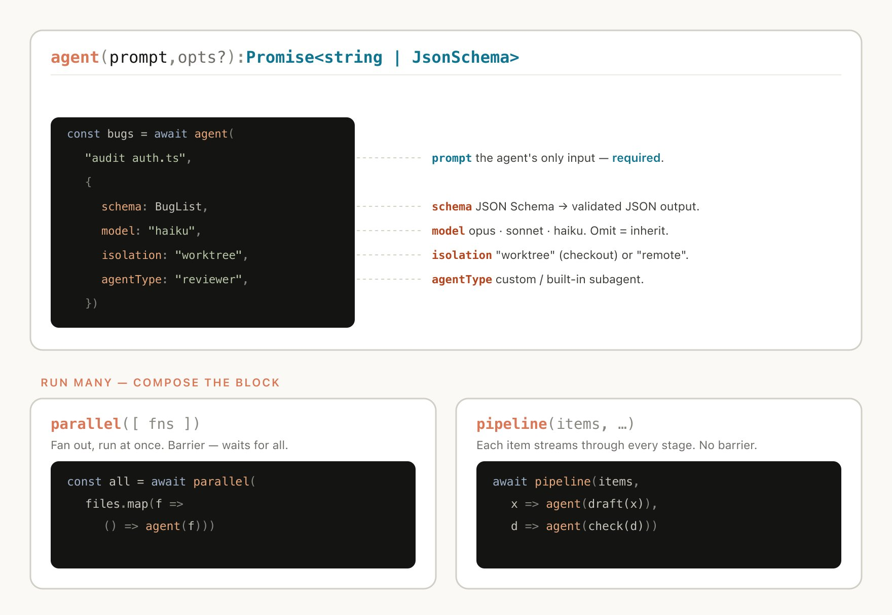

An agent harness is the non-model infrastructure that turns a stateless LLM into a tool-using, stateful, verifiable system. It includes the orchestration loop, tools, memory, context management, state, error handling, guardrails, subagents, reusable skills, and verification loops; in practice, the harness often determines whether two systems using the same model behave like a demo or a production agent.

## Sources

- [[raw/00-clippings/The Anatomy of an Agent Harness.md|raw/00-clippings/The Anatomy of an Agent Harness.md]]
- [[raw/00-clippings/A harness for every task dynamic workflows in Claude Code.md|raw/00-clippings/A harness for every task dynamic workflows in Claude Code.md]]
- [[raw/00-clippings/OpenClaw + CodexClaudeCode Agent Swarm The One-Person Dev Team Full Setup.md|raw/00-clippings/OpenClaw + CodexClaudeCode Agent Swarm The One-Person Dev Team Full Setup.md]]
- [[raw/00-clippings/The Only Claude Skills Tutorial You Need (Add Evals and Memory).md|raw/00-clippings/The Only Claude Skills Tutorial You Need (Add Evals and Memory).md]]


## Harness vs Model

The raw notes use a useful formula: if it is not the model, it is the harness. The model produces tokens. The harness decides what context the model sees, what tools it can call, how tool results are returned, when to compact state, how to recover from errors, and how to verify progress.

Three layers sit around the model:

| Layer | Scope |
|---|---|
| Prompt engineering | What instructions are written |
| Context engineering | What information is loaded, withheld, summarized, or retrieved just in time |
| Harness engineering | Context plus tools, loop control, state, memory, permissions, recovery, and verification |

This is why changing only the harness can change benchmark performance without changing model weights.

## Production Components

| Component | Role |
|---|---|
| Orchestration loop | Runs the thought/action/observation cycle until completion or stop condition |
| Tools | Gives the model controlled access to files, shell, search, browser, APIs, MCP servers, and subagents |
| Memory | Persists useful facts across sessions without assuming memory is ground truth |
| Context management | Prevents context rot through compaction, retrieval, masking, or delegation |
| Prompt construction | Builds the final model input from system rules, tools, memory, conversation, and task |
| Output parsing | Detects tool calls, structured outputs, handoffs, or final answers |
| State management | Stores current progress, checkpoints, scratchpads, task registries, or graph state |
| Error handling | Converts failures into recoverable observations when possible |
| Guardrails | Separates what the model wants to do from what the tool system permits |
| Verification loops | Uses tests, linters, screenshots, judges, or checklists to avoid false completion |
| Subagent orchestration | Delegates bounded context to isolated agents |
| Skills | Packages recurring instructions, examples, evals, and memory into reusable task routines |
| Termination rules | Stops on completion, budget, turn limit, interruption, guardrail, or refusal |

Research such as [ReAct](https://arxiv.org/abs/2210.03629) and [Lost in the Middle](https://arxiv.org/abs/2307.03172) helps explain why tool loops and context placement matter: the system has to interleave reasoning with action while keeping high-signal information visible.

## Loop in Motion

A typical harness cycle:

```text
assemble prompt
-> call model
-> classify output
-> validate tool calls
-> execute tools
-> package observations
-> update state/context
-> verify or continue
```

The loop itself can be simple. The hard engineering lives in everything the loop manages: permissions, tool schemas, compaction, retries, concurrent reads, serial writes, state checkpoints, and verification.

## Dynamic Workflows

Dynamic workflows are custom harnesses generated for a specific task. Instead of using one generic coding loop for every problem, the agent writes a workflow that coordinates subagents, worktrees, model choices, and verification patterns.

Common workflow patterns:

| Pattern | Use |
|---|---|
| Classify and act | Route each item to a specialized path |
| Fan out and synthesize | Split many independent subtasks, then merge structured results |
| Adversarial verification | Assign a separate reviewer to test each output against a rubric |
| Generate and filter | Produce many candidates, then dedupe and select |
| Tournament | Let agents compete on the same task and compare outputs |
| Loop until done | Continue until a measurable stop condition is reached |

Dynamic workflows are useful for migrations, deep research, fact checking, sorting large queues, memory/rule mining, incident triage, evals, and model routing. They are not free: they can spend more tokens and should have explicit budgets and stop conditions.



## Skills as Harness Fragments

The Claude Skills tutorial shows a smaller harness pattern: a skill is a reusable folder with concise instructions, trigger description, examples, pass/fail evals, and optional memory. The important move is to treat a skill as an executable routine, not just a prompt snippet.

Good skills use progressive disclosure:

- keep `SKILL.md` short enough for humans to review
- put bulky examples in separate files
- make the description explicit so routing works
- run concrete pass/fail evals in a clean context
- keep memory concise and non-overlapping with evals

This is why [[ai-skills]] belongs beside tools and workflows. A skill gives the agent a task-specific harness layer that can improve over repeated use.

## Design Decisions

Every harness makes a few architectural bets:

| Decision | Tradeoff |
|---|---|
| Single-agent vs multi-agent | Single agent preserves context; multi-agent isolates work and adds coordination overhead |
| ReAct vs plan-and-execute | ReAct adapts at every step; plan-and-execute can reduce repeated reasoning cost |
| Thin vs thick harness | Thin harness bets on model capability; thick harness encodes more deterministic control |
| Permissive vs restrictive tools | Speed vs safety |
| Static vs dynamic workflow | Reusable general routine vs task-specific orchestration |
| Tests vs LLM judges | Deterministic verification vs semantic review |

The practical default: start with one agent, expose the smallest useful tool set, give it a verifier, then add subagents or workflows only where the single-agent loop demonstrably breaks.

## Related Topics

- [[ai-agents]] - subagents, agent teams, and orchestration patterns
- [[codex-workflows]] - durable Codex threads, goals, automations, and side-panel workflows
- [[ai-skills]] - reusable instruction folders with examples, evals, and memory
- [[ai-coding]] - human-owned development loops around coding agents
- [[tmux]] - terminal session management for long-running agents
- [[ai-infrastructure]] - CPU and accelerator infrastructure for always-on agentic systems
