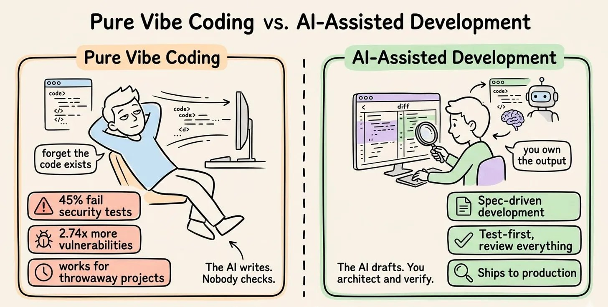
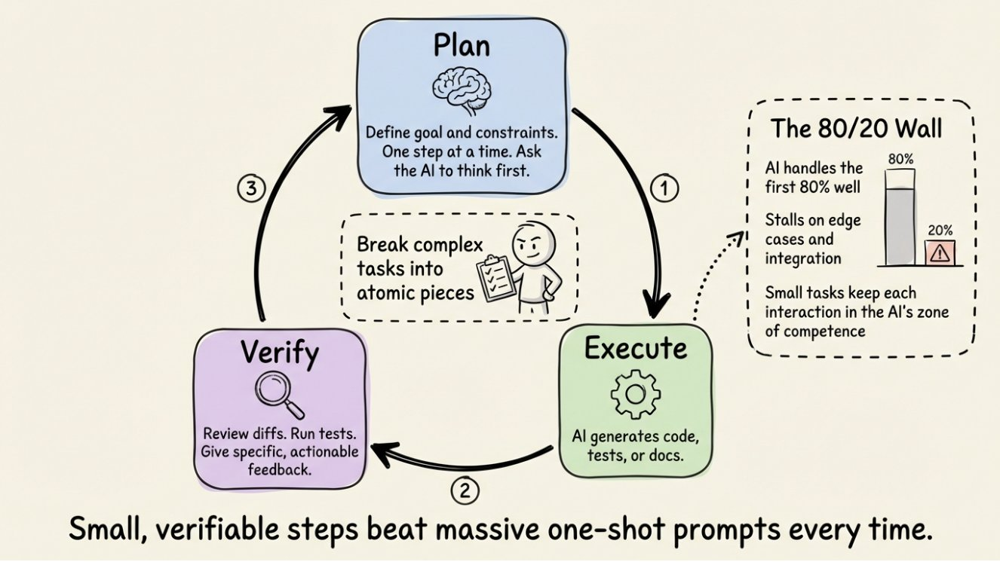

# AI-Assisted Development (Vibe Coding)

AI-assisted development is the practice of using LLM-powered coding agents to accelerate software implementation while maintaining engineering ownership and code quality. "Vibe coding" refers to the spectrum from fully accepting AI output (prototypes) to disciplined AI collaboration (production). The key insight: AI amplifies your judgment — it does not replace it.

## Source

- [[raw/00-clippings/How to Vibe Code A Developer's Playbook.md|raw/00-clippings/How to Vibe Code A Developer's Playbook.md]]

## The Productivity Trap

A randomized controlled trial found that experienced developers were **19% slower** with AI coding tools — yet believed they were **20% faster**. That's a **~40-point perception gap**. They felt productive; their output told a different story. The tools are not the problem; the practices around them are.

The biggest risk of AI coding tools is not bad code — it is **false confidence**.

## Two Modes on the Spectrum

| Mode | Description | When to Use |
|------|-------------|-------------|
| **Pure vibe coding** | The AI writes. Nobody checks. Forget the code exists. | Throwaway prototypes, weekend experiments |
| **AI-assisted development** | The AI drafts. You architect and verify. Spec-driven, test-first, ships to production. | Production code |

*That contrast is the whole page in one image: the dividing line is not whether AI writes code, but whether a human still owns the engineering standard.*

**Why pure vibe coding fails at scale:**
- 45% of AI-generated code fails security tests
- AI co-authored code had 2.74× higher security vulnerability rates across 470 analyzed PRs
- Works for throwaway projects; catastrophic for production

## The Mental Model Shift: The Flip

In traditional development, the time split is roughly:
- **70%** — translating ideas into syntax and implementation (you are the typist)
- **30%** — thinking and verification

AI-assisted development **flips this entirely**:
- **70%** — thinking, verification, and reviewing AI output
- **30%** — syntax and implementation

**Your role does not shrink. It changes.** AI does not reduce your cognitive load — it redirects it toward the work that matters most. You become the architect, not the typist.

## The 5 Core Practices

### 1. Spec Before You Prompt

The single biggest mistake is prompting too early. A 15-line spec outperforms an open-ended prompt every time.

**A good spec has three pillars:**

| Pillar | Contents |
|---|---|
| **Intent** | What are we building? Why does it matter? |
| **Constraints** | Tech stack choices, architectural patterns, what NOT to do |
| **Acceptance Criteria** | Testable conditions, edge cases, definition of done |

Once all three pillars are complete → now prompt the AI. No 20-page PRD needed. A markdown file covering these three things is enough.

Tip: have the AI **interview you** first. Let it probe requirements and surface tradeoffs. Then start a fresh session to execute against the resulting spec. This forces clean context focused entirely on implementation.

### 2. Context Engineering > Prompt Engineering

The quality of information available to the AI matters more than how cleverly you phrase your request.

| Prompt Engineering | Context Engineering |
|---|---|
| "Let me rephrase this more cleverly..." | Fresh sessions per task |
| Focuses on how you ask | Load context just in time |
| Diminishing returns | Only what AI can't infer |
| Controls what you say | Controls what the AI sees |

Context engineering is designing **what information is available to the AI** at any moment. The context window is a shared, finite resource — performance degrades as it fills.

- **Start fresh sessions for new tasks** — stale prior-feature context pollutes new implementations
- **Just-in-time context retrieval** — load files on demand via grep/file references, not by pre-loading the whole codebase
- **Keep context files focused on what the AI can't infer** — project conventions, naming patterns, unwritten team rules, security requirements

### 3. Plan → Execute → Verify Loop

The cycle runs continuously: Plan (1) → Execute (2) → Verify (3) → back to Plan.

*The practical value of the loop is not ceremony. It is containment: smaller steps make it easier to notice when the model is confidently wrong.*

1. **Plan** — define the goal and constraints for this one step; ask the AI to reason through the approach before writing any code
2. **Execute** — AI generates code, tests, or docs
3. **Verify** — review diffs, run tests, give specific actionable feedback ("The auth middleware should read from the Authorization header, not X-Token, and return 401 on expired tokens")

Between iterations: **break complex tasks into atomic pieces**. Small, verifiable steps beat massive one-shot prompts every time.

**The 80/20 Wall:** AI handles the first 80% of a project well, then stalls on edge cases and integration. Small tasks keep each interaction in the AI's zone of competence — you hit the 80/20 wall less often when you decompose aggressively.

### 4. Testing Is the Foundation

Without tests, AI output is unverifiable:
- The agent may claim something works without actually running it
- Any new change can silently break an unrelated feature
- AI-generated code optimizes for plausibility — code that "looks right" but contains subtle logic errors

**Test-first development with agents:**
1. Write (or have AI write) the tests
2. Review them — confirm they represent correct intent
3. Confirm they fail
4. Let the agent implement code to make them pass

### 5. Security and Review Are Non-Negotiable

- 40% of AI code completion suggestions were insecure in security-sensitive scenarios
- One platform's missing row-level security exposed 170+ production apps

**Supply chain attack via hallucinated packages — the three-stage flow:**

1. **AI Suggests** — AI generates code with `import fast-api-helpers`. The package doesn't exist on any registry.
2. **Attacker Registers** — An attacker notices the hallucinated name and registers it on npm/PyPI with malicious code inside. (20% of AI-suggested packages don't exist on registries — a persistent attack surface.)
3. **Compromised** — Developer installs without checking. Malicious code runs in the codebase.

**Prevention:** verify package names manually, use lockfiles with hash pinning, run dependency audits on every install.

**Three defenses:**
- **Security-first context** — include "always use parameterized queries, never hardcode secrets, validate all inputs" in your project context
- **Self-reflection loops** — prompt the agent to review its own output for vulnerabilities before you do
- **Supply chain vigilance** — verify every dependency; AI models suggest packages that don't exist ("slopsquatting") or pull in unreviewed transitive deps

**Golden rule:** don't commit code you can't explain to someone else.

## Anti-Patterns to Avoid

| Anti-pattern | What Happens | Fix |
|---|---|---|
| **Endless error loop** | AI "fixes" a bug by introducing another | Stop. Read the code. Diagnose root cause. Give precise problem description |
| **Comprehension gap** | Shipping code you don't understand | If you can't explain it, don't merge it |
| **Session drift** | Long sessions accumulate stale context; AI loses coherence | Start fresh; carry spec + decisions, not conversation history |

## Agent Modes (Mistral Vibe / similar tools)

The trust gradient runs from maximum safety to maximum speed. Switch anytime with Shift+Tab.

| Mode | Behavior | When to Use |
|---|---|---|
| **Plan** | Read-only; cannot write or execute; explores and thinks first | Safest. Scout the codebase before committing to any changes. Spec-driven: 50–80% reduction in implementation time. |
| **Default** | Preview every change; approve each action; full control | Recommended starting point for most tasks. |
| **Accept Edits** | File edits auto-approved; shell commands still ask | For confident code changes and trusted refactoring. |
| **Auto Approve** | Everything runs; no confirmations | Formatting, docs, linters only. Low-risk, well-defined tasks. |

**Match the trust level to the task. Start safe, dial up as confidence grows.**

Mistral Vibe differentiates from other CLI agents with: open source (Apache 2.0), model-agnostic (swap providers via config), self-hostable (code stays on your infrastructure), 7× lower cost (Devstral 2 pricing), and Skills + Custom Agents for encoding team workflows.

## Related Topics

- [[mlops]] — production deployment and monitoring of AI-built systems
- [[rag]] — agentic RAG is a common use case for AI coding agents
- [[attention-transformers]] — the LLMs powering coding agents
