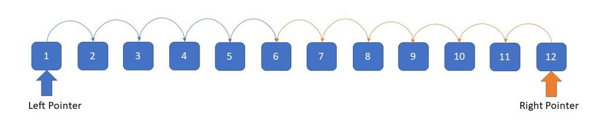
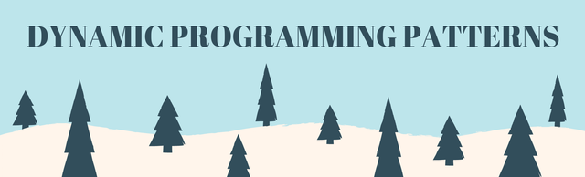

# Algorithmic Problem-Solving Patterns

Interview-style algorithm problems look infinite until you recognize that most of them collapse into a small number of reusable patterns. The raw notes here are less about memorizing solutions and more about learning the invariants that tell you which tool to reach for: monotonicity for binary search, pointer movement rules, graph traversal templates, DP state transitions, and bit-level identities.

## Source

- [[raw/00-clippings/Python Powerful Ultimate Binary Search Template. Solved many problems - Discuss.md|raw/00-clippings/Python Powerful Ultimate Binary Search Template. Solved many problems - Discuss.md]]
- [[raw/00-clippings/Solved all two pointers problems in 100 days. - Discuss.md|raw/00-clippings/Solved all two pointers problems in 100 days. - Discuss.md]]
- [[raw/00-clippings/Graph For Beginners Problems  Pattern  Sample Solutions - Discuss.md|raw/00-clippings/Graph For Beginners Problems  Pattern  Sample Solutions - Discuss.md]]
- [[raw/00-clippings/Dynamic Programming Patterns - Discuss.md|raw/00-clippings/Dynamic Programming Patterns - Discuss.md]]
- [[raw/00-clippings/All Types of Patterns for Bits Manipulations and How to use it - Discuss.md|raw/00-clippings/All Types of Patterns for Bits Manipulations and How to use it - Discuss.md]]

## The Unifying Idea

The point of a pattern is not to avoid thinking. It is to narrow the search space of possible solutions.

When a problem feels hard, ask:
- Is there a **monotone predicate**? → binary search
- Is there a **left/right or slow/fast invariant**? → two pointers
- Is the structure a **graph or grid connectivity problem**? → DFS/BFS/Union-Find
- Is the answer built from **overlapping subproblems**? → dynamic programming
- Is the state naturally encoded as **bits or sets**? → bit manipulation

## Binary Search as Monotone Feasibility

The cleanest abstraction from the binary-search source is:

```text
Minimize k such that condition(k) is True
```

That framing matters because the search space is often **not** a sorted array. It can be:
- an answer range (`0..x` for integer square root)
- a capacity range (`max(weights)..sum(weights)` for shipping)
- a threshold or budget

### Core Template

```python
left, right = min_possible, max_possible
while left < right:
    mid = left + (right - left) // 2
    if condition(mid):
        right = mid
    else:
        left = mid + 1
return left
```

The invariants are:
- boundaries must include **all feasible answers**
- `condition(mid)` must be monotone
- after the loop, `left` is the **smallest valid answer**

This is why "binary search on the answer" appears in problems like shipping capacity, split-array largest sum, and any setting where "if threshold `m` works, anything larger also works."

## Two-Pointer Families

The two-pointer notes organize a large topic into a few reusable movement patterns.



*This is why two pointers feel magical at first: one invariant lets you discard large parts of the state space in linear time.*

### 1. Opposite Ends

Start at both ends and move inward when the sorted order or symmetry tells you which side to discard.

Common uses:
- `2-sum` on sorted arrays
- `3-sum` after sorting
- trapping rain water
- palindrome / reverse-string style scans

### 2. Slow and Fast Pointers

One pointer discovers information; the other pointer uses it.

Common uses:
- linked-list cycle detection
- removing duplicates in-place
- sliding-window / caterpillar scans
- compression and overwrite-in-place problems

### 3. Two Inputs, Two Cursors

Maintain one pointer per array/string/list and merge or compare in linear time.

Common uses:
- merging sorted arrays
- subsequence checks
- intersection problems

### 4. Split Then Merge

Divide the structure, solve pieces, then recombine with pointer logic.

Common uses:
- merge-sort-style linked-list sorting
- partition / merge workflows

The real skill is defining the movement invariant clearly: what makes pointer `L` advance, what makes pointer `R` retreat, and what truth remains preserved after each move?

## Graph Patterns

The graph notes are really a taxonomy of recognition cues.

### Union-Find

Reach for Union-Find when the problem is secretly about:
- connected components
- grouping / merging identities
- detecting a redundant edge

Typical question shape: "which nodes belong to the same set?"

### DFS

DFS is the right default when you need to fully explore a component.

Recurring sub-patterns:
- **Boundary DFS** for "what is connected to the edge?"
- **Island DFS** for counting disconnected regions
- **Cycle / safe-state DFS** for recursive dependency graphs

### BFS

BFS dominates when the problem asks for:
- shortest path in an unweighted graph
- minimum number of steps
- how long until a process spreads everywhere

Multi-source BFS is especially important: initialize the queue with every valid source at once, then expand layer by layer.

### Bipartite / Coloring

If the prompt asks whether nodes can be split into two groups with no conflicts inside a group, think:
- 2-coloring
- BFS/DFS coloring
- contradiction if neighbors require the same color

## Dynamic Programming Patterns

The DP notes emphasize that DP gets easier when you stop treating every problem as unique.



*The useful abstraction is not "memorize this problem." It is "recognize which state-transition template this problem instantiates."*

### Minimum / Maximum Path to a Target

Generic recurrence:

```text
dp[i] = best(dp[previous states]) + local_cost
```

Typical use cases:
- minimum path sum
- coin change
- climbing-cost variants

### Count Distinct Ways

Generic recurrence:

```text
dp[i] = sum(dp[previous states])
```

Typical use cases:
- climbing stairs
- unique paths
- dice-roll counting

### Other High-Frequency DP Families

The source also highlights:
- **merging intervals**
- **DP on strings**
- **decision-making / choose-skip problems**

Across all of them, the key questions are the same:
- what is the state?
- what smaller states transition into it?
- what are the base cases?
- do I want a top-down memoized view or a bottom-up table?

## Bit Manipulation

Bit manipulation matters because it turns set membership and low-level state updates into constant-time operations.

### Core Operators

| Operator | Meaning | Common Use |
|---|---|---|
| `&` | AND | masking, testing bits |
| `|` | OR | setting bits |
| `^` | XOR | toggling, parity, swap tricks |
| `~` | NOT | inversion / masks |
| `<<` | left shift | multiply by powers of 2, build masks |
| `>>` | right shift | divide by powers of 2, extract bits |

### Identities Worth Memorizing

| Expression | Meaning |
|---|---|
| `x & (x - 1)` | removes the lowest set bit |
| `x & -x` | isolates the lowest set bit |
| `x && !(x & (x - 1))` | tests whether `x` is a power of two |
| `num & (1 << i)` | checks whether bit `i` is set |

### Why Bits Show Up in Interviews

Bits let you treat an integer as a compact set:
- union → `A | B`
- intersection → `A & B`
- subtraction → `A & ~B`
- set / clear / test membership via masks

That makes them useful for subset DP, state compression, flags, and problems where parity or powers of two are structural clues.

## Pattern Selection Cheat Sheet

| Signal in the Prompt | Likely Pattern |
|---|---|
| "minimum feasible X", "at least", "capacity", "threshold" | Binary search on answer |
| sorted array + pair / triple / inward movement | Two pointers |
| islands, regions, reachability, shortest spread | DFS / BFS |
| repeated subproblems, count ways, min cost | DP |
| toggles, masks, subsets, powers of two | Bit manipulation |

## Related Topics

- [[ai-coding]] — pattern recognition matters more than brute-force prompting during interviews and coding practice
- [[game-math]] — another example of small reusable primitives unlocking many problem types
- [[probability-statistics]] — mathematical problem-solving foundation adjacent to algorithmic reasoning
