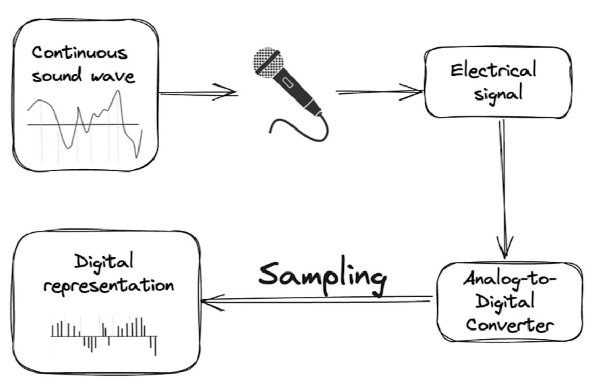

# Audio Processing

Audio processing covers the pipeline from raw waveforms to AI-powered tasks like speech recognition, text-to-speech, and audio classification. A key concept is the **sampling rate**, which defines how audio is digitized and must match what the model expects.

## Source

- [[raw/01-open-source-models-hugging-face/Open Source Models with Hugging Face.md|raw/01-open-source-models-hugging-face/Open Source Models with Hugging Face.md]]
- [[raw/01-open-source-models-hugging-face/05_zero_shot_audio_classification.py|raw/01-open-source-models-hugging-face/05_zero_shot_audio_classification.py]]
- [[raw/01-open-source-models-hugging-face/06_automatic_speech_recognition.py|raw/01-open-source-models-hugging-face/06_automatic_speech_recognition.py]]
- [[raw/01-open-source-models-hugging-face/07_text_to_speech.py|raw/01-open-source-models-hugging-face/07_text_to_speech.py]]

## Sampling Rate

**Sampling** = measuring a continuous audio signal at fixed time steps.
**Sampling rate (Hz)** = the number of samples per second.

| Rate | Usage |
|------|-------|
| 8,000 Hz | Telephone / walkie-talkie |
| 16,000 Hz | Human speech recording (standard for ASR models) |
| 44,100 Hz | CD audio quality |
| 192,000 Hz | High-resolution studio audio |

### Why Sampling Rate Matters for AI Models

Models are trained at a specific sampling rate and interpret input as if one second contains exactly that many samples. If you feed audio at the wrong rate:
- A 10-second clip at 192,000 Hz fed to a 16,000 Hz model → interpreted as 120 seconds
- Formula: `interpreted_duration = actual_samples / model_expected_rate`

Always **resample** audio to match the model's expected rate before inference.



*This is the core representation change behind all audio ML: microphones produce a continuous physical signal, and sampling turns it into a sequence of numbers the model can process.*

## Stereo vs Mono

- **Stereo** audio has left + right channels; the difference gives spatial cues (direction of sound source)
- **Transformer models almost always use mono audio** because:
  - Tasks like ASR, classification don't require spatial information
  - Stereo doubles the data without meaningful benefit for most tasks
  - Reduces computational complexity

## Automatic Speech Recognition (ASR)

ASR transcribes spoken audio into text.

**Applications:** meeting notes, video subtitles, voice commands.

**Key model:** `openai/whisper-large-v3`

```python
from transformers import pipeline
asr = pipeline("automatic-speech-recognition", model="openai/whisper-large-v3")
result = asr(audio_file, chunk_length_s=30, batch_size=4, return_timestamps=True)
```

- **Distilled models** (e.g., `distil-whisper`) are compressed versions trained on the teacher model's outputs — faster and cheaper while preserving most accuracy

## Zero-Shot Audio Classification

Classifies audio using arbitrary text labels — no task-specific training required.

**Model:** `laion/clap-htsat-unfused` (CLAP = Contrastive Language-Audio Pretraining)

**ESC-50 Dataset:** labeled collection of 5-second environmental sounds (animals, humans, nature, indoor, urban) — `ashraq/esc50` on Hugging Face.

### How CLAP Works

CLAP learns a joint audio–text embedding space using contrastive learning:
- Pulls embeddings of (audio, matching caption) pairs closer together
- Pushes embeddings of mismatched pairs apart
- At inference: score any audio against any text description without retraining

## Text-to-Speech (TTS)

TTS converts text into spoken audio.

**Why TTS is a hard problem:**
- It is a **one-to-many** problem: there are infinitely many valid ways to say the same sentence
- Different voices, dialects, speaking styles, accents — all correct
- Unlike ASR (one correct transcription) or classification (one correct label)

## Related Topics

- [[transformers-library]] — Pipeline API for audio tasks
- [[hugging-face]] — model hub (Whisper, CLAP, TTS models)
- [[multimodal-models]] — audio + text cross-modal models (CLAP)
