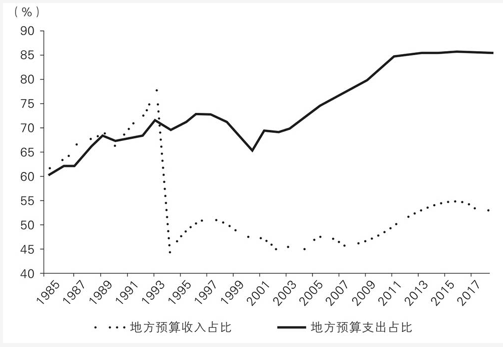
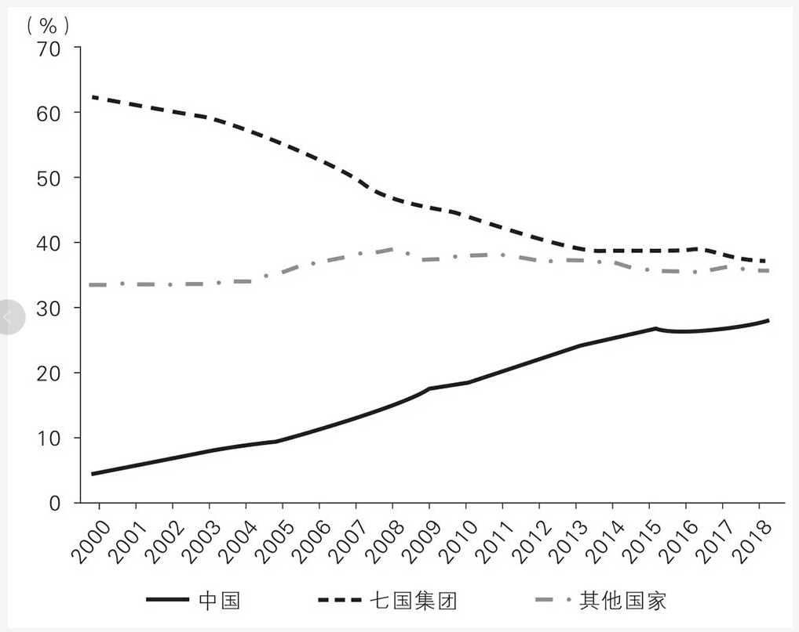

# China Development Economics and Local Government

These chapter notes describe China's development model as a specific political-economic system rather than a generic "state vs market" debate. The recurring pattern is central coordination plus aggressive local execution: local governments control land, finance, and implementation capacity, while the center tries to steer incentives, manage imbalances, and keep national coherence.

## Source

- [[raw/00-clippings/Chapter 1 Local Government Powers & Responsibilities.md|raw/00-clippings/Chapter 1 Local Government Powers & Responsibilities.md]]
- [[raw/00-clippings/Chapter 2 Finance, Taxation and Government Action.md|raw/00-clippings/Chapter 2 Finance, Taxation and Government Action.md]]
- [[raw/00-clippings/Chapter 3 Government Investment, Fundraising and Debt.md|raw/00-clippings/Chapter 3 Government Investment, Fundraising and Debt.md]]
- [[raw/00-clippings/Chapter 4 Government's Role in Industrialization.md|raw/00-clippings/Chapter 4 Government's Role in Industrialization.md]]
- [[raw/00-clippings/Chapter 5 Urbanization and Inequality.md|raw/00-clippings/Chapter 5 Urbanization and Inequality.md]]
- [[raw/00-clippings/Chapter 6 Debt and Risk.md|raw/00-clippings/Chapter 6 Debt and Risk.md]]
- [[raw/00-clippings/Chapter 7 Domestic and International Imbalance.md|raw/00-clippings/Chapter 7 Domestic and International Imbalance.md]]
- [[raw/00-clippings/Chapter 8 Government and Economic Development.md|raw/00-clippings/Chapter 8 Government and Economic Development.md]]

## Core Governance Model

China is described as a five-level governing system:

```text
Central → Province → City → County/District → Township/Village
```

Two structural tensions dominate the system:
- the center must preserve unity
- local governments must run day-to-day operations because the country is too large to govern purely from above

The notes emphasize three recurring governance constraints:
- **externalities**: cross-region spillovers push authority upward
- **economies of scale**: some services belong centrally, others locally
- **information asymmetry**: higher levels never fully know local reality

This creates a system with duplicated bureaucracies, overlapping reporting lines, and constant tension between autonomy and control.

## Fiscal Architecture: Tax Reform, Land Finance, and Imbalance

The 1994 tax reform is the turning point for the modern fiscal model.



*This is the structural setup behind the whole chapter set: local implementation capacity stayed huge even after central revenue power increased.*

Its effects:
- central government captured a much larger share of tax revenue
- local governments kept most expenditure responsibilities
- the resulting gap had to be filled through transfers and alternative funding tools

This produced a classic **vertical imbalance**:
- money flows upward
- responsibilities flow downward

The major workaround became **land finance**. Local governments could convert rural land, transfer urban land-use rights, and use rising land values to fund development. That tied local public finance tightly to:
- property prices
- urban expansion
- industrial land allocation

The result was a growth engine, but also a structural dependence on real estate and land appreciation.

## Local Government as Investor

Because local governments historically could not borrow directly from banks, they built financing vehicles often called:
- local government financing platforms
- city investment companies

These entities typically had:
- land as collateral
- weak standalone economics
- implicit government guarantees

They funded infrastructure, industrial parks, and PPP-style projects. After the 2008 stimulus, these vehicles multiplied rapidly and debt expanded with them.

The notes treat this as both rational and dangerous:
- rational because many infrastructure projects have low direct ROI but large indirect benefits
- dangerous because implicit guarantees distort credit pricing and hide risk

## Political Incentives and Corruption

Local officials operate on short time horizons. Mayors and party secretaries often have only a few years in office, while infrastructure projects take longer than that to mature.

That creates a bias toward:
- front-loaded investment
- visible construction
- land sales
- debt-funded expansion

Corruption is treated here not as a side issue but as a structural byproduct of land, permits, financing, and government-business coordination. The land-development nexus became a major corruption channel in the 2008–2013 period.

## Industrial Policy in Practice

The industrial-policy chapters argue that government support can work when a few conditions hold:
- the domestic market is large enough
- competition is preserved
- subsidies are not mistaken for permanent protection
- failed firms are allowed to restructure or die

### BOE and LCDs

BOE is used as the flagship example of local-government-backed industrial upgrading:
- state-linked investors provided loans and equity
- multiple cities competed to host expansion
- early losses were tolerated because the goal was strategic capability

The point is not that every subsidy works. It is that entry into complex industries often requires financing patience the private market will not provide alone.

### Photovoltaics

Solar shows both sides of the model:
- subsidies accelerated scale and cost reduction
- local duplication created overcapacity
- export dependence made firms vulnerable to foreign policy shifts

The notes defend subsidies as necessary, but only if competition remains real and weak firms are not protected forever.

### Guidance Funds

Government guidance funds are presented as a more venture-style evolution of industrial policy:
- government capital acts as LP or fund-of-funds capital
- target sectors are usually strategic technologies
- the main challenge is incentive design, especially outside major cities

## Urbanization, Hukou, and Inequality

Urbanization is presented as both China's growth engine and a major source of inequality.

Key mechanisms:
- hukou restricts access to local public services
- land quotas distort housing supply across regions
- top-tier cities face severe demand-supply imbalance
- household balance sheets become increasingly real-estate-heavy

This produces several linked problems:
- expensive housing
- unequal access to education and healthcare
- rising household debt
- widening wealth gaps between regions and classes

The notes argue that better growth now requires factor-market reform, especially:
- freer labor mobility
- more flexible land use
- less local monopoly over land conversion

## Debt and Systemic Risk

By 2018, total debt is framed as high by emerging-market standards, but the composition matters more than the headline number.

The key risks are:
- very high corporate debt
- SOE debt expansion after 2008
- real-estate developer leverage
- bank-led shadow banking
- hidden local-government debt through financing platforms

The diagnosis is that China did not mainly borrow to support consumption, as in the US mortgage cycle. It borrowed heavily to sustain investment, infrastructure, property, and local growth targets.

The proposed solution in the notes is not broad monetary easing. It is structural reform:
- slow property inflation
- reduce dependence on land finance
- cut implicit guarantees
- shift more financing toward equity markets

## Domestic and International Imbalance

The chapters tie domestic imbalance directly to trade conflict.



*The chart matters because it links two levels at once: internal under-consumption pushes excess capacity outward, and external success feeds geopolitical pressure back inward.*

The core logic:
- household consumption is too low as a share of GDP
- investment is too high
- income distribution and weak social services increase precautionary saving
- excess production must be exported

That model made China the world's factory, but it also increased vulnerability to:
- weak external demand
- trade conflict
- geopolitical pressure

The answer offered is **dual circulation**:
- stronger domestic demand and income growth
- continued openness, but less reliance on external demand as the main absorber of overcapacity

## The Larger Thesis

The book's broad argument is that China's development model succeeded because it combined:
- centralized strategic coordination
- decentralized local competition
- a professional bureaucracy with strong execution capacity

But the same system now has to evolve. A government optimized for industrialization, construction, and production has to become one that is better at:
- services
- redistribution
- urban integration
- risk control
- long-term innovation

That is the transition from a **production-oriented government** to a **services-oriented government**.

## Related Topics

- [[ai-industry]] — industrial policy, organizational incentives, and national capability formation are directly relevant to frontier technology sectors
