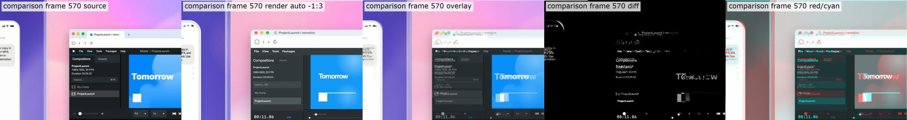
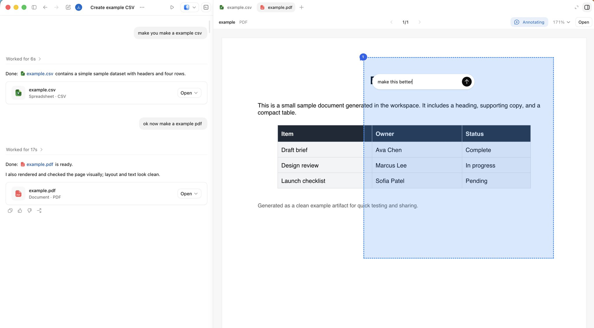

Codex workflows extend AI coding beyond single-turn repository edits into durable, tool-connected work streams. The raw notes frame Codex as a system for computer work: persistent threads, voice input, steering, queuing, browser and desktop tools, MCP connectors, automations, goals, side-panel review, and shared memory. Goal mode adds a stronger contract: the agent should keep working toward a concrete, verifiable outcome rather than merely answering the next prompt.

## Source

- [[raw/00-clippings/Getting the most out of Codex.md|raw/00-clippings/Getting the most out of Codex.md]]
- [[raw/00-clippings/A guide to goal.md|raw/00-clippings/A guide to goal.md]]

## Durable Threads

Durable threads preserve working context across repeated sessions. They are useful for recurring work streams:

- Release management
- Documentation review
- Chief-of-staff style coordination
- External monitoring
- Product or customer follow-up

The important distinction is that a durable thread is not just chat history. It becomes a persistent workspace with prior decisions, preferences, task state, and reusable context.

## Steering and Queuing

Codex workflows benefit from two kinds of user control:

| Control | Meaning | Example |
|---|---|---|
| Steering | Interrupt the current task with new direction | "Stop focusing on UI. Fix the API contract first." |
| Queuing | Add work after the current task completes | "When this passes, send the preview link to the reviewer." |

Steering changes now. Queuing changes next. Together they keep the user in the loop without forcing every operation to restart.

## Tools and Surfaces

Codex becomes more useful as it can act on more of the real workflow:

| Surface | Use |
|---|---|
| In-app browser | Inspect, debug, and annotate rendered web artifacts |
| Signed-in browser context | Work that depends on user-authenticated web state |
| Computer use | GUI-only tasks that do not expose clean APIs |
| MCP servers | Extend reach into local tools, company systems, or custom workflows |
| Connectors | Slack, Gmail, Calendar, and other workflow origins |
| Skills | Package repeated routines, examples, evals, and memory into reusable procedures |

This connects directly to [[agent-harness]]: tools are only valuable when the harness scopes permissions, captures observations, and verifies outcomes.

For reusable routines, see [[ai-skills]].

## Automations and Goals

Automations run work on a schedule. A scheduled automation starts from a workspace; a thread automation returns to an active conversation with its context.

Goals add a finish line. A strong goal has a verifier:

| Goal type | Useful verifier |
|---|---|
| Code migration | Unit tests pass |
| Bug fix | Reproduction fails before and passes after |
| Benchmark improvement | Metric threshold reached |
| Release readiness | Checklist complete and CI green |
| Report generation | Claims sourced and reviewed |

The raw notes emphasize that ambition without verification is just a wish. A Codex goal should state what is done, how to check it, and when to stop.

The goal-mode guide sharpens this into a practical checklist:

- **Clear, verifiable criteria:** define the exit condition up front; numeric thresholds help when they are meaningful.
- **Starting guidance:** point Codex toward likely bottlenecks, required tools, constraints, or known dead ends.
- **Progress measurement:** provide benchmarks, tests, screenshots, diffs, evals, or other feedback loops so the agent can tell whether it is closer.
- **Realistic environment:** let the agent test against production-like flags, data, devices, logs, or deploy previews when the result depends on environment.
- **Careful visual goals:** use images as context, but prefer checklists and design-system constraints over vague "pixel perfect" instructions.
- **Progress tracking:** ask for commits, reports, dashboards, or status updates at meaningful milestones.
- **Cleanup and review:** after the goal is reached, inspect failed attempts, remove dead code, and run review before treating the result as finished.

## Side Panel and Artifacts

The side panel keeps artifacts beside the thread that produced them. It works for:

- Code review
- Static HTML artifacts
- Documents and decks
- Data tables and spreadsheets
- Browser-based previews
- Annotated surfaces

This matters because the review loop stays inside the same context. The artifact is not thrown over a wall; it remains inspectable, annotatable, and repairable.

## Shared Memory

Shared memory should be explicit and reviewable. The raw notes suggest an Obsidian-style vault for durable work memory: TODOs, people, projects, agent notes, and decisions.

Good memory rules:

- Preserve decisions, blockers, owners, dates, and useful links.
- Prefer canonical notes over note sprawl.
- Do not churn memory files when nothing meaningful changed.
- Treat memory as a hint, not proof; verify against current state before acting.

This vault itself follows that pattern: `raw/` holds source material, `wiki/` holds organized durable context, and `wiki_html/` renders reviewable artifacts.

## Related Topics

- [[ai-coding]] - disciplined AI-assisted development practices
- [[agent-harness]] - infrastructure around model, tools, memory, and verification
- [[ai-skills]] - reusable skills with examples, evals, memory, and review loops
- [[ai-agents]] - subagents and orchestration patterns
- [[recursive-self-improvement]] - how AI-assisted R&D changes long-running AI work
- [[desktop-ai-automation]] - no-code desktop and connector workflows with scoped AI assistants
- [[tmux]] - terminal surface for long-running local agent work
- [[docling]] - document processing for agent-friendly Markdown artifacts
