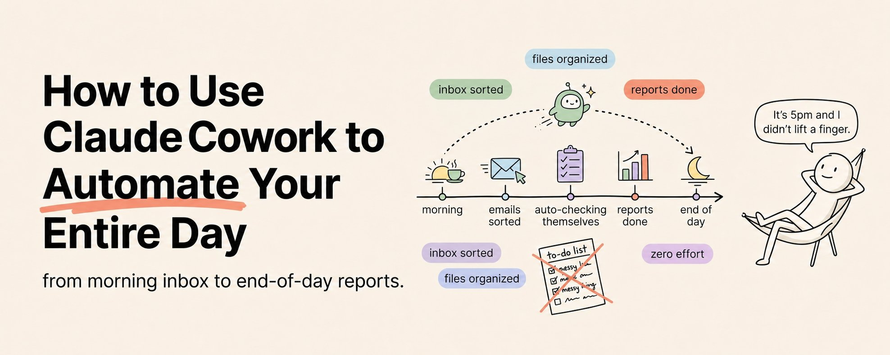

# Desktop AI Automation

Desktop AI automation turns an LLM assistant into a scoped local worker that can read approved folders, process files, use connected services, and run scheduled workflows. The Claude Cowork clipping frames this as a no-code version of agentic computer work: the value comes from turning recurring knowledge-work routines into explicit, reviewable automations.

## Source

- [[raw/clippings/How to Use Claude Cowork to Automate Your Entire Day (Full Course).md|raw/clippings/How to Use Claude Cowork to Automate Your Entire Day (Full Course).md]]



## Core Capability

The workflow starts with local permissions. Instead of chatting with a model in isolation, the assistant is granted access to selected folders and connected services, then asked to perform concrete work on real artifacts.

Common capability layers:

| Layer | Examples | Risk Control |
|---|---|---|
| **Local files** | Read PDFs, organize downloads, create summaries, fill templates | Start with narrow folders and explicit output paths |
| **Connectors** | Gmail, Calendar, Drive, Slack, Notion | Prefer draft/review steps before sending or posting |
| **Scheduled tasks** | Morning briefing, weekly cleanup, monthly reports | Require stable prompts, deterministic locations, and review checkpoints |
| **Remote dispatch** | Trigger laptop workflows from a phone | Keep destructive actions out of mobile-triggered flows |

This is closely related to [[agent-harness]]: the assistant needs a permission boundary, a set of tools, an observation loop, and a verifier for finished work.

## Automation Patterns

The source's strongest examples are not one-off prompts. They are recurring workflows with stable inputs and outputs.

| Pattern | Input | Output |
|---|---|---|
| **Morning briefing** | Overnight email, calendar, Slack mentions, project notes | Daily briefing document |
| **End-of-day closeout** | Modified files, sent emails, Slack threads | Summary of accomplishments, pending items, tomorrow priorities |
| **Invoice processor** | PDFs in an incoming invoice folder | Spreadsheet with vendor, amount, due date, line items, and flags |
| **Meeting prep** | Tomorrow's calendar, prior notes, email threads | One-page prep document per meeting |
| **Client report pipeline** | Project notes, Slack messages, Drive updates | Status report, draft email, and channel summary |
| **Reading batch processor** | URL list or article folder | Summaries with key argument, insights, actions, and relevance rating |

The common shape is: gather context, extract structure, transform it into a useful artifact, save it somewhere predictable, and ask for human review before high-impact actions.

## Workflow Design Checklist

Good desktop automations need the same rigor as code agents:

1. Define the trigger: manual, scheduled, or remote dispatch.
2. Define the input surface: exact folders, services, labels, date windows, or filenames.
3. Define the action: summarize, extract, classify, draft, move, rename, or report.
4. Define the output: destination path, document format, spreadsheet schema, or draft location.
5. Define the review point: what the human checks before anything is sent, deleted, or posted.
6. Define the verifier: the file exists, the table has required columns, every source is cited, or flagged items are surfaced.

Example prompt shape:

```text
Read PDFs in /Invoices/Incoming.
For each invoice, extract vendor, invoice number, amount, due date, and line items.
Create /Invoices/Summary/YYYY-MM invoices.csv.
Flag invoices due within 7 days.
Do not delete, move, email, or pay anything.
```

The final line matters. Desktop agents operate on real files and accounts, so good prompts include negative permissions as well as desired actions.

## Limits and Cautions

The clipping is a social-media course-style source, so treat product names, availability, and exact connector behavior as claims to verify in the actual app before depending on them. The durable idea is product-independent: scoped computer-use agents are useful when the task is repetitive, file-heavy, and easy to review.

Main failure modes:

- Overbroad folder access creates privacy and deletion risk.
- Vague output instructions produce hard-to-review artifacts.
- Large files and messy document formats can hit model or extraction limits.
- Scheduled tasks can silently drift if prompts, folder conventions, or connector permissions change.
- Fully autonomous send/post/delete actions should be rare and heavily constrained.

The safe operating model is narrow access, draft-first behavior, visible artifacts, and periodic review of both prompts and outputs.

## Related Topics

- [[ai-agents]] — desktop automation is an agentic system with tools and feedback
- [[agent-harness]] — permissioning, state, tools, and verification around agent loops
- [[codex-workflows]] — durable threads, automations, goals, and review surfaces for coding work
- [[docling]] — document extraction for file-heavy automation workflows
- [[rag]] — retrieval over local and connected personal data
