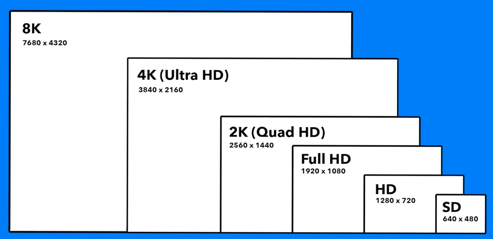

Display resolutions describe the pixel dimensions of common screens and rendered targets. This small reference matters for computer graphics, XR, video, screenshots, UI review, and generated artifacts because resolution controls detail, aspect ratio, file size, and GPU workload.

## Source

- [[raw/00-clippings/Monitor Resolutions.md|raw/00-clippings/Monitor Resolutions.md]]

## Common Resolutions

| Label | Dimensions | Notes |
|---|---:|---|
| 8K | 7680 x 4320 | Very high-end video, large displays, heavy GPU and storage cost |
| 4K / Ultra HD | 3840 x 2160 | Common high-resolution monitor and media target |
| 2K / QHD | 2560 x 1440 | Common productivity and gaming monitor resolution |
| HD | 1280 x 720 | Lightweight video and preview target |
| SD | 640 x 480 | Legacy and low-bandwidth target |

## Practical Implications

Resolution affects:

- Pixel count and memory footprint
- Render time for graphics and video
- Screenshot clarity in UI review
- Texture sizes in games and XR
- Bandwidth for streaming or remote review
- Whether text remains readable after scaling

Pixel count grows quadratically with linear resolution. 4K has four times as many pixels as 1080p, and 8K has four times as many pixels as 4K.

## Related Topics

- [[computer-vision]] - image dimensions and pixel-level model inputs
- [[shaders]] - fragment shading cost scales with rendered pixels
- [[game-math]] - screen-space calculations and field-of-view geometry
- [[multimodal-models]] - image inputs and visual model constraints
- [[excalidraw-rendering]] - generated diagram output sizes
