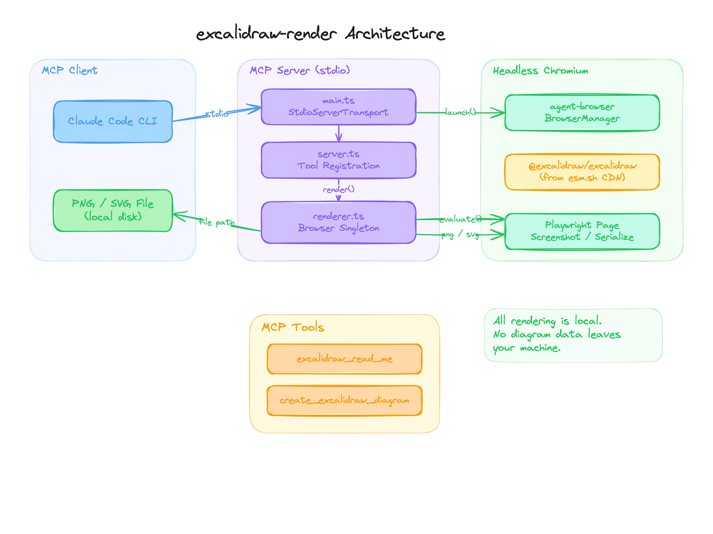

Excalidraw rendering is the workflow of turning Excalidraw scene JSON into local PNG or SVG artifacts without relying on the Excalidraw web app. The raw source focuses on `excalidraw-render`, an MCP server that lets CLI agents render diagrams locally through headless Chromium and return file paths for downstream review or documentation.

## Source

- [[raw/00-clippings/bassimeledathexcalidraw-render-mcp MCP server for headless Excalidraw diagram rendering. Renders locally — no data sent to third-party servers..md|raw/00-clippings/bassimeledathexcalidraw-render-mcp MCP server for headless Excalidraw diagram rendering. Renders locally — no data sent to third-party servers..md]]



## How It Works

The MCP server exposes two tools:

| Tool | Purpose |
|---|---|
| `excalidraw_read_me` | Returns the Excalidraw element format reference |
| `create_excalidraw_diagram` | Renders an Excalidraw element JSON array to PNG or SVG |

The rendering path:

```text
agent prompt
-> Excalidraw element JSON
-> headless Chromium singleton
-> @excalidraw/excalidraw import
-> convertToExcalidrawElements()
-> exportToSvg()
-> SVG file or Playwright PNG screenshot
```

First render is slower because the browser launches and imports the library. Later renders reuse the browser and are much faster.

## Installation Shapes

For Claude Code:

```bash
claude mcp add --scope user --transport stdio excalidraw -- npx -y excalidraw-render
```

For generic MCP clients:

```bash
npx -y excalidraw-render
```

For source installs, clone the repository, install dependencies, build it, then point the MCP config at the built `dist/index.js`.

## Privacy and Tradeoffs

The key design choice is local rendering. Diagram content is not sent to Excalidraw servers. The renderer fetches the Excalidraw JavaScript library from `esm.sh` at startup, then performs diagram conversion locally inside headless Chromium.

| Approach | Strength | Tradeoff |
|---|---|---|
| `excalidraw-render` | CLI-friendly PNG/SVG output, local rendering, good for agents | No interactive browser UI |
| Excalidraw MCP app | Interactive diagram surface in Claude Desktop | More UI-oriented, not optimized for terminal workflows |
| Manual Excalidraw export | Human-friendly editing | Breaks automation loop |

## Vault Use Cases

This is especially useful for:

- Rendering [[system-design]] diagrams from `.excalidraw` sources
- Generating architecture diagrams during [[ai-coding]] sessions
- Keeping visual documentation inside a local artifact workflow
- Giving [[agent-harness]] tools a diagram output path they can verify

## Related Topics

- [[system-design]] - architecture and distributed-system diagrams
- [[ai-coding]] - agent-generated docs and reviewable artifacts
- [[codex-workflows]] - side-panel artifact review and tool-connected workflows
- [[agent-harness]] - MCP tools as part of the agent tool layer
- [[computer-vision]] - visual representations and image outputs
