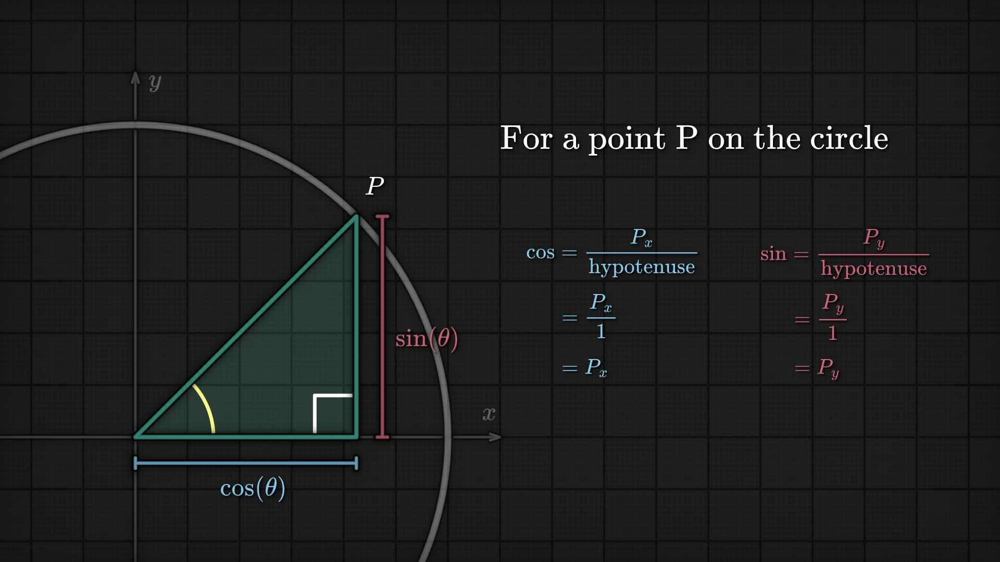
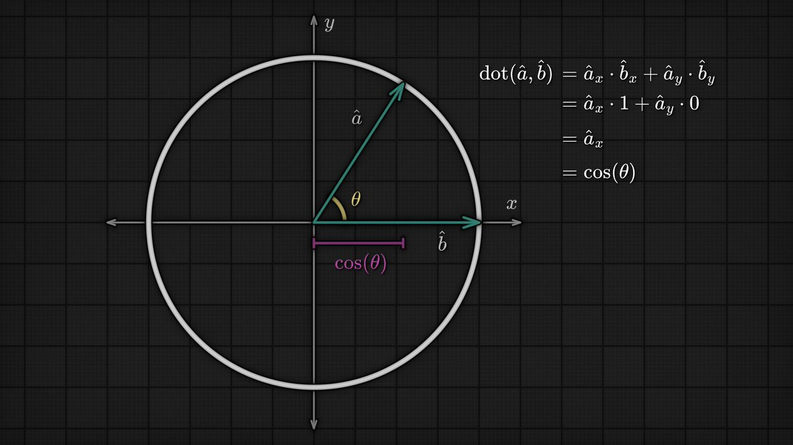

# Game Math

Game math is the layer between raw code and spatial intuition. The most useful pieces are not advanced theorems but a handful of geometric primitives that appear everywhere: the unit circle, sine/cosine, dot products, direction vectors, projections, and `atan2`.

## Source

- [[raw/00-clippings/Thread by @iced_coffee_dev.md|raw/00-clippings/Thread by @iced_coffee_dev.md]]
- [[raw/00-clippings/Thread by @iced_coffee_dev 1.md|raw/00-clippings/Thread by @iced_coffee_dev 1.md]]

## Unit Circle Mental Model

The simplest useful fact in game math is that a point on the unit circle is:

```text
P = (cos θ, sin θ)
```

Because the circle radius is 1:
- `cos(θ)` is the x-coordinate
- `sin(θ)` is the y-coordinate

That makes trig much less mystical. On the unit circle, sine and cosine are not abstract ratios anymore; they are just coordinates.



*This is the most useful trig picture in game dev. Once `cos(θ)` and `sin(θ)` become x/y coordinates, direction vectors stop feeling like memorized formulas.*

## Angles and Direction Vectors

Once you have the unit-circle view, direction vectors become trivial:

```text
direction = (cos θ, sin θ)
```

This is why trig shows up constantly in:
- player movement
- aiming
- orbiting cameras
- projectile motion
- steering behaviors

Going the other way is just as important:

```text
θ = atan2(y, x)
```

`atan2` is the practical inverse because it handles quadrants correctly and returns the signed angle of a direction vector.

## Dot Product Intuition

For two normalized vectors `â` and `b̂`:

```text
dot(â, b̂) = cos(θ)
```

That one identity explains most common uses:
- `1` means same direction
- `0` means perpendicular
- `-1` means opposite directions

If only one vector is normalized, the dot product becomes the signed projection length:

```text
dot(a, b̂) = |a| cos(θ)
```

So the dot product is not "just another formula." It is a fast way to ask: how much of vector `a` points along vector `b`?



*That identity is why the dot product shows up everywhere in gameplay code: facing checks, FOV tests, projections, steering, and lighting all reduce to measuring alignment.*

## Practical Uses in Games

### Facing / Field-of-View Checks

The classic FOV test:

```text
dot(forward̂, toTarget̂) > cos(fov / 2)
```

This avoids expensive angle comparisons and works directly on vectors.

### Movement and Rotation

- Use `(cos θ, sin θ)` to move something in the direction it is facing
- Use `atan2` to rotate a character or camera toward a target
- Use the dot product to determine whether something is in front of or behind another object

### Projection

Projection logic is everywhere:
- velocity along a surface
- input along a forward axis
- camera-relative movement
- light and normal interactions in shading

## Why This Matters

A lot of graphics and gameplay code gets simpler once you stop memorizing formulas and start treating vectors geometrically:
- sine/cosine give coordinates on the circle
- dot product measures alignment
- `atan2` converts vectors back into angles

That is enough to unlock a surprising amount of real game code.

## Related Topics

- [[shaders]] — fragment and vertex code constantly use trig, projections, and vector math
- [[3d-vision]] — geometric representations and camera reasoning build on the same vector foundations
- [[open-usd]] — 3D scenes, transforms, and composed hierarchies rely on the same spatial math
