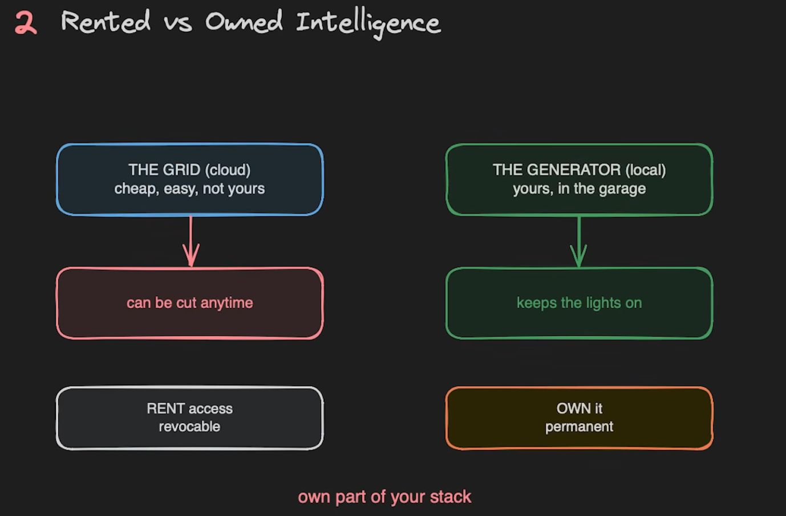
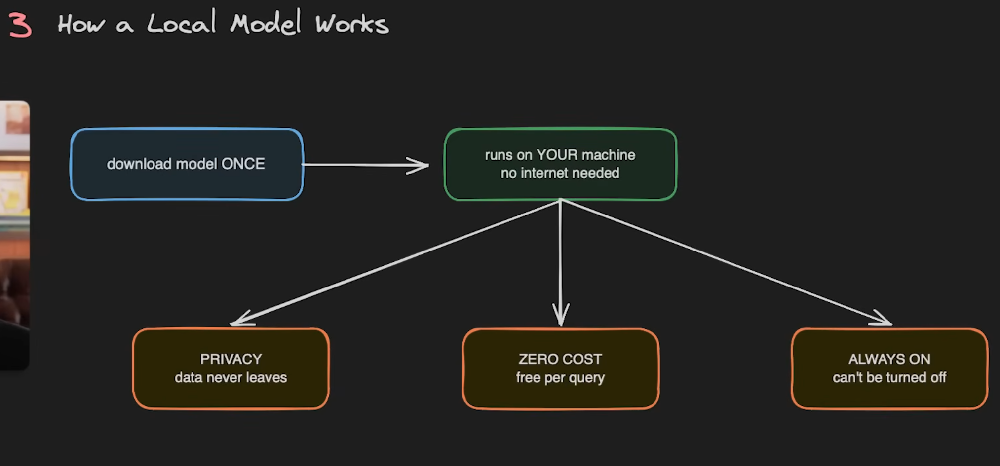
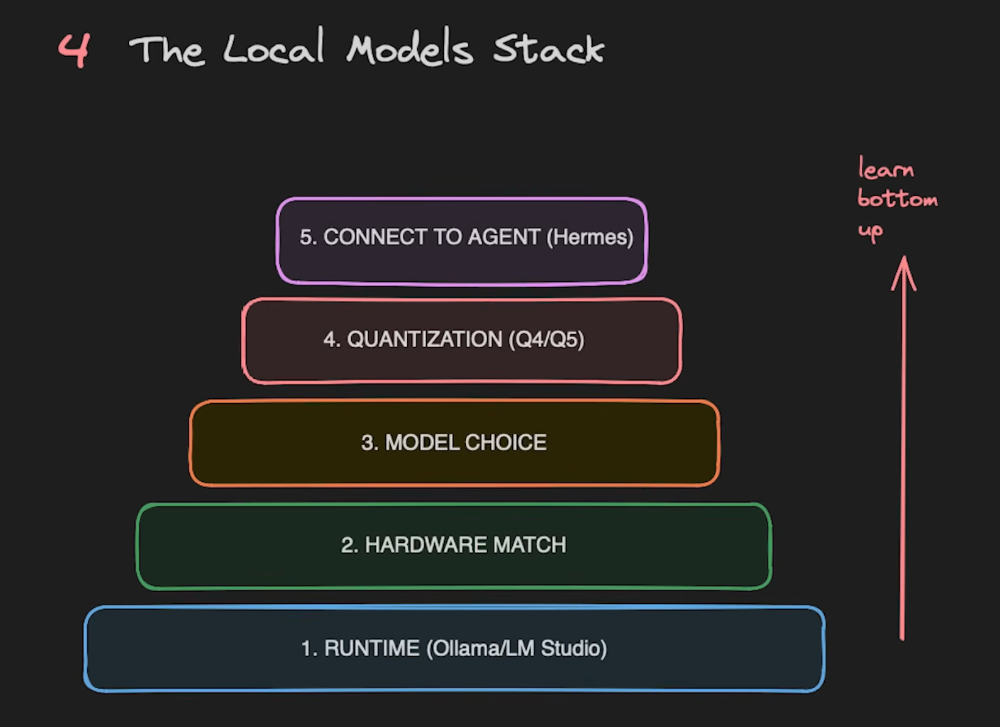
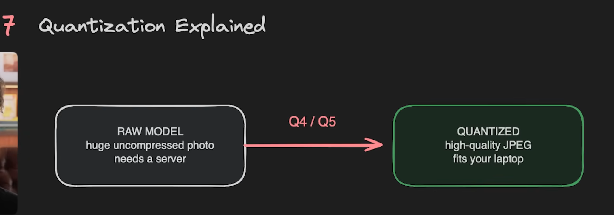
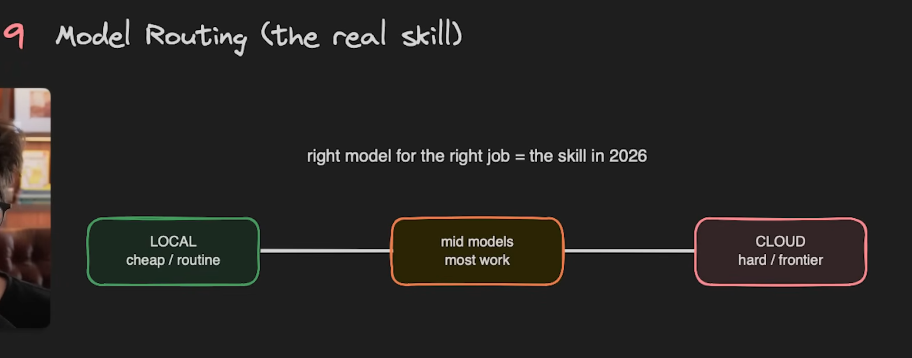
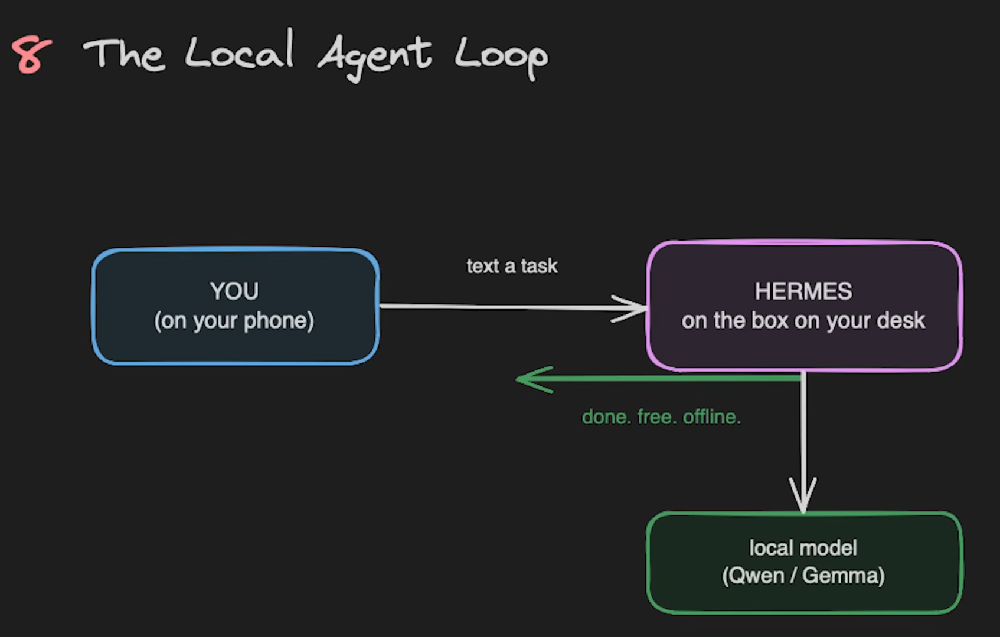

Local models are AI models that run on hardware you control, shifting the operating model from rented cloud intelligence to owned, private, offline-capable inference. The local-models source frames the stack as a sequence of practical choices: runtime, hardware fit, model family, quantization level, optional agent connection, and routing between cheap local work and harder frontier-model calls.

## Source

- [[raw/reference-packs/local-models/Local Models.md|raw/reference-packs/local-models/Local Models.md]]

## Core Thesis

The source contrasts two ways of using AI:

| Model access pattern | Upside | Risk |
|---|---|---|
| Rented cloud intelligence | Frontier capability, managed serving, no local setup | API cost, outage risk, privacy exposure, vendor dependency |
| Owned local intelligence | Privacy, offline access, zero per-query marginal cost | Hardware limits, setup burden, smaller model capability |

The practical reason to run local models is not that they beat frontier cloud models on every task. It is that many tasks do not require a frontier model, and the local system gives stronger control over privacy, availability, and cost.

## How Local Inference Works

The source's basic loop is:

1. Download a model once.
2. Run it on the local machine through a runtime such as Ollama or LM Studio.
3. Send prompts to the local runtime.
4. Keep data on the machine unless another tool is explicitly called.

This makes local inference especially useful for draft generation, classification, summarization, embeddings, structured extraction, code assistant side tasks, and agent loops where most calls are routine.

## The Local Model Stack

The source presents a five-layer stack:

| Layer | Decision |
|---|---|
| Runtime | Ollama, LM Studio, or another local serving layer |
| Hardware match | Pick model size and quantization that fit RAM, VRAM, and latency needs |
| Model choice | Select a family based on task: coding, reasoning, general chat, ecosystem support |
| Quantization | Use Q4 or Q5-style compressed weights when full precision is too large |
| Agent connection | Connect the local runtime to an agent harness such as Hermes or another local tool loop |

This connects directly to [[ai-infrastructure]]: the limiting resource is often not just accelerator speed, but the total local system - RAM, VRAM, disk, CPU, thermals, and tool orchestration.

## Hardware Fit and Quantization

The source uses model parameter count as a rough hardware-sizing guide:

| Model size | Source guidance |
|---|---|
| 4B | Any laptop or phone class device |
| 12B | 16 GB RAM is the sweet spot |
| 27B-35B | 32 GB+ RAM or GPU |
| 70B+ | High-end local workstation such as DGX Spark or a maxed Mac |

Quantization is the key compression tool. The source compares it to turning a huge uncompressed photo into a high-quality JPEG: some precision is lost, but the result often becomes practical to run locally.

For deeper mechanics, see [[quantization]].

## Routing Is the Real Skill

The strongest operational point is model routing:

| Route | Best for |
|---|---|
| Local cheap route | Private notes, simple classification, extraction, drafts, offline work |
| Mid-model route | Routine coding, longer summarization, medium reasoning |
| Cloud hard route | Frontier reasoning, high-stakes synthesis, difficult debugging, tasks needing latest tools |

This is the same architectural instinct as [[agent-harness]]: the system should choose the smallest capable tool or model, observe results, and escalate only when needed.

## Local Agent Loop

The local-agent setup in the source connects a user device to a local agent harness, then to local models such as Qwen or Gemma.

The value is not just private chat. It is local, repeatable execution: an agent can read files, call tools, use a local model for cheap substeps, and reserve cloud calls for cases where capability matters more than privacy or cost.

## Related Topics

- [[ai-infrastructure]] - hardware, CPU, memory, and always-on agent workload constraints
- [[quantization]] - compression methods that make local inference practical
- [[agent-harness]] - routing, tools, state, and verification around model calls
- [[transformers-library]] - high-level APIs for running model pipelines
- [[hugging-face]] - model discovery, formats, and ecosystem context
- [[ai-coding]] - local models as part of coding-agent workflows
