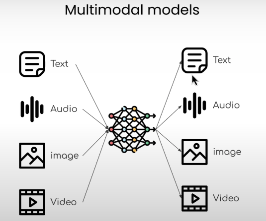
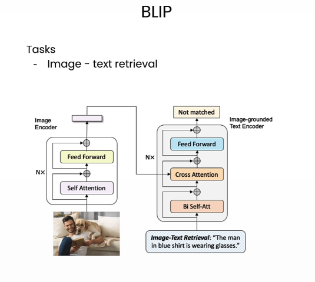

# Multimodal Models

Multimodal models are AI systems that accept and relate more than one type of data (modality) — such as images and text, or audio and text — within a single model. They power tasks like image captioning, visual Q&A, and zero-shot image classification.

## Source

- [[raw/00-clippings/(824) Stanford CS231N Deep Learning for Computer Vision  Spring 2025  Lecture 16 Vision and Language - YouTube.md|raw/00-clippings/(824) Stanford CS231N Deep Learning for Computer Vision  Spring 2025  Lecture 16 Vision and Language - YouTube.md]]
- [[raw/01-open-source-models-hugging-face/11-image-retrieval.py|raw/01-open-source-models-hugging-face/11-image-retrieval.py]]
- [[raw/01-open-source-models-hugging-face/12-image-captioning.py|raw/01-open-source-models-hugging-face/12-image-captioning.py]]
- [[raw/01-open-source-models-hugging-face/05_zero_shot_audio_classification.py|raw/01-open-source-models-hugging-face/05_zero_shot_audio_classification.py]]

## What Makes a Model Multimodal

A model is **multimodal** when it takes more than one type of input — for example:
- Image + text prompt → text answer (Visual Q&A)
- Audio clip + text labels → classification score (CLAP)
- Image → text description (captioning)

*The important shift is architectural: modalities are no longer handled as separate silos if the model can reason across them jointly.*

Modern multimodal systems are usually **foundation models**: pretrain once on large image-text or audio-text corpora, then adapt the same model to retrieval, captioning, VQA, grounding, classification, and generation with little or no task-specific data.

## From Specialized Models to Foundation Models

Older vision systems were usually one-model-per-task:
- Image classifier for classification
- Captioning model for captioning
- Detector for detection

The newer pattern is:
1. Pretrain a large shared encoder or encoder-decoder on broad multimodal data
2. Learn a joint representation space or a general instruction-following interface
3. Adapt that foundation model to many tasks with prompts, small fine-tunes, or in-context examples

This shift matters because it reduces per-task data collection and lets one model transfer knowledge across tasks.

## CLIP-Style Vision-Language Pretraining

CLIP-style models learn a shared embedding space for images and text:
- Image encoder maps image → vector
- Text encoder maps caption / label / prompt → vector
- Contrastive loss pulls matched image-text pairs together
- Unmatched pairs are pushed apart

This makes **zero-shot classification** possible: embed candidate text labels like "a photo of a golden retriever" and choose whichever text is closest to the image embedding.

## Common Multimodal Tasks

| Task | Description |
|------|-------------|
| **Image captioning** | Generate a natural language description of an image |
| **Image-text matching (ITM)** | Score how well an image and text description match |
| **Visual Q&A** | Answer a question about an image |
| **Zero-shot image classification** | Classify an image using text labels, no task-specific training |
| **Zero-shot audio classification** | Classify audio using text labels (see [[audio-processing]]) |

## Key Models

*That shared-space idea is what makes retrieval, matching, and zero-shot transfer feel like one family of tasks instead of separate pipelines.*

### BLIP (Bootstrapping Language-Image Pretraining)

Salesforce's BLIP models handle multiple image-language tasks:

- **Image-Text Matching (ITM):** `Salesforce/blip-itm-base-coco`
  - Given an image and a sentence, scores how well they match
  - Used for image retrieval: find the image that best matches a query

- **Image Captioning:** `Salesforce/blip-image-captioning-base`
  - Generates a natural language description for any input image

### CLAP (Contrastive Language-Audio Pretraining)

- **Model:** `laion/clap-htsat-unfused`
- Learns a shared audio–text embedding space via contrastive learning
- Enables zero-shot audio classification with arbitrary user-supplied labels
- See [[audio-processing]] for details on how CLAP works

## Captioning, Grounding, and Structured Understanding

Image captioning was one of the first successful multimodal tasks: vision features from a CNN fed a language model that generated a sentence token by token. That moved the field from "what object is this?" toward "tell me what is happening."

From there, richer representations emerged:
- **Dense captioning** — caption local regions, not just the whole image
- **Scene graphs** — represent objects, attributes, and relationships explicitly
- **Grounded generation** — force the model to point to evidence in the image while generating text

These structured forms help because raw captions often hide *why* the model said something.

## Chaining Models

A strong multimodal system does not have to be a single monolithic network. In practice, you can chain:
- A vision-language model for broad understanding
- Specialized detectors or segmenters for precise grounding
- A language model for reasoning or label expansion
- Verifiers to catch hallucinations before the final answer reaches the user

This is especially useful for fine-grained or long-tail categories. A language model can generate rich textual descriptions of rare classes, and a CLIP-like model can then match images against those descriptions even when labeled training data is tiny.

## Failure Mode: Hallucination

Multimodal models inherit the same core problem as language models: they can generate plausible statements not fully supported by the image.

Common failure patterns:
- Mentioning objects that are typical for a scene but absent in this image
- Confusing relationships or actions
- Over-committing when evidence is weak

Grounding, pointing, verification models, and specialist sub-models reduce this, but they do not eliminate it.

## Contrastive Learning Principle

The contrastive pretraining approach (used in both CLIP for vision-language and CLAP for audio-language):

1. Collect matched pairs: (image/audio, text description)
2. Train the model to pull matched-pair embeddings **closer** in vector space
3. Train the model to push mismatched-pair embeddings **further apart**
4. Result: a joint embedding space where similarity = semantic alignment

At inference time, you can compare any image/audio against any text description — no fine-tuning required.

## Related Topics

- [[computer-vision]] — vision-only models and tasks
- [[audio-processing]] — audio-only models and tasks (ASR, TTS, CLAP)
- [[nlp]] — text-only models
- [[sentence-embeddings]] — embedding spaces and similarity search
- [[human-centered-ai]] — hallucination, grounding, bias, and human impact in multimodal systems
- [[hugging-face]] — hosting and discovering multimodal models
- [[attention-transformers]] — the architectural foundation for most multimodal models
