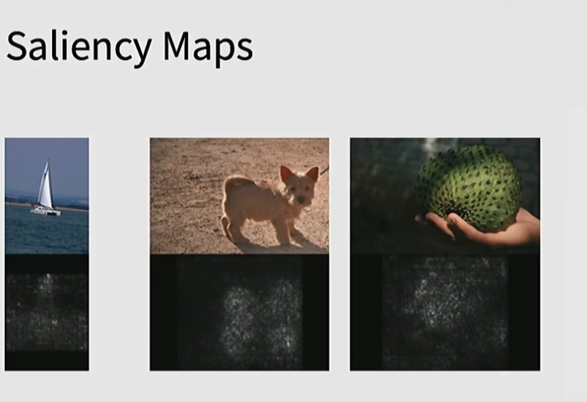
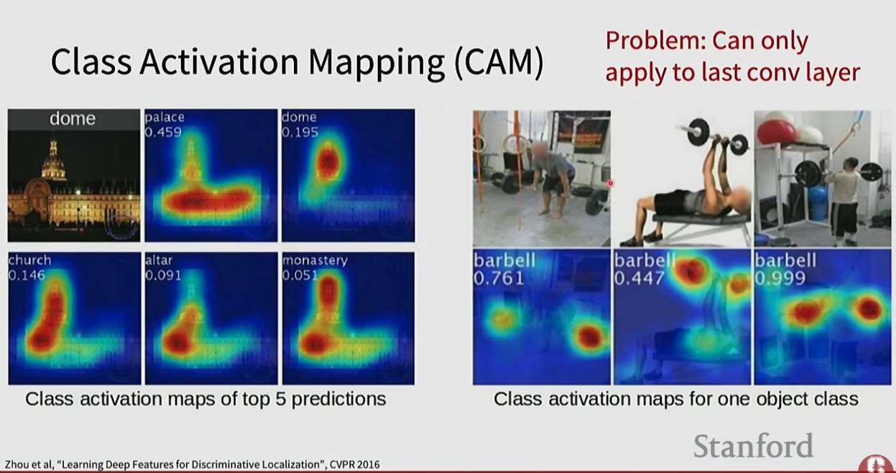

# Network Visualization

Network visualization techniques help understand what a neural network has learned — which parts of the input drive its decisions. These tools are essential for debugging, interpretability, and building trust in model predictions.

## Source

- [[raw/03-stanford-cs231n/Stanford CS231N.md|raw/03-stanford-cs231n/Stanford CS231N.md]]

## Key Papers

- [Deep Inside Convolutional Networks: Visualising Image Classification Models and Saliency Maps](https://arxiv.org/pdf/1312.6034) - the saliency-map reference point.
- [Learning Deep Features for Discriminative Localization](https://arxiv.org/pdf/1512.04150) - the original CAM paper.
- [Grad-CAM: Visual Explanations from Deep Networks via Gradient-Based Localization](https://arxiv.org/pdf/1610.02391) - the paper that made class-localization explanations broadly useful beyond CAM-compatible architectures.

## Motivation

Deep networks are often described as "black boxes." Visualization techniques let us answer:
- Which pixels in an image cause this classification?
- What does each filter or layer respond to?
- Is the model looking at the right parts of the image?

## Linear Classifier Templates

The rows of the weight matrix **W** in a linear classifier can be visualized as template images:
- Each row captures what the classifier "looks for" in a specific class
- The templates are blurry but show the learned class prototype
- Limitations: one template per class; cannot capture multimodal structure

## CNN Filter Visualization

The first convolutional layer's filters are directly interpretable — they learn:
- Oriented edges at various angles
- Color blobs
- Texture patterns

Deeper layers become increasingly abstract and hard to interpret directly.

## Saliency Maps

**Question:** which pixels matter most for this specific prediction?

**Method:** compute the gradient of the class score with respect to each input pixel:
- Large gradient → this pixel strongly influences the prediction
- Small gradient → this pixel is mostly irrelevant

Paper: [Deep Inside Convolutional Networks: Visualising Image Classification Models and Saliency Maps](https://arxiv.org/pdf/1312.6034)

Saliency maps produce a heatmap overlaid on the input image showing the most influential regions.

*The gradients are often noisy, but they still answer the basic interpretability question: which pixels would most change the class score if you perturb them?*

## Class Activation Mapping (CAM)

**Idea:** weight the last convolutional feature maps by the class-specific classifier weights and sum them.

**Limitation: CAM can only be applied to the last convolutional layer.** It requires a global average pooling layer before the final classifier — the architecture must be specifically designed for CAM.

CAM produces class-specific heatmaps:
- **Top-5 predictions for one image:** church, dome, monastery, mosque, dome — each produces a different heatmap highlighting different spatial regions
- **Single class localization:** barbell → bright spots over the barbells and hands in the image, very dark elsewhere

This means the network implicitly localizes objects during training with only image-level labels — no bounding boxes needed. When the model predicts "barbell," it has learned to look at where the barbells actually are.

CAM allows:
- Identifying which image regions contribute most to a class prediction
- **Weakly supervised localization** — highlights where the object is without using bounding-box labels during training
- Visualizing attention patterns without explicit attention mechanisms

**Limitation:** requires a Global Average Pooling (GAP) layer immediately before the classifier — constrains architecture.

Paper: [Learning Deep Features for Discriminative Localization](https://arxiv.org/pdf/1512.04150)

*CAM is more visually intuitive than raw saliency maps because it lifts the explanation to feature-map regions. The tradeoff is architectural: classic CAM only works cleanly when the classifier sits on top of GAP features from the last conv layer.*

## Grad-CAM (Gradient-weighted Class Activation Mapping)

Grad-CAM generalizes CAM to **any CNN architecture** without requiring GAP:
- Uses gradients flowing into the last convolutional layer to determine class-specific importance
- Computes a weighted combination of feature maps using gradient-averaged weights
- Produces coarse but semantically meaningful heatmaps
- Works on any CNN — VGG, ResNet, DenseNet, etc.

Paper: [Grad-CAM: Visual Explanations from Deep Networks via Gradient-Based Localization](https://arxiv.org/pdf/1610.02391)

## ViT Feature Visualization

Vision Transformers (ViTs) learn differently from CNNs — they use self-attention instead of convolutions:

**Step-by-step ViT process:**
1. Split image into fixed-size patches (e.g., 16×16 pixels)
2. Turn patches into embedding vectors
3. Add positional encodings
4. Feed patches through Transformer encoder
5. Classification token (CLS) aggregates global information

ViT attention maps can be visualized to show which patches each token attends to — often revealing object-centric attention patterns even without supervision.

Papers:
- [When Vision Transformers Outperform ResNets Without Pretraining or Strong Data Augmentations](https://arxiv.org/pdf/2106.01548)
- [Robustness & interpretability of ViTs](https://arxiv.org/pdf/2105.14030)

## Summary Comparison

| Method | Requires | Output | Architecture constraint |
|--------|----------|--------|------------------------|
| Saliency map | Input gradient | Pixel-level heatmap | None |
| CAM | GAP + linear classifier | Coarse heatmap | GAP required |
| Grad-CAM | Gradients to conv layer | Coarse heatmap | None |
| ViT attention | Self-attention maps | Patch-level attention | Transformer only |

## Related Topics

- [[convolutional-neural-networks]] — CNN architectures being visualized
- [[attention-transformers]] — ViT attention visualization
- [[computer-vision]] — image classification tasks where visualization is applied
- [[neural-networks]] — gradient computation (backpropagation) underlies saliency maps
