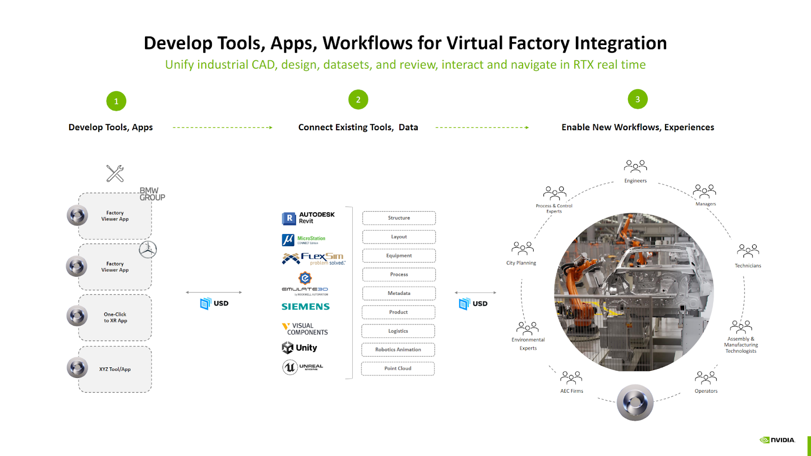
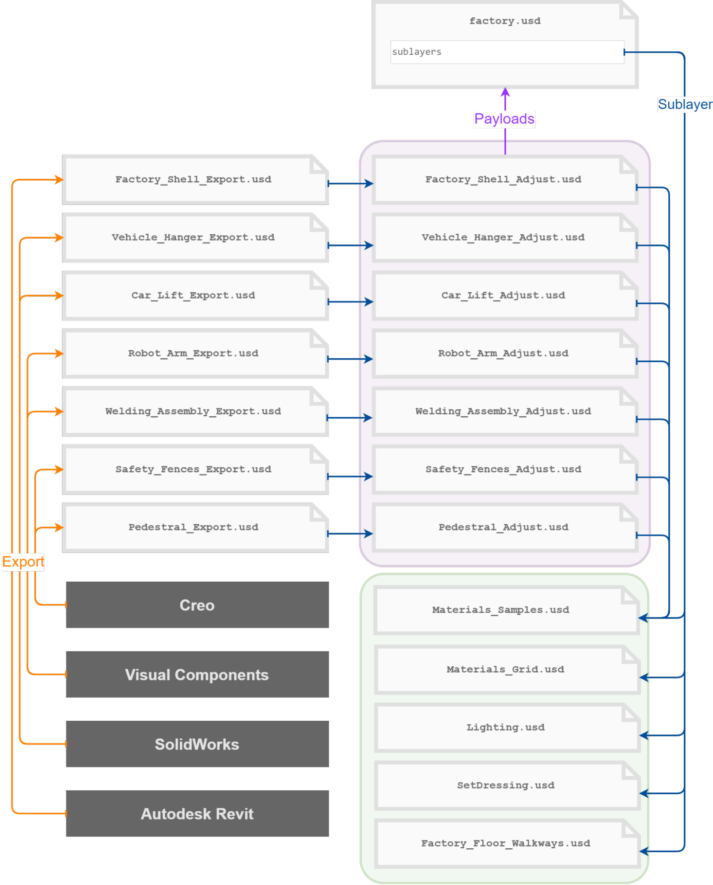

# NVIDIA Omniverse

NVIDIA Omniverse is an application platform for building OpenUSD-native 3D tools, simulation environments, and industrial digital-twin workflows. It packages scene composition, rendering, physics, connectors, and extensible UI/runtime components so teams can turn shared 3D data into production apps instead of building the infrastructure stack from scratch.

## Source

- [[raw/05-omniverse/Omniverse.md|raw/05-omniverse/Omniverse.md]]
- [NVIDIA Omniverse](https://www.nvidia.com/en-us/omniverse/)
- [NVIDIA Omniverse Documentation](https://docs.omniverse.nvidia.com/)

## Platform Model

Omniverse sits above [[open-usd]] and uses it as the common scene representation. In practice, that means CAD exports, BIM data, robotics assets, material libraries, and simulation metadata can all meet in one composed scene instead of being trapped in tool-specific formats.

The platform is geared toward industrial and robotics use cases:
- building digital-twin applications for factories, warehouses, cities, and data centers
- running physically grounded simulation with rendering and physics in the same environment
- connecting operational data, sensors, and enterprise systems to a live 3D model

## Kit-Based Applications

Omniverse applications are typically built on **Kit**, an extension-based runtime:
- a `.kit` file defines the application, its dependencies, and settings
- extensions package isolated functionality in Python or C++
- teams compose apps by enabling windows, tools, and domain-specific bundles rather than rewriting the shell

Common extension categories include stage browsing, property editing, toolbars, consoles, PhysX simulation, and custom domain UI.

## Virtual Factory Workflow

A representative Omniverse workflow for manufacturing has three layers:
1. Build custom viewer or review apps on top of Kit.
2. Connect existing tools such as Revit, Siemens, FlexSim, Unity, or Unreal through USD-compatible data exchange.
3. Use the composed virtual facility for planning, collaboration, simulation, and XR review.

*The platform value is orchestration: many tools still exist, but Omniverse gives them one shared runtime and one shared scene representation.*

## Why Teams Use It

- **Non-destructive integration:** exported source data can stay intact while adjustment layers add overrides.
- **Simulation-ready environments:** physics, lighting, and asset scale matter for robotics and operations planning.
- **Collaborative review:** multiple roles can inspect the same composed scene instead of exchanging screenshots and static files.

*That assembly graph shows why Omniverse is useful operationally: each supplier or team can own its layer without giving up a single usable scene.*

## Related Topics

- [[open-usd]] — the scene format and composition model underneath Omniverse
- [[digital-twins]] — the main industrial application pattern for the platform
- [[physical-ai]] — simulation-first robotics development built on these environments
- [[shaders]] — rendering and material systems still matter inside Omniverse apps
