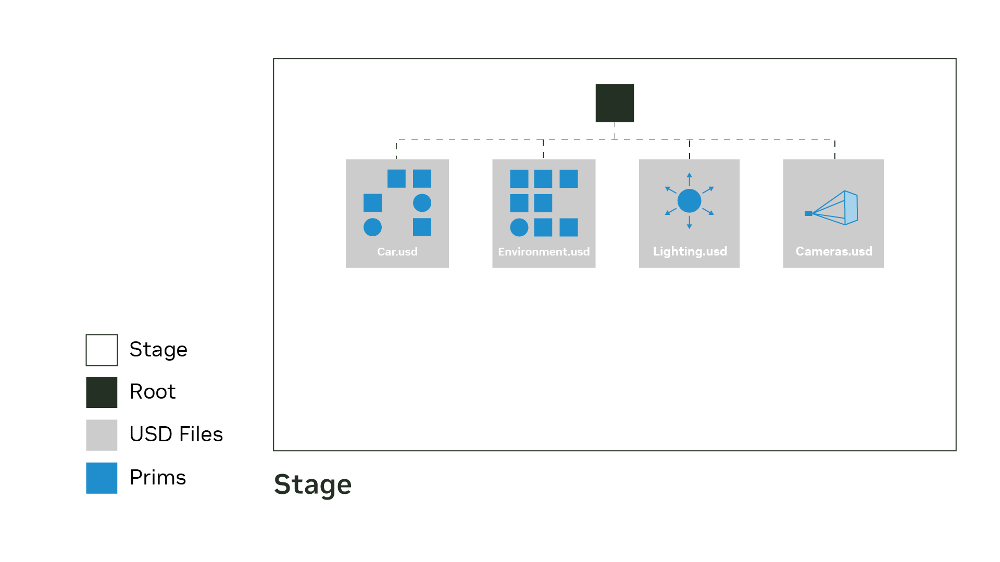
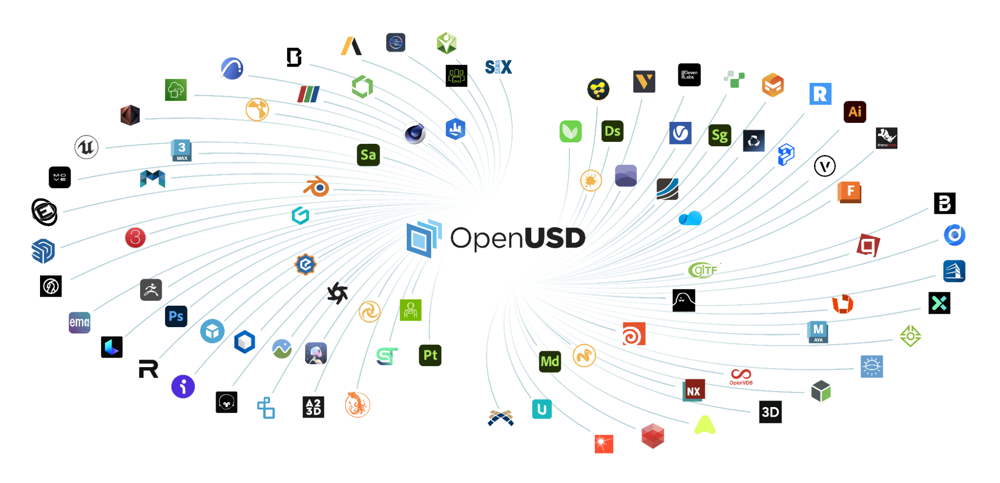

# OpenUSD

OpenUSD (Universal Scene Description) is the scene description and composition system at the core of modern Omniverse workflows. It is not just a 3D file format: it is a layered data model for building, composing, querying, and exchanging complex scenes across tools while preserving hierarchy, metadata, overrides, and non-destructive collaboration.

## Source

- [[raw/05-omniverse/Omniverse.md|raw/05-omniverse/Omniverse.md]]
- [[raw/05-omniverse/01-create-usd-file.py|raw/05-omniverse/01-create-usd-file.py]]
- [[raw/05-omniverse/20-modifying-attributes.py|raw/05-omniverse/20-modifying-attributes.py]]
- [Introduction to USD](https://openusd.org/release/intro.html)
- [OpenUSD API](https://openusd.org/release/api/index.html)

## Tutorial Source Inventory

The OpenUSD raw material is a staged tutorial: it starts with a single cube, then grows toward hierarchy, schemas, properties, and custom metadata.

- [[raw/05-omniverse/01-create-usd-file.py|raw/05-omniverse/01-create-usd-file.py]] - creates a new `.usda` stage and defines the first `Cube` prim.
- [[raw/05-omniverse/02-defining-cube-stage.py|raw/05-omniverse/02-defining-cube-stage.py]] - reopens the stage and inspects the authored cube definition.
- [[raw/05-omniverse/03-creating-hierarchy.py|raw/05-omniverse/03-creating-hierarchy.py]] - builds a `Scope -> Xform -> Cube` hierarchy to show scenegraph structure.
- [[raw/05-omniverse/04-lighting-stage.py|raw/05-omniverse/04-lighting-stage.py]] - adds `DistantLight` and `SphereLight` prims plus authored transforms and intensities.
- [[raw/05-omniverse/05-adding-attributes-prim.py|raw/05-omniverse/05-adding-attributes-prim.py]] - inspects cube schema attributes and authors display color.
- [[raw/05-omniverse/06-getting-value-current-attribute.py|raw/05-omniverse/06-getting-value-current-attribute.py]] - reads the cube size, doubles it, and adds a translated secondary cube.
- [[raw/05-omniverse/07-traversing-stage.py|raw/05-omniverse/07-traversing-stage.py]] - demonstrates depth-first stage traversal across the composed scene.
- [[raw/05-omniverse/08-does-the-prim-exist.py|raw/05-omniverse/08-does-the-prim-exist.py]] - checks for child prim existence under a known path.
- [[raw/05-omniverse/09-defining-prim-without-schema.py|raw/05-omniverse/09-defining-prim-without-schema.py]] - uses generic `DefinePrim` to author namespace objects without a typed schema.
- [[raw/05-omniverse/10-getting-validating-and-setting-prims-path.py|raw/05-omniverse/10-getting-validating-and-setting-prims-path.py]] - retrieves prims by path and contrasts valid versus invalid lookups.
- [[raw/05-omniverse/11-setting-default-prim.py|raw/05-omniverse/11-setting-default-prim.py]] - marks `/hello` as the stage default prim for downstream referencing.
- [[raw/05-omniverse/12-usdgeom-and-xform.py|raw/05-omniverse/12-usdgeom-and-xform.py]] - introduces `UsdGeom.Xform` as the typed transform container for a scene root.
- [[raw/05-omniverse/13-scope-and-cube.py|raw/05-omniverse/13-scope-and-cube.py]] - adds `Scope` and `Cube` children under the world transform to separate grouping from geometry.
- [[raw/05-omniverse/14-usdshade-and-material.py|raw/05-omniverse/14-usdshade-and-material.py]] - defines a `Material` prim to illustrate `UsdShade` containers.
- [[raw/05-omniverse/15-usdlux-and-distantlight.py|raw/05-omniverse/15-usdlux-and-distantlight.py]] - adds an environment scope and a typed `DistantLight` schema.
- [[raw/05-omniverse/16-retrieving-properties-prim.py|raw/05-omniverse/16-retrieving-properties-prim.py]] - lists property names on a cube to separate prim structure from property payload.
- [[raw/05-omniverse/17-getting-values-for-attributes.py|raw/05-omniverse/17-getting-values-for-attributes.py]] - reads fallback values for cube size, display color, and extent.
- [[raw/05-omniverse/18-authoring-attributes.py|raw/05-omniverse/18-authoring-attributes.py]] - authors explicit size, extent, and display-color opinions on the cube.
- [[raw/05-omniverse/19-create-additional-attributes.py|raw/05-omniverse/19-create-additional-attributes.py]] - creates custom metadata attributes such as weight, size, type, and hazard flags.
- [[raw/05-omniverse/20-modifying-attributes.py|raw/05-omniverse/20-modifying-attributes.py]] - sets and reads custom attribute values, completing the custom-metadata flow.

## Asset Inventory

The authored and referenced assets show how the tutorial scripts materialize into concrete USD layers.

- [[raw/05-omniverse/assets/01-first_stage.usda|raw/05-omniverse/assets/01-first_stage.usda]] - minimal stage containing only a single authored `Cube` prim.
- [[raw/05-omniverse/assets/01-first_stage_flattened-inter.usda|raw/05-omniverse/assets/01-first_stage_flattened-inter.usda]] - intermediate flattened view of the first stage prior to schema expansion.
- [[raw/05-omniverse/assets/01-first_stage_flattened.usda|raw/05-omniverse/assets/01-first_stage_flattened.usda]] - fully flattened mesh form of the initial cube, exposing generated points, normals, and topology.
- [[raw/05-omniverse/assets/03-second-stage.usda|raw/05-omniverse/assets/03-second-stage.usda]] - hierarchy plus authored cube size/color and two lights.
- [[raw/05-omniverse/assets/03-second-stage_flattened-inter.usda|raw/05-omniverse/assets/03-second-stage_flattened-inter.usda]] - partially flattened representation of the hierarchy with light opinions preserved.
- [[raw/05-omniverse/assets/03-second-stage_flattened.usda|raw/05-omniverse/assets/03-second-stage_flattened.usda]] - flattened mesh and transform version of the second stage.
- [[raw/05-omniverse/assets/04-prims.usda|raw/05-omniverse/assets/04-prims.usda]] - generic namespace example with `hello/world` and a default prim.
- [[raw/05-omniverse/assets/05-many_prims.usda|raw/05-omniverse/assets/05-many_prims.usda]] - typed world scene collecting geometry, material, and lighting scopes under one root.
- [[raw/05-omniverse/assets/06-attributes.usda|raw/05-omniverse/assets/06-attributes.usda]] - attribute-focused stage with authored cube extent, display color, size, and transform.
- [[raw/05-omniverse/assets/07-custom_attributes.usda|raw/05-omniverse/assets/07-custom_attributes.usda]] - referenced asset wrapper with user-defined custom attributes for workflow metadata.
- [[raw/05-omniverse/assets/08-cubebox_a02_distilled.usd|raw/05-omniverse/assets/08-cubebox_a02_distilled.usd]] - large binary USD asset referenced by the custom-attribute example to attach metadata to a real mesh payload.

## Core Mental Model

The key concept is the **stage**: the composed scenegraph you work with at runtime. A stage may be assembled from many layers and files, but applications traverse it as one coherent hierarchy of prims and properties.

```python
from pxr import Usd, UsdGeom

stage = Usd.Stage.CreateNew("assets/first_stage.usda")
UsdGeom.Cube.Define(stage, "/cube")
stage.Save()

stage = Usd.Stage.Open("assets/first_stage.usda")
for prim in stage.Traverse():
    print(prim)
```



*That distinction matters because most real USD workflows are about composition, not isolated files.*

## Building Blocks

- **Prims:** the scenegraph nodes that represent geometry, transforms, lights, materials, scopes, and more.
- **Attributes:** typed values on prims, including time-sampled data for animation.
- **Relationships:** links between prims, used for bindings, collections, and non-destructive connectivity.
- **Schemas:** standard contracts that define what a prim is or what APIs apply to it.

Common file encodings:

| Extension | Use |
|---|---|
| `.usd` | general container, ASCII or binary |
| `.usda` | human-readable text |
| `.usdc` | compact binary crate format |
| `.usdz` | packaged distribution archive |

## Composition and Value Resolution

OpenUSD is designed around layered opinions:
- `def` defines a prim in a layer
- `over` overrides existing authored data
- `class` provides reusable inherited defaults

That lets multiple teams contribute to one asset or environment without destructive merges. The final value for a property comes from **value resolution**, which evaluates all applicable layers in priority order.

## Why It Became a Hub Format

The practical advantage of OpenUSD is ecosystem reach: it acts as shared 3D infrastructure across DCC tools, CAD/BIM pipelines, renderers, and simulation platforms.



*When many tools can exchange structured scene data instead of flattened exports, collaboration gets cheaper and less lossy.*

## Related Topics

- [[omniverse]] — Omniverse uses OpenUSD as its native scene layer
- [[digital-twins]] — digital twins depend on OpenUSD to unify many data sources
- [[3d-vision]] — 3D representations and scene structure intersect with USD workflows
- [[game-math]] — transforms, hierarchy, and spatial reasoning still rest on core geometry
