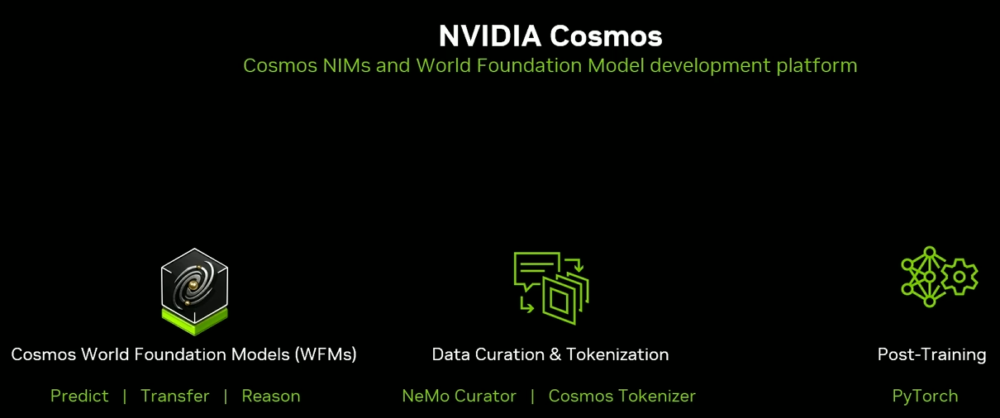
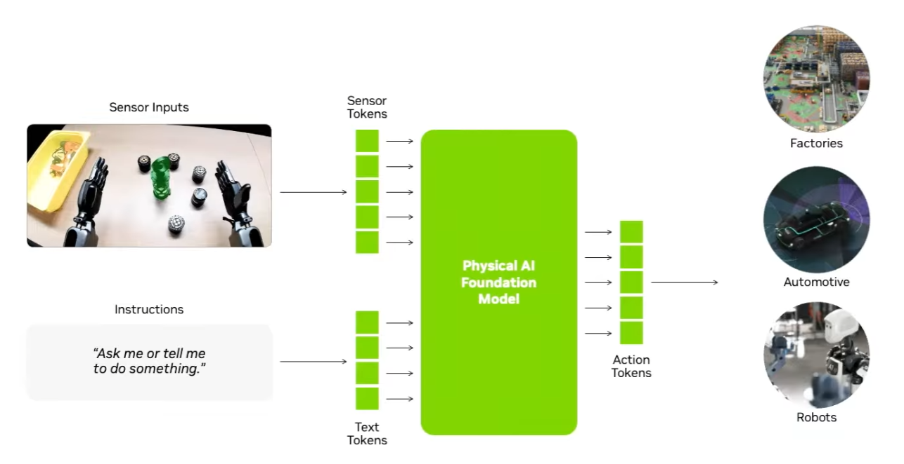
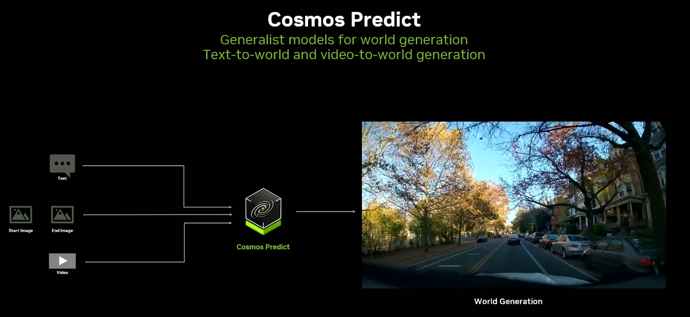

# Physical AI

Physical AI is the use of AI systems to perceive, reason, and act in the physical world through robots, autonomous vehicles, drones, and other embodied machines. In NVIDIA's framing, the main bottleneck is not model architecture alone but the cost and danger of collecting enough real-world interaction data, which pushes the whole stack toward simulation-first development.

## Source

- [[raw/05-omniverse/Omniverse.md|raw/05-omniverse/Omniverse.md]]
- [Using NVIDIA Cosmos World Foundation Models for Physical AI Development](https://www.youtube.com/watch?v=wjCVFfmsai0)
- [A Simulation First Approach to Developing Physical AI-Based Robots With OpenUSD](https://www.youtube.com/watch?v=pztkN1RFLKU)
- [How To Build End-to-End Physical AI Systems for Robots](https://www.youtube.com/watch?v=f-IcFNRUSIU)

## Why It Is Hard

Two constraints dominate:
1. real-world data collection is slow, expensive, and hard to diversify
2. physical testing is risky, destructive, and operationally expensive

That creates the robotics data gap: teams need far more edge cases and task diversity than they can safely collect in the real world.

## Simulation-First Stack

The standard answer is to convert the data problem into a compute problem:
- **Omniverse** provides simulation environments and digital twins
- **synthetic data** expands what the model sees without repeating physical capture
- **world models** predict or generate future world states for training and evaluation

*This is the core shift: spend more GPU time so you can spend less robot time.*

## Foundation-Model View

A physical-AI foundation model maps:
- **sensor tokens** from cameras, lidar, force, or other embodied inputs
- plus **text or task tokens**
- into **action tokens** that drive robot behavior

*The architecture is "LLM-like" in shape, but the output is not text. It is control.*

## Cosmos Workflow

NVIDIA Cosmos is presented as a world-foundation-model platform with three recurring functions:

| Component | Role |
|---|---|
| **Predict** | generate plausible world trajectories or videos |
| **Transfer** | create controllable augmentations from real or synthetic footage |
| **Reason** | support downstream world understanding and decision-making |

*Predict-style models matter because a small real dataset can become a much larger and more varied training curriculum.*

## Related Topics

- [[robot-learning]] — policy learning and foundation-model robotics sit directly on this stack
- [[omniverse]] — simulation infrastructure for embodied-AI development
- [[digital-twins]] — realistic twins are where many systems get trained and validated
- [[generative-models]] — world models and synthetic-data pipelines borrow heavily from generative modeling
