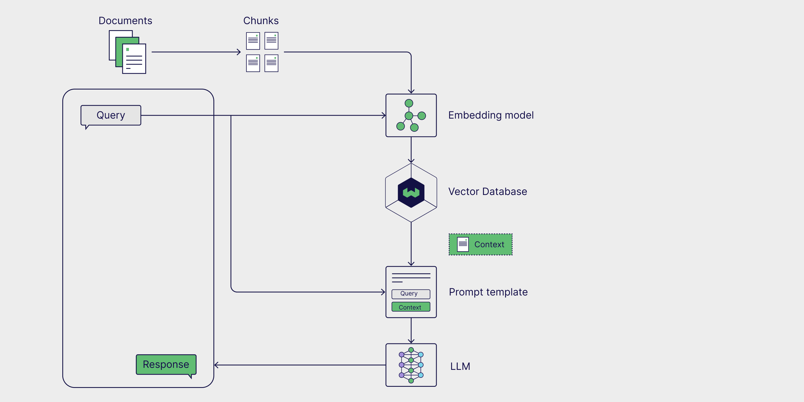
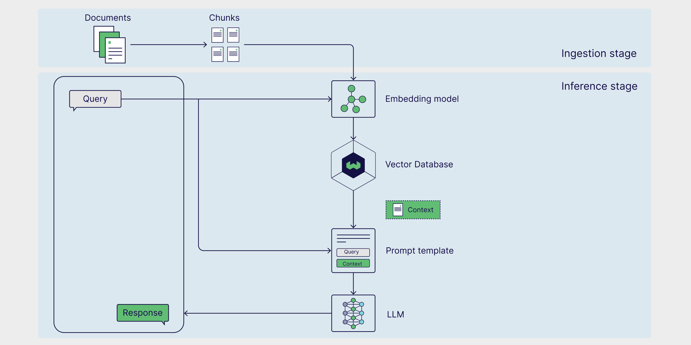
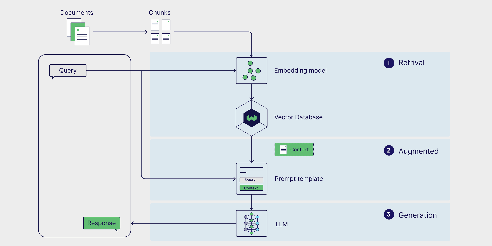
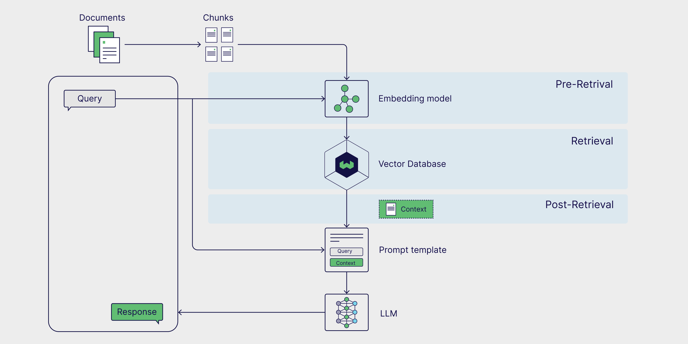
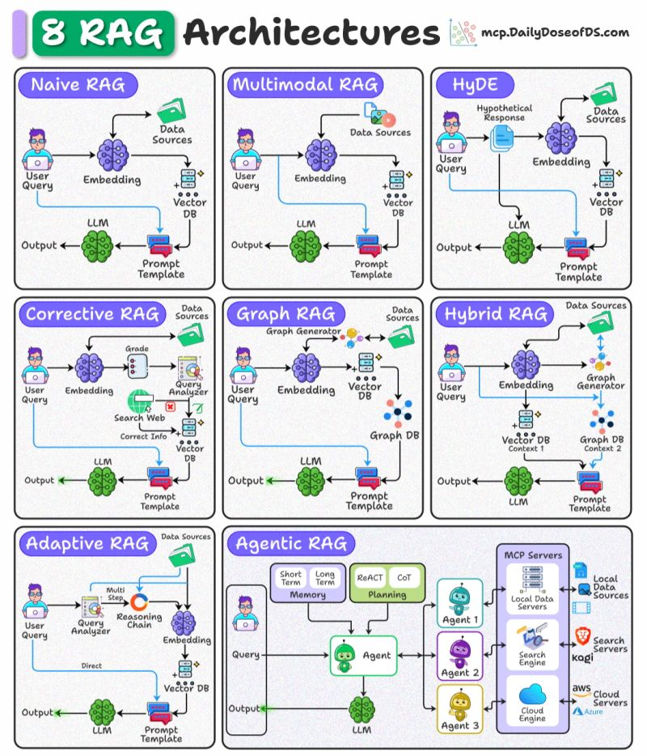
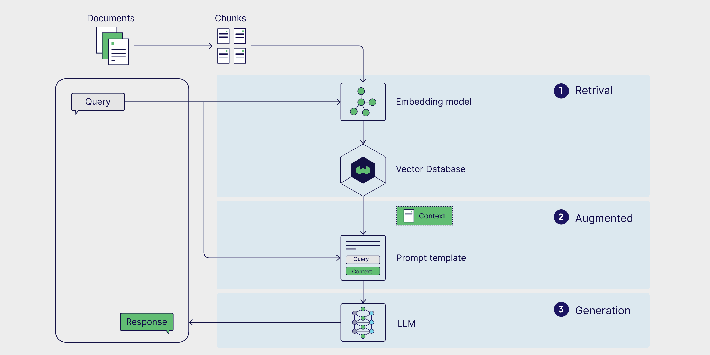
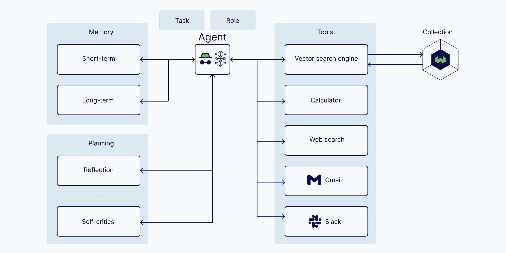
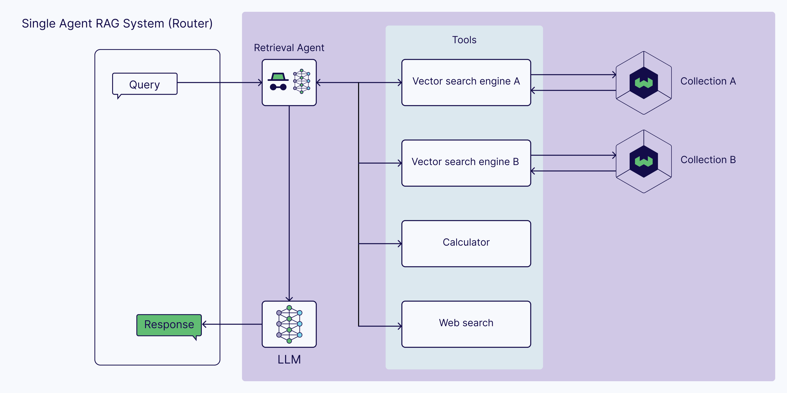
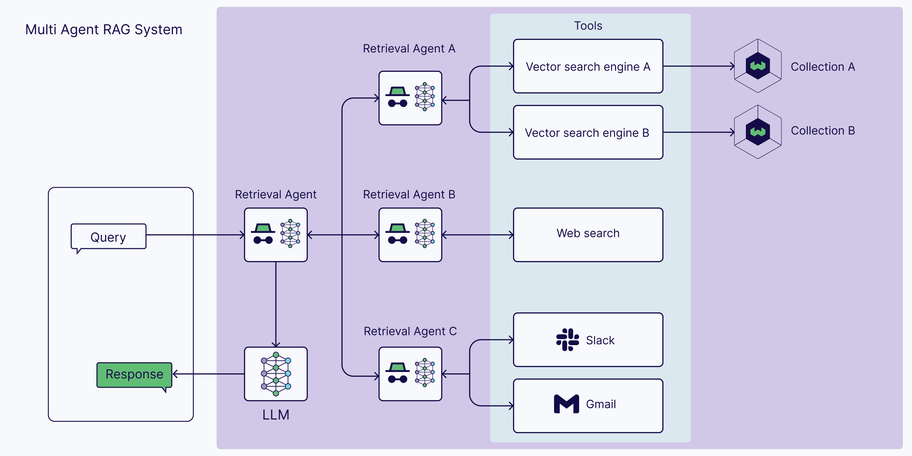
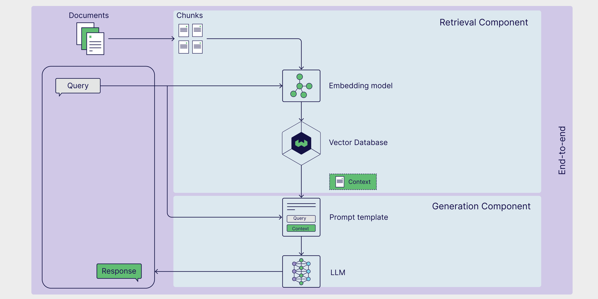

# Retrieval-Augmented Generation (RAG)

RAG augments LLM generation by retrieving relevant external context at inference time, grounding answers in up-to-date, private, or domain-specific knowledge without retraining the model. A production RAG system is not just "vector search before an LLM"; it includes ingestion, retrieval quality controls, prompt augmentation, generation, evaluation, and sometimes agents that decide when and how to retrieve.

## Source

- [[raw/00-clippings/Thread by @akshay_pachaar.md|raw/00-clippings/Thread by @akshay_pachaar.md]]
- [[raw/00-clippings/Introduction to LLM RAG - Retrieval Augmented Generation Explained.md|raw/00-clippings/Introduction to LLM RAG - Retrieval Augmented Generation Explained.md]]
- [[raw/00-clippings/What Is Agentic RAG From LLM RAG to AI Agents.md|raw/00-clippings/What Is Agentic RAG From LLM RAG to AI Agents.md]]

## Core Pipeline

RAG combines three parts: an external knowledge source, a prompt template, and a generative model. The model keeps its parametric knowledge, but the answer is conditioned on non-parametric context retrieved from files, databases, web pages, scientific literature, or personal/work data.

The original research formulation is [Retrieval-Augmented Generation for Knowledge-Intensive NLP Tasks](https://arxiv.org/abs/2005.11401). The practical goal is to reduce hallucinations, cite supporting sources, and answer questions whose facts are absent from the model's training data.

## Ingestion and Inference

RAG has two operating stages:

1. **Ingestion** prepares the knowledge base: parse files, clean text, chunk documents, create embeddings, store vectors and metadata, and keep source provenance.
2. **Inference** answers a query: embed the query, retrieve relevant chunks, place them into a prompt template, generate an answer, and optionally cite or validate sources.

Retrieval quality depends heavily on document processing choices. Chunk size, overlap, metadata, source filtering, deduplication, and hybrid search often matter more than swapping the final LLM.

## Retrieval Quality Levers

Advanced RAG techniques improve the weak points of naive vector similarity:

- **Chunking strategy** — choose units that preserve meaning without overloading context.
- **Metadata filtering** — narrow by source, date, author, product, customer, or document type before semantic search.
- **Hybrid search** — combine dense vector retrieval with keyword/BM25 signals.
- **Re-ranking** — use a ranker model to reorder candidate chunks before prompt construction.
- **Query rewriting** — expand vague user queries into retrieval-friendly forms.
- **Fine-tuning** — adapt embedding or generator models when domain language is specialized and examples exist.

## 8 RAG Architectures

*This diagram is useful as a map of the design space. Most real systems are variations on these retrieval, routing, verification, and orchestration patterns rather than entirely new categories.*

### 1. Naive RAG

**Pipeline:** User Query → Embedding → Vector DB → Prompt Template → LLM → Output

Retrieves documents purely based on **vector similarity** between the query embedding and stored document embeddings.

- Works best for simple, fact-based queries where direct semantic matching is sufficient
- Baseline approach: embed → retrieve top-k → generate

### 2. Multimodal RAG

**Pipeline:** User Query → Embedding → Vector DB (multi-modal data sources) → Prompt Template → LLM → Output

Handles multiple data types (text, images, audio) by embedding and retrieving **across modalities**.

- Ideal for cross-modal tasks: answering a text query with both text and image context
- Requires modality-specific encoders such as CLIP for image-text retrieval

### 3. HyDE (Hypothetical Document Embeddings)

**Pipeline:** User Query → Query Generator (Hypothetical Response) → Embedding → Vector DB → Prompt Template → LLM → Output

Addresses the problem where queries are not semantically similar to documents:

1. Generate a **hypothetical answer document** from the query using the LLM
2. Embed that hypothetical document
3. Use its embedding to retrieve real documents

HyDE bridges the vocabulary/style gap between short queries and long documents.

### 4. Corrective RAG

**Pipeline:** User Query → Embedding → Analyzer → Search Web (Correct Info) → Prompt Template → LLM → Output

Validates retrieved results by comparing them against trusted sources:

- Ensures up-to-date and accurate information
- Filters or corrects retrieved content before passing to the LLM
- Useful when the knowledge base may be stale or incomplete

### 5. Graph RAG

**Pipeline:** User Query → Graph Generator → Graph DB + Vector DB → Prompt Template → LLM → Output

Converts retrieved content into a **knowledge graph** capturing entities and relationships:

- Provides structured context alongside raw text
- Enhances multi-hop reasoning over interconnected facts
- Useful for questions that compare or summarize across many documents

### 6. Hybrid RAG

**Pipeline:** User Query → Embedding → Vector DB (Context 1) + Graph Generator → Graph DB (Context 2) → Prompt Template → LLM → Output

Combines **dense vector retrieval** with graph-based or structured retrieval in a single pipeline:

- Useful when the task requires both unstructured text and structured relational data
- Produces richer answers by leveraging complementary retrieval signals

### 7. Adaptive RAG

**Pipeline:** User Query → Query Analyzer → (Direct path to Vector DB) or (Reasoning Chain → Vector DB) → LLM → Output

Dynamically decides whether a query requires simple retrieval or a **multi-step reasoning chain**:

- Routes simple queries directly to retrieval
- Breaks complex queries into sub-queries for better coverage
- Reduces unnecessary latency and cost for easy queries

### 8. Agentic RAG

**Pipeline:** Query → Agent (Planning: ReAct/CoT, Short-term + Long-term Memory) → Tools / Retriever Agents → Output

Uses AI agents with planning, reasoning, and memory to orchestrate retrieval from multiple sources:

- Best suited for complex workflows requiring tool use, external APIs, or multiple RAG techniques
- The agent decides what to retrieve, when, and from where
- Can iterate: retrieve → evaluate → re-retrieve → answer

## Agentic RAG

Vanilla RAG is usually one-shot: retrieve once, place the result in the prompt, generate. Agentic RAG adds a controller that can plan, route, call tools, evaluate retrieved context, and retry.

Agentic systems add the components from [[ai-agents]]: LLM, memory, planning, and tools.

The ReAct pattern is a common control loop: thought, action, observation, repeat. The relevant paper is [ReAct: Synergizing Reasoning and Acting in Language Models](https://arxiv.org/abs/2210.03629).

### Vanilla vs Agentic

| Capability | Vanilla LLM RAG | Agentic RAG |
|---|---|---|
| External tools | Usually no | Yes |
| Query preprocessing | Usually fixed | Agent can rewrite or decompose |
| Multi-step retrieval | No | Yes |
| Validation of retrieved context | Limited | Agent can evaluate and re-retrieve |
| Cost/latency | Lower | Higher |
| Failure modes | Bad retrieval, stale context | Bad retrieval plus agent/tool-loop errors |

### Single-Agent Router

In the simplest agentic RAG setup, one agent chooses between multiple retrievers or tools.

This is useful when answers may come from different sources: a vector index, web search, a calculator, a database, Slack, email, or a product API.

### Multi-Agent RAG

In a multi-agent setup, one coordinator delegates retrieval to specialized agents.

This helps when different sources require different prompts, permissions, tools, or validation logic. It also increases coordination overhead, so it should be reserved for workflows where source specialization materially improves answer quality.

## Evaluation

RAG needs both component-level and end-to-end evaluation.

Component-level checks:

- **Retriever accuracy** — did retrieval return documents that answer the query?
- **Retriever relevance** — are the chunks specific enough for the user's need?
- **Generator faithfulness** — does the answer stay grounded in retrieved context?
- **Generator correctness** — is the answer factually right against ground truth?

End-to-end checks:

- Semantic similarity between generated and expected answers
- Citation correctness and source coverage
- Human review on high-risk domains
- Regression datasets for common and adversarial queries

RAGAS is a common evaluation framework, and the paper [Evaluation of Retrieval-Augmented Generation: A Survey](https://arxiv.org/abs/2405.07437) is a good map of the evaluation literature.

## Architecture Selection Guide

| Use Case | Recommended Architecture |
|----------|--------------------------|
| Simple fact lookup | Naive RAG |
| Images + text context | Multimodal RAG |
| Short query, long docs | HyDE |
| Freshness-critical data | Corrective RAG |
| Multi-hop reasoning over facts | Graph RAG |
| Mixed structured + unstructured | Hybrid RAG |
| Mixed simple + complex queries | Adaptive RAG |
| Multi-tool / multi-source workflows | Agentic RAG |

## Related Topics

- [[attention-transformers]] — the LLM backbone that generates from retrieved context
- [[sentence-embeddings]] — vector similarity search is core to most RAG variants
- [[nlp]] — text retrieval and generation fundamentals
- [[multimodal-models]] — cross-modal retrieval in Multimodal RAG
- [[ai-agents]] — agentic RAG adds planning, tools, and multi-step control
- [[docling]] — document conversion, chunking, and provenance for RAG ingestion
