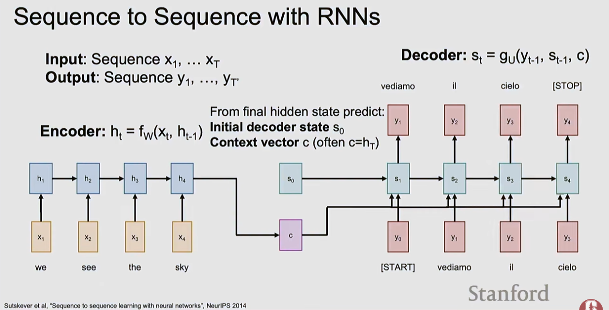

# Recurrent Neural Networks

Recurrent Neural Networks (RNNs) are neural networks designed for sequential data where the order of elements matters. Unlike standard feedforward networks, RNNs maintain an internal **hidden state** that acts as memory, allowing them to carry information across time steps.

## Source

- [[raw/03-stanford-cs231n/Stanford CS231N.md|raw/03-stanford-cs231n/Stanford CS231N.md]]
- [[raw/00-clippings/Spring 2025  Lecture 7 Recurrent Neural Networks - YouTube.md|raw/00-clippings/Spring 2025  Lecture 7 Recurrent Neural Networks - YouTube.md]]

## Key Papers

- [Finding Structure in Time](https://crl.ucsd.edu/~elman/Papers/fsit.pdf) - the classic Elman RNN reference for recurrent state over sequences.
- [Long Short-Term Memory](https://www.bioinf.jku.at/publications/older/2604.pdf) - the foundational LSTM paper for long-range sequence memory.
- [Sequence to Sequence Learning with Neural Networks](https://arxiv.org/pdf/1409.3215) - the standard seq2seq paper that made encoder-decoder RNNs dominant before transformers.

## Vanilla RNN (Elman RNN)

The simplest RNN, sometimes called an "Elman RNN" after Prof. Jeffrey Elman. The state consists of a single hidden vector h:

```
hₜ = tanh(Whh · hₜ₋₁ + Wxh · xₜ)    ← hidden state update
yₜ = Why · hₜ                          ← output (when needed)
```

Three weight matrices: Whh (hidden-to-hidden), Wxh (input-to-hidden), Why (hidden-to-output). The **tanh** activation squashes values to [-1, 1].

The **hidden state** is the internal memory of the RNN — it summarizes everything the model has seen up to time t.

**Truncated Backpropagation Through Time (TBPTT):** full BPTT through very long sequences (e.g., an entire text corpus) is computationally intractable. TBPTT processes the sequence in chunks:
- Carry hidden states forward through time forever (full sequence)
- Only backpropagate for a smaller fixed number of steps
- Breaks the sequence into windows; gradients don't flow further back than the window

**CNN + RNN for image captioning:**
```
Image → CNN encoder → initial hidden state h₀
h₀ → RNN: [START] → "straw" → "hat" → END → yₜ
```
The CNN encodes visual features (using W_hi for the image-to-hidden projection), initializes the RNN hidden state, and the RNN generates words autoregressively. Each step: x_t = previous word → h_t = RNN(x_t, h_{t-1}) → y_t = predicted next word.

## Sequence Processing Modes

RNNs can be configured for different input-output patterns:

| Mode | Diagram | Example |
|---|---|---|
| **One-to-one** | 1 input → 1 output | Standard classification (not really an RNN) |
| **One-to-many** | 1 input → sequence output | Image captioning: image → sentence |
| **Many-to-one** | Sequence input → 1 output | Sentiment: sentence → positive/negative |
| **Many-to-many (synced)** | Seq → seq (same length) | Video: each frame → action label |
| **Many-to-many (async)** | Seq → seq (different length) | Translation: English → French |

The many-to-many synced case: at each step t, the RNN receives input xₜ, produces output yₜ, and updates hidden state hₜ. Loss Lₜ is computed at each output, and total loss L = sum of all Lₜ. This is sometimes called "action prediction" — e.g., a sequence of video frames → a sequence of action class labels.

## Computational Graph

Many-to-many RNN unrolled:
```
W (shared)
h₀ → fW → h₁ → fW → h₂ → fW → h₃ → ... → hT
       ↑          ↑          ↑
       x₁         x₂         x₃

       y₁  L₁     y₂  L₂     y₃  L₃     yT  LT
                                              ↓
                                              L (total)
```
The same weight matrix W is used at every time step — this is what makes it "recurrent."

## Applications of RNNs

- Language modeling (predict next word)
- Machine translation (seq-to-seq)
- Sentiment analysis
- Time series prediction
- Music generation
- Interpretable cells: researchers have found cells that track specific structure (e.g., a "line length tracking cell" that activates with a blue/red gradient showing current position within a line of text)

## RNN Tradeoffs

**Advantages:**
- Unlimited context length (in theory)
- Compute scales linearly with sequence length

**Disadvantages:**
- Cannot be parallelized (must process sequentially)
- Vanilla RNNs struggle with long-range dependencies (vanishing gradients)

## Encoder-Decoder Bottleneck

Classical sequence-to-sequence RNNs compress the entire input sequence into one final hidden state, then ask the decoder to generate everything from that single vector.

```
Input sequence → RNN encoder → final state c → RNN decoder → output sequence
```

This works on short sequences, but it creates an information bottleneck on long inputs: the model must remember everything important in one fixed-size state.



*Pre-attention seq2seq: the encoder summarizes the whole source sentence into one context vector. Attention was introduced to remove this bottleneck.*

## Multilayer RNNs

Stack multiple RNN layers on top of each other (stacked RNNs):
- Each layer processes the hidden states from the layer below
- Learns progressively more abstract temporal patterns

## Vanishing Gradient Problem

When backpropagating through many time steps, the gradient is multiplied by the same weight matrix repeatedly:
- If weights are slightly < 1: gradients shrink exponentially → vanish
- If weights are slightly > 1: gradients grow exponentially → explode

Result: vanilla RNNs effectively only remember ~10–20 steps back.

## LSTM (Long Short-Term Memory)

LSTMs address the vanishing gradient problem with **gates** and a separate **cell state**:

The LSTM has two streams of information:
- `hₜ` — hidden state (short-term memory, passed between time steps)
- `cₜ` — cell state (long-term memory, modified by gates)

### The Four Gates

| Gate | Purpose |
|------|---------|
| **Forget gate** `fₜ` | What to erase from cell state |
| **Input gate** `iₜ` | What new information to write |
| **Cell gate** `g̃ₜ` | Candidate values to add |
| **Output gate** `oₜ` | What part of cell state to expose as output |

**LSTM gate computation in matrix form:**
```
⎛ i ⎞   ⎛ σ    ⎞         ⎛ hₜ₋₁ ⎞
⎜ f ⎟ = ⎜ σ    ⎟ · W  ·  ⎜      ⎟
⎜ o ⎟   ⎜ σ    ⎟         ⎝  xₜ  ⎠
⎝ g ⎠   ⎝ tanh ⎠
```

All four gates are computed in one matrix multiply. Gates i, f, o use sigmoid (output ∈ [0,1]); candidate update g uses tanh (output ∈ [-1,1]).

```
cₜ = f ⊙ cₜ₋₁ + i ⊙ g    ← cell state update (forget old, write new)
hₜ = o ⊙ tanh(cₜ)         ← hidden state (what to expose)
```

Also written explicitly:
```
fₜ = σ(Wf · [hₜ₋₁, xₜ] + bf)
iₜ = σ(Wi · [hₜ₋₁, xₜ] + bi)
g̃ₜ = tanh(Wg · [hₜ₋₁, xₜ] + bg)
oₜ = σ(Wo · [hₜ₋₁, xₜ] + bo)
cₜ = fₜ ⊙ cₜ₋₁ + iₜ ⊙ g̃ₜ
hₜ = oₜ ⊙ tanh(cₜ)
```

The cell state behaves like a **highway** — gradients can flow back without being repeatedly multiplied, similar to ResNet skip connections.

### Does LSTM Solve Vanishing Gradients?

No — but it makes long-range learning much easier:
- If forget gate f = 1 and input gate i = 0, the cell state cₜ = cₜ₋₁ — information is preserved indefinitely
- By contrast, a vanilla RNN must learn a recurrent weight matrix Wh that preserves info through repeated multiplication — much harder
- LSTM doesn't **guarantee** no vanishing/exploding gradient, but provides an easier path to learn long-distance dependencies

**Sequence to sequence with attention:** the original motivation for attention was to fix the RNN encoder-decoder bottleneck. Encoder produces h₁, h₂, h₃, h₄ for "we see the sky". At each decoder step, the context vector cₜ is a different weighted combination of all encoder states — "looks at" different parts of the input sequence at each output step. (Bahdanau et al., "Neural machine translation by jointly learning to align and translate", ICLR 2015)

LSTMs saw enormous success in NLP before the transformer revolution (2017–2018).

## Modern RNNs

Recent architectures (Mamba, RWKV, xLSTM) revisit RNNs with improvements:
- **Unlimited context length** — major advantage over transformers (which are quadratic in sequence length)
- **Linear compute scaling** with sequence length vs transformers' quadratic scaling
- Actively competing with transformers for long-sequence tasks

## Historical Note

The attention mechanism (now used in transformers) was originally developed to overcome RNN limitations in machine translation — see [[attention-transformers]].

## Related Topics

- [[neural-networks]] — foundational concepts (backprop, loss functions)
- [[attention-transformers]] — attention mechanism born from RNN limitations; now dominant
- [[optimization]] — training RNNs (gradient clipping for exploding gradients)
- [[nlp]] — primary domain where RNNs were applied
