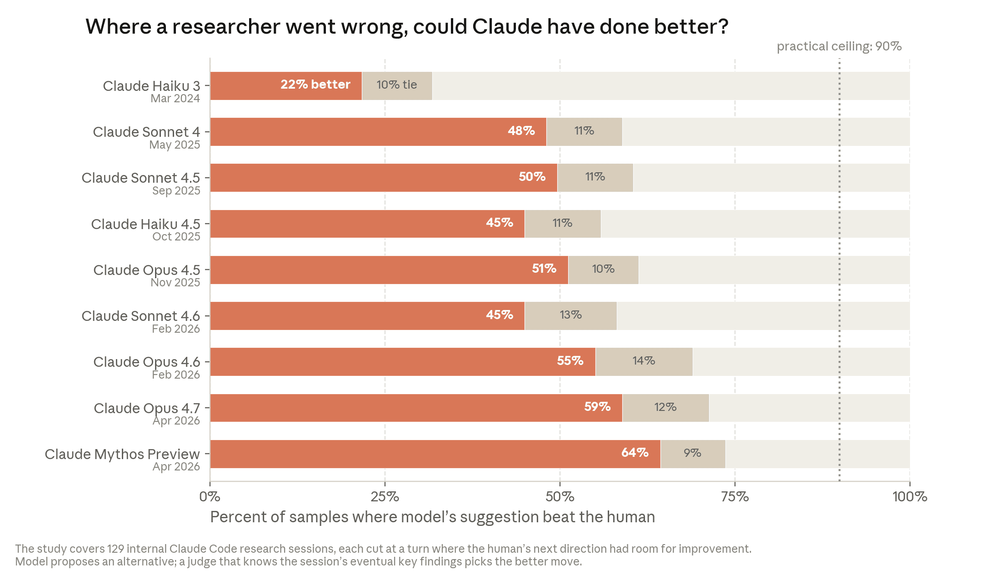

Recursive self-improvement is the scenario where AI systems increasingly automate the work of building stronger AI systems, eventually making model development limited less by human execution and more by compute, experiments, verification, and institutional judgment. The Anthropic Institute clipping argues that this is not yet full autonomy, but that AI is already accelerating AI research, coding, and research-direction choices enough to matter for [[ai-industry]], [[ai-agents]], and [[ai-coding]].

## Source

- [[raw/00-clippings/When AI builds itself.md|raw/00-clippings/When AI builds itself.md]]
- [Anthropic Institute - When AI builds itself](https://www.anthropic.com/institute/recursive-self-improvement)

## Core Idea

Recursive self-improvement has three stages:

| Stage | Human role | AI role | Bottleneck |
|---|---|---|---|
| AI-assisted development | Write, review, decide | Draft code, debug, run tools | Human execution and review |
| AI-accelerated R&D | Choose directions, validate results | Implement experiments, analyze failures, suggest next steps | Research taste, verification, compute |
| Full recursive self-improvement | Oversight and governance | Design and develop successor systems | Compute, alignment, evaluation, coordination |

The important shift is compounding. If models write more code, run more experiments, and improve the tools used to build future models, each generation of AI development can increase the rate at which the next generation is built.

## Evidence Stack

The Anthropic article combines external benchmark trends with internal production data. The central claim is not that AI already runs the entire research loop, but that more of the loop is being delegated.

The most direct internal signal is code throughput: Anthropic reports that engineers ship far more code per quarter than before Claude became part of the development loop. This matters because frontier AI research is heavily mediated through code: training runs, evals, infrastructure, data pipelines, and analysis scripts.

The second signal is reliability on progressively harder internal Claude Code sessions. Open-ended work is the relevant category for research acceleration because the path is not pre-scripted; the agent must investigate, adapt, and recover from failed attempts.

External evidence points in the same direction. METR's [task-completion time horizon](https://metr.org/time-horizons/) metric estimates the length of tasks frontier agents can complete at fixed reliability, and the paper [Measuring AI Ability to Complete Long Tasks](https://arxiv.org/abs/2503.14499) frames progress as longer autonomous task horizons rather than single benchmark scores.

## The Bottleneck Moves

Once an AI system can cheaply perform implementation work, the scarce resource shifts:

- from typing code to reviewing code
- from running experiments to choosing which experiments are worth running
- from producing ideas to filtering, sequencing, and validating them
- from individual productivity to organizational throughput

This is the [[ai-industry]] version of Amdahl's law: accelerating one part of the process exposes the slowest remaining part. Human code review, experiment prioritization, safety evaluation, and infrastructure capacity become the limiting factors.

## Research Taste

The hardest remaining part is research taste: picking problems that matter, interpreting ambiguous results, and deciding when a path is a dead end.

Anthropic's internal "where a researcher went wrong" evaluation is a proxy for this taste problem. It asks whether a model can propose a better next step at moments where a human research session had room for improvement. The result is not proof of autonomous research judgment, but it is evidence that models are improving at the judgment calls that sit above raw implementation.

## Possible Futures

The source sketches three futures:

1. **The trend stalls.** Today's capabilities diffuse broadly, but model progress bends into an S-curve because research taste, compute, data, energy, or another constraint becomes binding.
2. **AI labs compound efficiency gains.** Humans still set direction, but one person coordinates far more AI-executed work. This compresses knowledge work and makes organizational bottleneck management central.
3. **Full recursive self-improvement emerges.** AI systems become capable of designing and developing successor systems, shifting the frontier pace toward compute availability, alignment, evaluation, and governance.

The prudent read is that even without full recursive self-improvement, AI-accelerated R&D changes the operating model of frontier labs and AI-native companies.

## Paper Trail

- [Attention Is All You Need](https://arxiv.org/abs/1706.03762) - the Transformer paper is an example of the rare architectural breakthroughs the Anthropic source contrasts with incremental, experiment-heavy frontier progress.
- [Measuring AI Ability to Complete Long Tasks](https://arxiv.org/abs/2503.14499) - METR's time-horizon metric tracks autonomous task duration at fixed reliability.
- [Measuring the Impact of Early-2025 AI on Experienced Open-Source Developer Productivity](https://arxiv.org/abs/2507.09089) - useful counterweight showing that perceived AI productivity gains can differ from measured productivity in real developer work.
- [Benchmarks Saturate When The Model Gets Smarter Than The Judge](https://arxiv.org/abs/2601.19532) - relevant to the evaluation bottleneck: stronger models can expose benchmark and judge failures before apparent saturation is meaningful.

## Related Topics

- [[ai-industry]] - AI-native organizations and model-building companies
- [[ai-agents]] - tool-using systems that run coding and research loops
- [[ai-coding]] - AI-assisted development and human verification
- [[codex-workflows]] - long-running goals, verifiers, and durable agent work
- [[agent-harness]] - the runtime systems around tool use, state, and verification
- [[llm-training]] - the training pipeline that recursive improvement would accelerate
