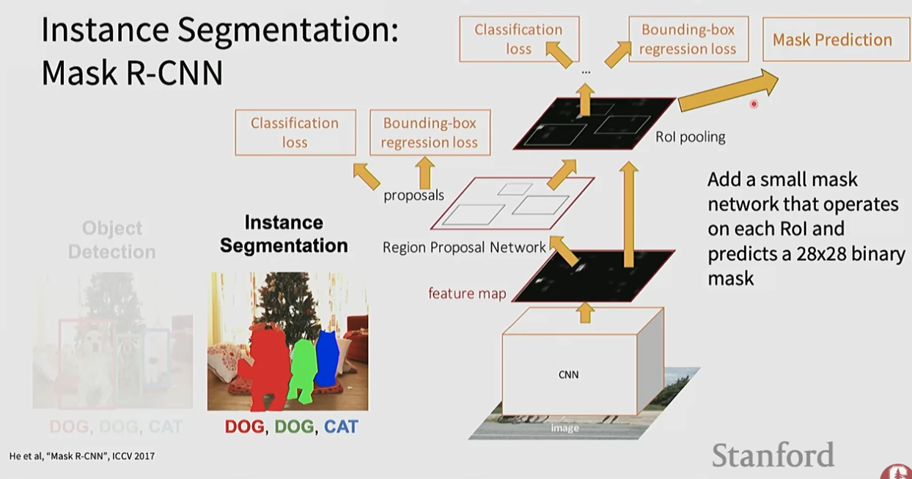

# Semantic Segmentation and Instance Segmentation

Semantic segmentation labels every pixel in an image with a class category (e.g., road, sky, person). Instance segmentation goes further by distinguishing individual instances of the same class (person #1 vs person #2). Both tasks require maintaining spatial resolution — a challenge for standard CNNs that progressively downsample.

## Source

- [[raw/03-stanford-cs231n/Stanford CS231N.md|raw/03-stanford-cs231n/Stanford CS231N.md]]
- [[raw/00-clippings/Spring 2025  Lecture 9 Object Detection, Image Segmentation, Visualizing - YouTube.md|raw/00-clippings/Spring 2025  Lecture 9 Object Detection, Image Segmentation, Visualizing - YouTube.md]]
- [[raw/01-open-source-models-hugging-face/09_segmentation_mask.py|raw/01-open-source-models-hugging-face/09_segmentation_mask.py]]
- [[raw/01-open-source-models-hugging-face/09_segmentation_mask_single_point.py|raw/01-open-source-models-hugging-face/09_segmentation_mask_single_point.py]]

## Key Papers

- [U-Net: Convolutional Networks for Biomedical Image Segmentation](https://arxiv.org/pdf/1505.04597) - the classic encoder-decoder with skip connections for dense prediction.
- [Mask R-CNN](https://arxiv.org/pdf/1703.06870) - the core instance-segmentation paper.
- [0.1% Data Makes Segment Anything Slim](https://arxiv.org/pdf/2312.05284) - the paper closest to the promptable segmentation examples used in this repo.

## Promptable Segmentation In Practice

The Hugging Face examples ground the theory in Segment Anything style prompting. Instead of predicting a semantic label map for every class, the model can generate masks from sparse prompts.

- [[raw/01-open-source-models-hugging-face/09_segmentation_mask.py|raw/01-open-source-models-hugging-face/09_segmentation_mask.py]] - runs `Zigeng/SlimSAM-uniform-77` on the sample image and visualizes the model's mask proposals over the full image.
- [[raw/01-open-source-models-hugging-face/09_segmentation_mask_single_point.py|raw/01-open-source-models-hugging-face/09_segmentation_mask_single_point.py]] - adds a single input point prompt targeting the toddler's torso, then renders the three candidate masks returned for that prompt.

## Why CNNs Need Modification for Dense Prediction

Classic CNNs were designed for image classification ("is there a cat?"):
- Pooling layers progressively reduce spatial resolution
- High-level semantics accumulate, but spatial detail is destroyed
- For per-pixel tasks (segmentation, depth, optical flow), you need **both** semantics and spatial location

**Rule of thumb:** downsampling builds context; upsampling restores resolution.

## Semantic Segmentation

Every pixel is assigned a class label. The model learns:
- A pixel alone is meaningless — you need local and global context
- Downsampling rapidly expands the **receptive field** (collects context)
- Upsampling restores the original resolution for pixel-level predictions

**Limitation:** semantic segmentation does not differentiate between instances — all "cow" pixels are labeled "cow" regardless of how many cows exist.

### Naive Approach: Sliding Window

The simplest (and computationally most expensive) approach:
1. For each pixel in the image, extract a patch centered on that pixel
2. Classify the center pixel by passing the patch through a CNN
3. Repeat for every pixel

This produces correct results but is **extremely slow** — a separate forward pass per pixel. No GPU parallelism across pixels.

Better approaches (FCN, encoder-decoder) process the entire image in a single forward pass and produce dense predictions efficiently.

## Unpooling / Upsampling

To restore spatial resolution after downsampling:

### Nearest-Neighbor / Bed-of-Nails Unpooling
Simple replication or zero-padding to expand feature maps.

### Max Unpooling
During max pooling, the network records the **argmax position** (where each max value came from). During unpooling:
- Values are placed back at their original positions
- Other positions are filled with zeros
- Preserves where features were spatially

## U-Net

U-Net is the state-of-the-art architecture for dense prediction, especially biomedical segmentation:
- **Downsampling ("encoder") phase:** increasingly abstract features, growing receptive field, shrinking spatial resolution
- **Upsampling ("decoder") phase:** progressively restore original image resolution
- **Skip connections:** directly connect corresponding encoder and decoder layers → decoder sees both high-level semantics AND fine spatial details

Paper: [U-Net: Convolutional Networks for Biomedical Image Segmentation](https://arxiv.org/pdf/1505.04597)

```
Input → [Conv → Pool]* → bottleneck → [Upsample + Skip Concat → Conv]* → Output
```

The skip connections are U-Net's key innovation: they prevent spatial information loss across the bottleneck.

## Instance Segmentation

Semantic segmentation cannot distinguish between multiple instances of the same class. Instance segmentation assigns a unique mask to each individual object.

### Mask R-CNN

Mask R-CNN extends Faster R-CNN by adding a third head that predicts a 28×28 binary segmentation mask per region of interest (RoI):
1. CNN backbone extracts features
2. RPN proposes regions
3. RoI Align (improved RoI Pooling) extracts per-region features
4. Three parallel heads: class label, bounding box refinement, binary mask

Paper: [Mask R-CNN](https://arxiv.org/pdf/1703.06870)



*This is the clean conceptual bridge from object detection to instance segmentation: keep the detection pipeline, then add a small mask head that predicts a binary mask for each proposed object.*

### Panoptic Segmentation

Combines semantic + instance segmentation:
- "stuff" classes (background, sky, road) → semantic labels
- "thing" classes (person, car) → instance labels

## Evaluation Metric: mIoU

**Intersection over Union (IoU):**
```
IoU = (Predicted ∩ Ground Truth) / (Predicted ∪ Ground Truth)
```

**Mean IoU (mIoU):** average IoU across all semantic classes — standard metric for segmentation.

```python
def iou(boxA, boxB):
    x_left   = max(boxA[0], boxB[0])
    y_top    = max(boxA[1], boxB[1])
    x_right  = min(boxA[2], boxB[2])
    y_bottom = min(boxA[3], boxB[3])
    if x_right <= x_left or y_bottom <= y_top:
        return 0.0
    intersection = (x_right - x_left) * (y_bottom - y_top)
    areaA = (boxA[2]-boxA[0]) * (boxA[3]-boxA[1])
    areaB = (boxB[2]-boxB[0]) * (boxB[3]-boxB[1])
    return intersection / (areaA + areaB - intersection)
```

## Related Topics

- [[computer-vision]] — classification and detection overview
- [[convolutional-neural-networks]] — backbone architectures and pooling
- [[object-detection]] — detection architectures (RCNN family, DETR)
- [[attention-transformers]] — transformer-based segmentation models
- [[hugging-face]] — `Zigeng/SlimSAM-uniform-77` for class-agnostic segmentation
